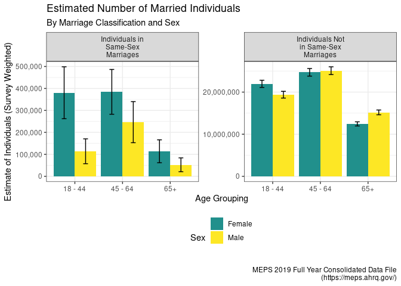
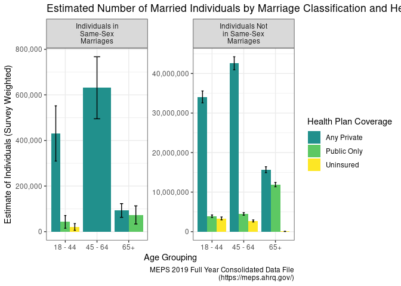
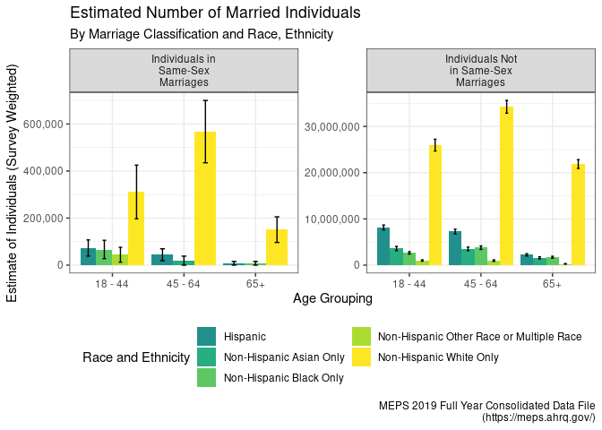
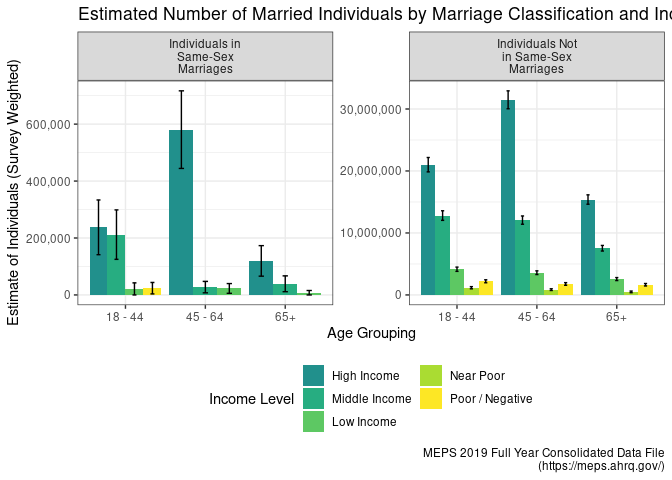
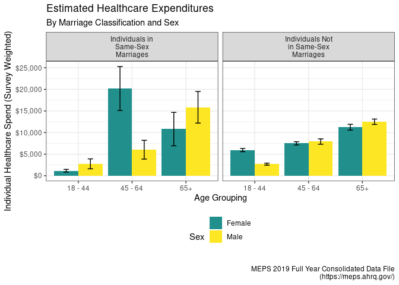
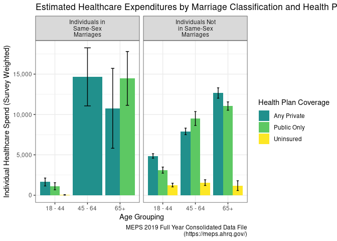
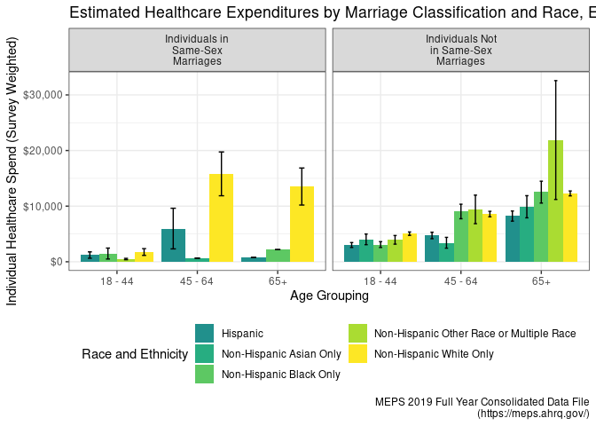
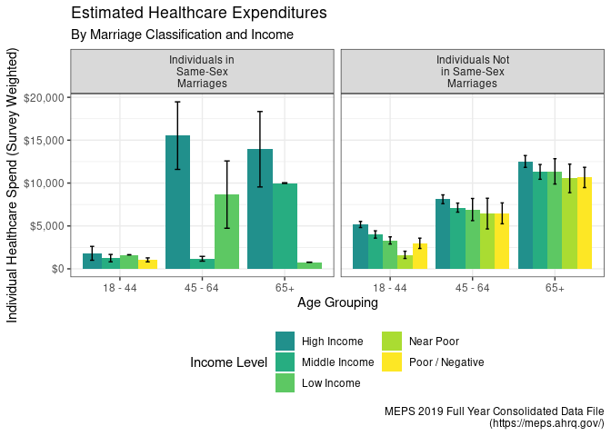

Social Determinants of Health… and Wealth?
================
C. Seth Lester, ASA
(<a href="mailto:cslester@gmail.com">cslester@gmail.com</a>) 
14 February 2023

*The following paper is a submission in reply to the [Society of
Actuaries’ Call for
Papers](https://www.soa.org/research/opportunities/call-for-papers-list/)
under the heading “[Aging and Retirement Issues for LGBTQ+ People –
Second
Invitation](https://www.soa.org/research/opportunities/call-for-essay-aging-retire-lgbtq/)”.*

# Health and Wealth Are Heavily Socially Determined

For many years, people who identify as LGBTQ+ have endured
discrimination from a wide variety of sources, such as from laws and
regulations at all levels of government, or as a result of the ebb and
flow of occupational attitudes over time, and even from members in our
own community.

For some LGBTQ+-identifying subpopulations, the level of discrimination
we face in society is rapidly waning; for others, such as transgender
individuals, there are still impactful and endemic stigmas in play which
act as a barrier to these individuals from living full and rewarding
lives. Barriers such as these have likely inhibited the ability of many
people who identify as LGBTQ+ from enjoying the same protections of our
social safety net – such as healthcare and retirement security systems –
that are enjoyed by non-LGBTQ+-identifying people.

It is difficult today for analysts to credibly estimate how
retirement-related outcomes differ between LGBTQ+ and non-LGBTQ+
populations, or how to quantify the disparities of outcomes among
intersectional subpopulations that exist today within LGBTQ+
communities. One primary reason motivating this difficulty stems from
the lack of available data that can help guide our policymaking
apparatus towards better regulations and protections for members of our
society who are more likely to be marginalized, stigmatized, or
disadvantaged by systemic factors. This includes LGBTQ+ people, of
course, but heavily intersects with people of color, women, religious
minorities, immigrants, disabled individuals, and countless other
populations of interest that comprise the greater whole of the nation.

In the healthcare space, there is ample energy surrounding the important
work being done by organizations, both private and public, to better
understand the impacts of what are known as Social Determinants of
Health – “the conditions in the environments where people are born,
live, learn, work, play, worship, and age that affect a wide range of
health, functioning, and quality-of-life outcomes and risks” (definition
lifted from the [US Dept. of Health and Human
Services](https://health.gov/healthypeople/priority-areas/social-determinants-health).

Social Determinants of Health (SDoH) can provide strong causal evidence
for why certain subpopulations of our society are marginalized or
disadvantaged by systemic factors. Consequently, population health
professionals and actuaries alike have an interest in better
understanding the relationships between SDoH and access to quality
healthcare that is both affordable and can be sustainably provided by
the care delivery system.

It is therefore reasonable to suspect that disparities in
retirement-related outcomes between LGBTQ+ and non-LGBTQ+ populations
are also highly dependent upon many of the same Social Determinants of
Health (SDoH) factors that heavily influence healthcare outcomes,
experiences, and costs.

In order to investigate this idea, I set out to explore the
publicly-available [Medical Expenditure Panel
Survey](https://meps.ahrq.gov/mepsweb/) (MEPS) datasets to determine if
there were useful data available for distilling connections between
retirement-related outcomes, many of which depend extensively on
healthcare outcomes, and the lived socioeconomic experiences often
encountered by LGBTQ+ individuals.

\#About MEPS The Medical Expenditure Panel Survey has been administered
since 1996, and according the [Agency for Healthcare Research and
Quality](https://www.ahrq.gov/) (AHRQ), which is the government agency
at MEPS’ helm, MEPS is a collection of “data on the specific health
services that Americans use, how frequently they use them, the cost of
these services, and how they are paid for, as well as data on the cost,
scope, and breadth of health insurance held by and available to U.S.
workers” ([Survey Background, MEPS
Homepage](https://meps.ahrq.gov/mepsweb/about_meps/survey_back.jsp)).

On the [MEPS Github page](https://github.com/HHS-AHRQ/MEPS), you’ll find
several excellent code examples written in both SAS and R which I used
to familiarize myself with the layout of the data. Furthermore, the MEPS
staff regularly conducts well-crafted online training seminars.

As MEPS is a survey and therefore the data is either self-reported or
imputed, there are some situations in which you’ll find the data isn’t
perfect. And furthermore, MEPS provides [some basic ground
rules](https://meps.ahrq.gov/survey_comp/precision_guidelines.shtml)
about making inferences with the data, which include restrictions and
guidance concerning how much you are permitted to slice and dice the
data before your unweighted sample of respondents is too small. I
discuss this guidance further in a subsequent section.

# My Approach: MEPS and LGBTQ+ Individuals

The MEPS questionnaire is broad and comprehensive, and includes
questions ranging from basic demography facts to employment status, food
stamp usage, diagnoses of key chronic conditions, who pays for the
respondent’s insurance, what medications they filled, medical procedures
they received, even down to the ethnicity of their providers.

However, one question that is glaringly absent from the panel survey
questionnaire is any mention of the respondent’s LGBTQ+ identity. There
are very good reasons to suspect adding these questions would impose
unnecessary sample biases.

At any rate, because MEPS does provide a way to identify respondents in
the survey who are spouses of one another, and because MEPS provides the
self-reported sex of each respondent, one can use this approach to
create a dataset of all married respondents, and then easily label which
are in same-sex marriages and which are not in same-sex marriages.

The R code that performs this analysis and prepares the data
visualizations that follow is available on my personal Github site (the
repository and content which you are currently reading).

# Caveats and Housekeeping

In the following infographics, I have used the 2019 datasets available
on the MEPS website. Note that these are actual populations estimates
based on the weighted survey design, so the population counts and dollar
amounts below are intended to be representative of the US population, in
context.

Next, please take care to note that MEPS recommends [not displaying
estimates of any kind with a RSE (relative standard error) of .5 or
higher](https://meps.ahrq.gov/survey_comp/precision_guidelines.shtml)
due to the high degree of sampling error. Therefore, in the following
images, take care to note that error bars extending more than 50% into
the shaded bar should not be taken at face value. Conversely, error bars
extending no more than 30% into the shaded bar can be regarded as
sufficiently precise.

Finally, I want to reiterate that while the distinction between sex and
gender is not lost on me (in particular in the context of analyzing
causal connections between SDoH and healthcare outcomes), I must point
out that the variable called “SEX” in the data is indeed, according to
the MEPS handbook, intended to express the respondent’s gender. The
handbook also points out that sometimes this value is assigned based on
the name of the respondent or based on the relationship to other
respondents in the same family or dwelling unit, which is obviously not
ideal.

For consistency’s sake, I continue to refer to the variable in the
context of sex and not gender in the visualizations below. This also
means it is possible that some of these “same-sex” and “non-same-sex”
couples could potentially include transgender individuals, but I will
proceed with the materiality assumption that this does not occur in the
data very frequently.

# Exploring the Demographic Composition of Same-Sex Marriages in the US

In the following infographics, I attempt to better understand the
demographic composition of individuals in same-sex marriages by
exploring the relationships between age, sex, income level, race, and
insurance coverage status between the same-sex and non-same-sex marriage
cohorts.

You can include R code in the document as follows:

<!-- --><!-- --><!-- --><!-- -->

One surprising piece of information I was able to learn from these
images is precisely how stark the difference is between the percentage
of non-Hispanic white individuals in same-sex marriages vs. non-same-sex
marriages, which potentially could indicate a greater deal of social
acceptance of same-sex marriages among non-Hispanic white populations.

This is an important point of discussion as it illustrates the need for
researchers and policymakers to better understand the idea of
intersectionality within the many subpopulations within LGBTQ+ groups.
As marriage tends to confer financial security and stabilization
benefits, to both participants in the couple, then it follows that
LGBTQ+ individuals who are white are more likely to access these
benefits than their non-white LGBTQ+ counterparts, which can contribute
to additional disparities along racial lines which are fully contained
within the LGBTQ+ population.

# Visualizing Total Healthcare Expenditures

It is also the case that LGBTQ+ individuals can possess unique
healthcare needs or face different barriers to access to healthcare,
both of which can move the needle on the cost of healthcare –
particularly in retirement, in which individuals are more likely to face
one or more costly chronic conditions such as heart disease, diabetes,
or asthma.

To better determine if there are relationships between these demographic
factors and the cost of care – particularly for older age groups, I
prepared the following series of visualizations below that examine the
average individual expenditures broken out on the same demographic
features as the visualizations above.

<!-- --><!-- --><!-- --><!-- -->

# Conclusion

Due to the lack of data currently available, we must continue to be
creative about how we source information that helps build policy and
products to better strengthen the lives of LGBTQ+ individuals who are
currently enjoying retirement, as well as those who will be retiring
soon.

While we’ve only just skimmed the surface of what MEPS has to offer,
MEPS provides an excellent cross section of data collected in a
well-designed survey framework that can aid key decision makers as they
go about analyzing the impacts that Social Determinants of Health have
on retirement-related outcomes.

Some examples of other potentially interesting variables in the context
of examining retirement-related outcomes alongside the ones I’ve shown
in this paper include:

    MILDIF31    DIFFICULTY WALKING A MILE - RD 3/1 
    MIAGED      AGE OF DIAGNOSIS-HEART ATTACK(MI) 
    FAMSZEYR        SIZE OF RESPONDING ANNUALIZED FAMILY 
    WHTLGSPK        WHAT LANGUAGE SPOKEN OTHER THAN ENGLISH 
    DDNWRK19        # DAYS MISSED WORK DUE TO ILL/INJ 2019 
    ADRESP42        SAQ 12 MOS: DR SHOWED RESPECT 
    PROBPY42        FAMILY HAVING PROB PAYING MEDICAL BILLS 

And while the particular method I’ve demonstrated in this paper for
identifying LGBTQ+ individuals and experiences certainly does have its
flaws, we have to do the best we can with the information we have – and
publicly available data on the needs of LGBTQ+ individuals at or near
retirement age is frustratingly scarce.

Finally, this sort of work encourages discussions that broaden our
understanding of how systemic disparities act with intersectionality
among other groups and subpopulations. And while understanding the
concept of intersectionality is one thing, being able to quantify the
result of intersectional disparate outcomes, even if the data isn’t
perfect, is entirely more useful.
