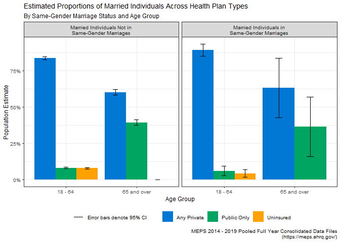
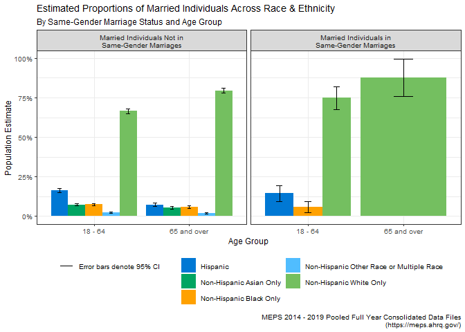
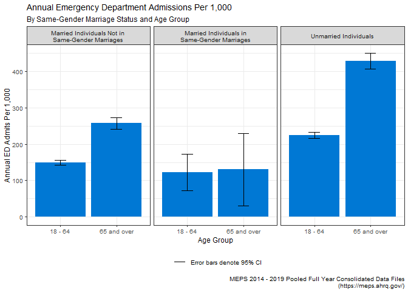
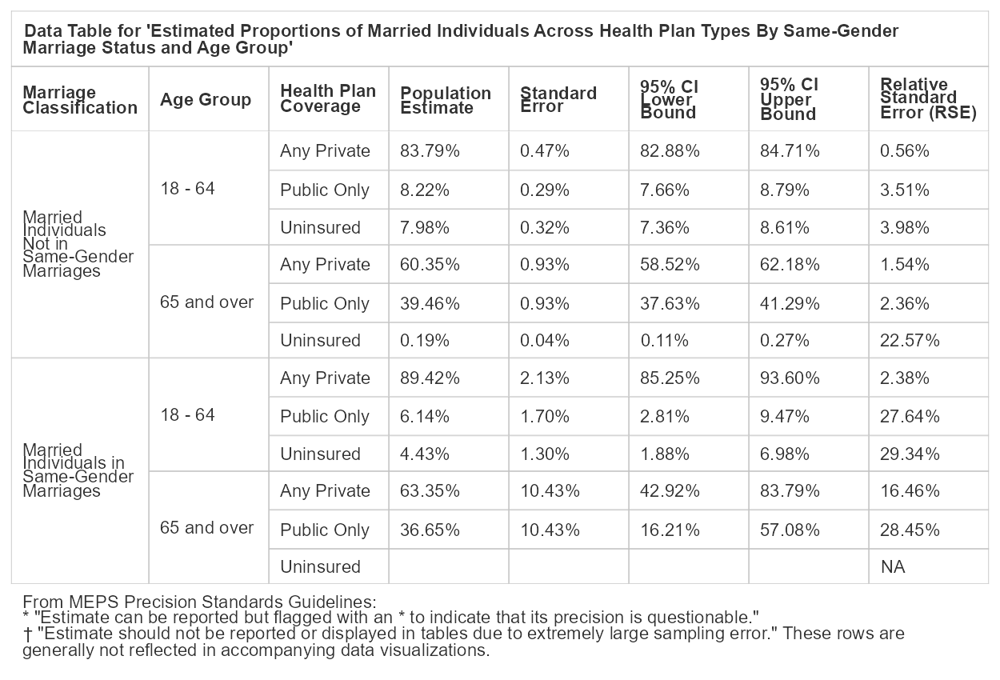
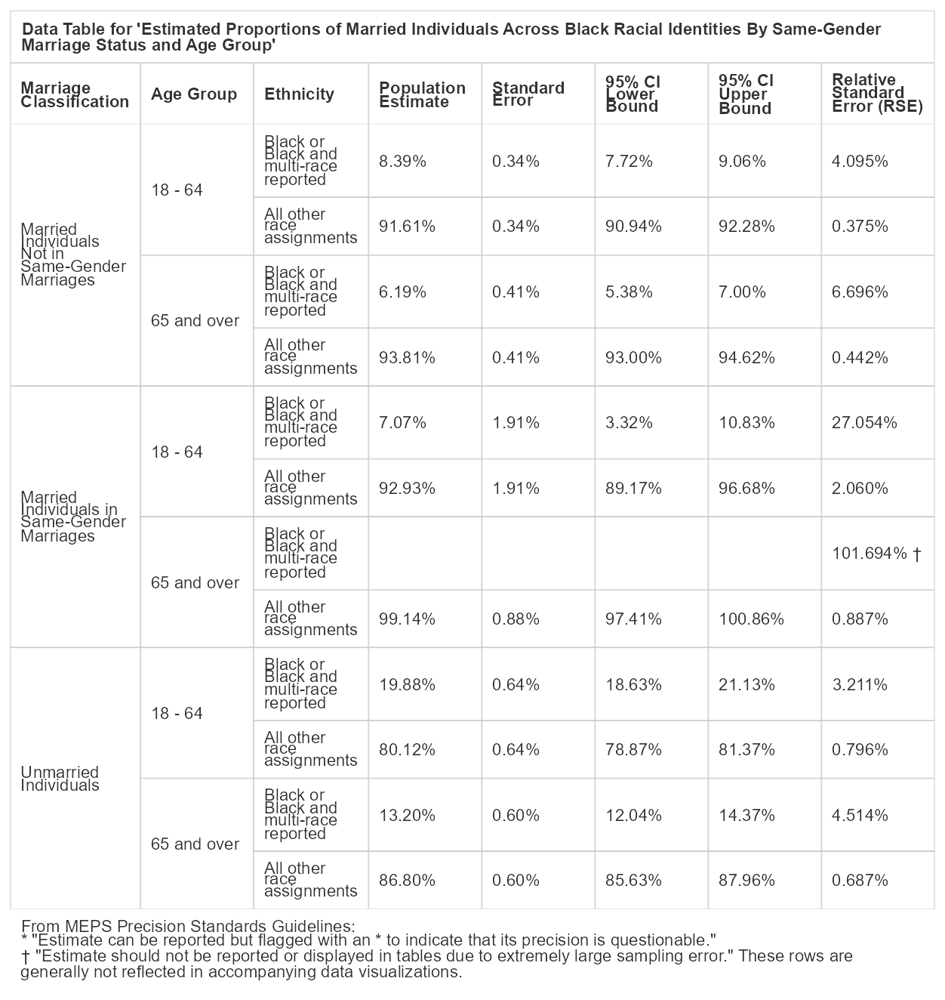
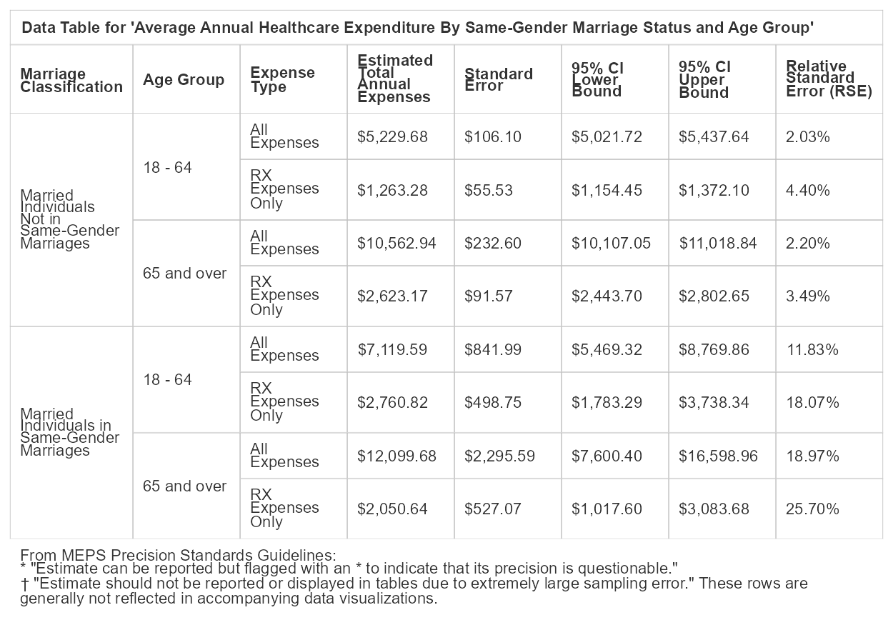
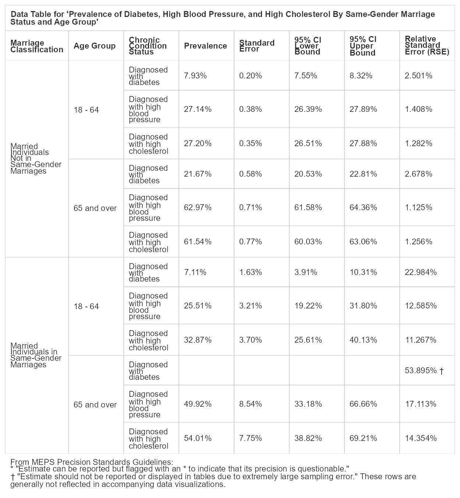

Healthcare Experiences of Medicare-Aged LGBTQ+ Individuals in the US
================
C. Seth Lester, ASA, MAAA
([Seth.Lester@milliman.com](mailto:seth.lester@milliman.com))  
10 September 2023 (final version)

*The following paper is a submission in reply to the [Society of
Actuaries’ Call for
Papers](https://www.soa.org/research/opportunities/call-for-papers-list/)
under the heading “[Aging and Retirement Issues for LGBTQ+ People –
Second
Invitation](https://www.soa.org/research/opportunities/2022-aging-retirement-lgbtq/)”.*

# Background and Purpose

The “Don’t Ask, Don’t Tell” policy prohibiting gay, lesbian, and
bisexual servicemembers from serving openly in the United States Armed
Forces was repealed in 2011. A few years later, the Supreme Court
decision in Obergefell v. Hodges effectively ended state-level bans on
same-gender marriages. In recent years, the level of discrimination that
some LGBTQ+-identifying subpopulations face in society is rapidly
decreasing; for others, such as transgender individuals, there are still
impactful and endemic stigmas in play which act as a barrier to living
full and rewarding lives. Barriers such as state-level restrictions on
gender affirming care, for example, have inhibited the ability of many
people who identify as LGBTQ+ from enjoying the same protections of our
social safety net – such as healthcare and retirement security systems –
that are enjoyed by non-LGBTQ+-identifying people.

It is currently difficult to credibly estimate how healthcare-related
outcomes, such as total individual healthcare expenditures or emergency
department utilization, differ between Medicare-aged (i.e., individuals
aged 65 and over) LGBTQ+ and non-LGBTQ+ populations. It is also
difficult to quantify the differences in healthcare outcomes among
intersectional subpopulations within the United States’ Medicare-aged
LGBTQ+ population. One key reason for this difficulty is the lack of
available data that can help guide our policymaking apparatus toward
better regulations and protections for members of society who are more
likely to be marginalized, stigmatized, or disadvantaged by systemic
factors. These groups include LGBTQ+ people, of course, but also heavily
intersects with people of color, women, religious minorities,
foreign-born individuals, disabled individuals, and – key to this paper
– the US’ rapidly growing population over age 65.

Even though many discriminatory laws and policies targeting LGBTQ+
populations been repealed or removed in recent years, it is reasonable
to suspect that Medicare-aged LGBTQ+ individuals encounter different
healthcare experiences and outcomes than their non-LGBTQ+ counterparts,
and that investigating differences in healthcare experiences and
outcomes between Medicare-aged LGBTQ+-identifying individuals and their
non-LGBTQ+ Medicare-aged or non-Medicare-aged LGBTQ+ counterparts can
give us better information about how the Medicare-aged LGBTQ+ population
should plan and prepare for healthcare experiences in retirement.

The primary goal of this paper is to motivate additional and more
rigorous research into the specific healthcare outcomes-related
challenges faced by current and future Medicare-aged LGBTQ+ individuals
within the United States. The paper also describes a preliminary
investigation of healthcare outcomes experienced by Medicare-aged LGBTQ+
populations using an analysis of the public use files (PUFs) made
available by the [Medical Expenditure Panel
Survey](https://meps.ahrq.gov/mepsweb/) (MEPS). This analysis leverages
an approach to enriching existing data sources for LGBTQ+ status in lieu
of self-reported or unreported information about population sexual
orientation or gender identity.

This paper is divided into two primary sections:

1.  In [Data and Methodology](#data-and-methodology) a consistent data
    preprocessing approach for identifying certain cohorts who are
    likely to identify as LGBTQ+ within the MEPS public data files is
    thoroughly explained; and
2.  In [Visualizing Healthcare Experiences for LGBTQ+
    Subpopulations](#visualizing-healthcare-experiences-for-lgbtq-subpopulations)
    a visual representation of preliminary findings around key
    healthcare experiences and outcomes between Medicare-aged LGBTQ+
    cohorts and other relevant cohorts is showcased. These findings
    describe healthcare outcomes commonly of interest to population
    health analyses, such as total pharmacy expenditure per individual,
    and average pharmacy utilization, average inpatient length-of-stay,
    and average hospital emergency department utilization utilization,
    to name a few.

The R code that performs this analysis and prepares the this document,
including all data tables and visualizations, is available [on
Github](https://github.com/bentwheel/lgbtq-retirement-meps-analysis).

# Data and Methodology

## About MEPS

The Medical Expenditure Panel Survey has been administered in its
current form since 1996, and according the [Agency for Healthcare
Research and Quality](https://www.ahrq.gov/) (AHRQ), the government
agency at MEPS’s helm, MEPS is a collection of “data on the specific
health services that Americans use, how frequently they use them, the
cost of these services, and how they are paid for, as well as data on
the cost, scope, and breadth of health insurance held by and available
to U.S. workers” ([Survey Background, MEPS
Homepage](https://meps.ahrq.gov/mepsweb/about_meps/survey_back.jsp)).

Because MEPS data is drawn from survey respondents, any analysis of MEPS
data is subject to many of the usual strengths and limitations of survey
data analysis. One major weakness of using survey data to perform
inferential analysis is that data from respondents is often
self-reported or imputed and is not always accurate. Therefore, there
are some situations in which it would be advisable for individuals using
this data to perform additional data quality checks. For example, an
analyst might want to compare, in aggregate, the results of two separate
but related survey questions, such as the count of individual
respondents that have a valid person ID (PID) value for spouse ID
(SPOUID) against the count of individuals who indicated that they are
currently married.

Additionally, MEPS provides [statistical precision
guidelines](https://meps.ahrq.gov/survey_comp/precision_guidelines.shtml)
about applying and displaying the results of inferential statistical
methods using the data, which include restrictions and guidance
concerning minimum sample sizes of cohorts used in statistical methods,
as well as standards establishing acceptable standard error thresholds
of estimates calculated using statistical methods. This guidance is
discussed at length in a subsequent section of this paper.

## About the MEPS Public Use Files

MEPS is administered in two distinct components - the [Household
Component](https://meps.ahrq.gov/mepsweb/survey_comp/household.jsp),
which was used to generate the preliminary findings in this paper, and
the Insurance Component, which is not publicly available for download
and must be accessed in a [Federal Statistical Research Data
Center](https://www.census.gov/content/census/en/about/adrm/fsrdc/locations.html).
Data from the Insurance Component was not used in this analysis.

The MEPS Household Component “fields questionnaires to individual
household members to collect nationally representative data on
demographic characteristics, health conditions, health status, use of
medical care services, charges and payments, access to care,
satisfaction with care, health insurance coverage, income, and
employment” ([Household Component, Survey Background, MEPS
Homepage](https://meps.ahrq.gov/mepsweb/survey_comp/household.jsp)).

MEPS data files have been used in the past to generate many findings
within the academic disciplines of public health and health policy. Some
specific examples of scientific literature containing analyses of MEPS
data relevant to the current strategic research initiatives of the
[Society of Actuaries Research
Institute](https://www.soa.org/programs/strategic-research-program/) are
given below:

- [Medical Expenditure Panel Survey: a valuable database for studying
  racial and ethnic disparities in prescription drug
  use](https://pubmed.ncbi.nlm.nih.gov/18794032/)
- [Any Use and “Frequent Use” of Opioids among Elderly Adults in
  2018-2019, by Socioeconomic
  Characteristics](https://pubmed.ncbi.nlm.nih.gov/35696517/)
- [Healthcare Expenditures for Treatment of Mental Disorders: Estimates
  for Adults Ages 18 and Older, U.S. Civilian Noninstitutionalized
  Population, 2019](https://pubmed.ncbi.nlm.nih.gov/35696514/)
- [Comparison of the Total Number of People in the U.S. Civilian
  Noninstitutionalized Population Purchasing One or More Antidepressant
  or Antipsychotic Prescriptions by Select Sociodemographic
  Characteristics, 2013 and
  2018](https://pubmed.ncbi.nlm.nih.gov/35696503/)
- [Top Five Most Costly Conditions among Adults Age 18 and Older, 2012:
  Estimates for the U.S. Civilian Noninstitutionalized
  Population](https://pubmed.ncbi.nlm.nih.gov/28783295/)

One piece of information that is absent from the long list of data
points sampled in the MEPS Household Component is whether individual
respondents identify as any LGBTQ+ subpopulation. This lack of
information presents a major challenge for using MEPS public use files
to investigate healthcare outcomes experienced by LGBTQ+ individuals in
the US. However, a method for identifying some individuals who are very
likely to identify as LGBTQ+ is described in further detail in the next
section.

Since the LGBTQ+-identifying population in the United States [is a
relatively small subset of the overall
population](https://www.pewresearch.org/short-reads/2023/06/23/5-key-findings-about-lgbtq-americans/),
MEPS data PUFs from surveys representative of years between 2014 and
2019 (see table below) are pooled together to produce the data
visualizations and tables within this paper.

The purpose of pooling the MEPS PUFs across such a long span of time is
to build a cohort of Medicare-aged (i.e., aged 65 and up) LGBTQ+
individuals that is large enough to comply with MEPS’ [statistical
precision
guidelines](https://meps.ahrq.gov/survey_comp/precision_guidelines.shtml)
for applying statistical methods to generate population-level estimates
of this cohort’s demographic composition and measurable healthcare
outcomes.

All MEPS Full Year Consolidated data PUFs used in this analysis contain
variables pertaining to survey administration, income, person-level
conditions, health status, disability days, quality of care, employment,
health insurance, and person-level medical care use and expenditures. A
list of all MEPS PUFs used in this analysis is in [Appendix
B](#appendix-b-meps-pufs-used).

## Identifying Individuals in Same-Gender Marriages in the MEPS Public Use Files

As stated earlier, there is no LGBTQ+ indicator in the MEPS survey
questionnaires that are administered to respondents. Therefore, in this
paper, the simplifying assumption that individuals in same-gender
marriages are members of the US subpopulation identifying as LGBTQ+ is
made. To determine which individual respondents in the MEPS PUFs are in
same-gender marriages, the members of all unique dwelling units and
family units are first grouped together. These groupings are then
scanned for individuals that meet the following criteria:

- **Married individuals**: For any member of a dwelling unit + family
  unit grouping, if there are two records with unique person IDs (PID)
  whose values for spouse ID (SPOUIDYY) are symmetrically related, then
  these individuals are labeled as married. This approach does not
  include individuals who are married but whose spouse does not reside
  in the same dwelling unit + family unit grouping.
- **Individuals in same-gender marriages**: For any two individuals
  within a dwelling unit + family unit grouping labeled as married, if
  their value for gender (SEX) is identical, then they are labeled as
  being in a same-gender marriage.

Below are several examples of actual records and fields in the [2019
MEPS Full Year Consolidated PUF
Codebook](https://meps.ahrq.gov/mepsweb/data_stats/download_data_files_codebook.jsp?PUFId=H216)
provided in order to showcase the methodology used to construct the
same-gender marriage flag in the MEPS PUFs.

There are many shortcomings to this approach, as this approach will fail
to identify certain individual respondents who may identify as LGBTQ+,
such as:

- Any individual who may identify as LGBTQ+ but is married to someone of
  a different gender (e.g., individuals who identify as transgender or
  bisexual and are married to an individual who is not the same gender);
  and,
- All unmarried persons who identify as LGBTQ+.

However, this approach will succeed in identifying any
LGBTQ+-identifying individual married to any other LGBTQ+-identifying
individual, in cases where both spouses have the same gender marker.

While this approach undercounts some subgroups within the broader LGBTQ+
population, it can still be used to determine if there are substantial
differences in the underlying demography, patient experiences, or
incurred expenses between subpopulations in same-gender marriages and
otherwise-similar subpopulations not in same-gender marriages. Although
these cohorts do not fully represent LGBTQ+- and non-LGBTQ+-identifying
subpopulations, they might be useful proxies given the lack of publicly
available data concerning individuals who explicitly identify as LGBTQ+.
And, since publicly available data specifically relevant to healthcare
experiences of Medicare-aged LGBTQ+ individuals is not abundant, this
approach, while limited, can yield information that is not widely
available from other public or private data sources.

In this paper, evidence supporting the possibility that marriage (or
perhaps cohabitation, more generally) has a confounding influence on
some of the population-level estimates of measurements of interest
(e.g., annual healthcare expenditures, emergency room utilization, etc.)
will be discussed. Therefore, most data visualizations and data tables
in this paper will present findings comparing key population-level
estimates between married individuals in same-gender marriages against
married individuals not identified as being in same-gender marriages in
order to control for the potential of confounding effects from marriage.

## MEPS Precision Guidelines for Population-Level Estimates

In most cases, the MEPS statistical precision guidelines require that
any estimates of statistics (e.g., means, total counts, or proportions)
based on categorical indicators (e.g., race, gender, etc.) or numeric
variables (e.g., mean number of RX fills per year) adhere to the
following two restrictions:

1.  The underlying sample data associated with the subpopulation from
    which the estimates are derived should consist of at least 60
    sampling units. The sampling units can be families or individuals,
    but in this case are individual respondents.
2.  If the relative standard error (RSE) corresponding to an estimate of
    a statistic of interest exceeds 0.5, it should not be displayed in
    data tables or visualizations of findings. Furthermore, if the RSE
    of the corresponding population-level estimate exceeds 0.3, it must
    be called out in any charts or tables as questionable. Relative
    standard error can be computed as:
    $$ RSE = \frac{Std. Err}{Estimate} $$ and is displayed as a
    percentage in the data tables in [Appendix
    A](#appendix-a-data-tables) for all population-level estimates
    computed in this paper.

## Sample Sizes Before Pooling Across MEPS Years

In the data visualization below, the minimum sample threshold required
by the MEPS precision standards guidelines (*n* = 60) is denoted by a
dashed red line. This visualization shows that every individual-year
sample representing this paper’s cohort of interest (individuals in
same-gender marriages aged 65 and up) fails to meet the sample size
requirement in any single year.

Additionally, there should be some concern about the statistical
validity of population-level estimates that are computed by applying
weights to very small cross-sectional subsets of the MEPS respondent
data, especially when the subpopulation of interest (in this paper,
individuals over age 65 in same-gender marriages) was sampled across
demographic strata that have little to do with this particular
demographic subpopulation.

## Population-level Estimates Before Pooling

The following table displays population-level estimates for the total
number of married individuals within the United States, broken out by
MEPS survey year, which have been calculated based on the individual
respondents in each group and their associated weighting. Furthermore,
stratum-level variances are also used to compute a measure of the
estimate’s precision, which is expressed as a standard error
measurement, relative standard error (RSE), and the lower and upper
bounds of the 95% confidence interval.

Additionally, the population-level estimates and squared errors
displayed in the table can be used to construct a visualization of these
estimates and the corresponding level of statistical variability around
them, which is potentially more helpful in monitoring the data for
opportunities where more rigorous investigation would bear statistically
meaningful insights.

As in the chart above, and in subsequent visualizations of
population-level estimates of key findings in this essay, each of the
solid bars represents a population-level estimate of the statistic of
interest for the entire US population. The error bars accompanying each
solid bar represent the upper and lower bounds of the 95% confidence
interval around the corresponding population-level estimate.

In other words, each solid bar represents an *estimate* of the
population measure based on survey data; that is the bar is intended to
represent a good (but not exact) guess at the “true” population-level
measure of interest.

The error bars can be interpreted as expressing the level of variability
around that guess. In other words, a survey analyst can be confident at
a 95% level that the “true” population-level measure of interest, if
they were able to survey the entire US population, would be positioned
somewhere in between the top and bottom of the associated error bar. As
in most cases, estimates with larger underlying sample sizes (e.g., in
this analysis, the cohort of individuals aged 18 – 64 not in same-gender
marriages) will tend to be expressed with much less variability than
estimates with smaller underlying sample sizes.

In many cases, the estimates of population-level statistics will appear
to show meaningful differences among cohorts in this paper’s
visualizations. It is important to also contextualize these statistical
estimates by using the error bars. When viewing the data visualizations
that follow, make use of the error bars to question the degree of belief
to which the estimates reflect “true” population-level differences
between cohorts. For example, if the solid bars for two populations show
different estimates, but the error bars overlap, a healthy degree of
skepticism should be used when drawing conclusions about potential
differences.

Finally, while inspecting the data visualizations in this paper, please
refer to the corresponding data table in [Appendix
A](#appendix-a-data-tables) for additional information about the
estimates or their variability and statistical validity. Validation of
results against independent sources is a key component of any analysis
that imputes or infers population-level measures. Several comparisons
against independent sources are made in following sections.

## A Validation Example: Estimating the Number of Same-Gender Marriages in the US

As a validation exercise, a population-level estimate of total counts of
individuals in same-gender marriages in the table above, drawn from a
MEPS survey year that does meet the MEPS statistical precision
guidelines for sample size, can be compared against a comparable
estimate derived from published findings which are not related to MEPS.

For example, the data from 2016 represents the US population one year
after *Obergefell v. Hodges* effectively legalized same-gender marriages
across the US. In this year, a total of 94 individuals in same-gender
marriages were sampled by MEPS – 83 individuals under age 65 and 11
individuals over age 65 – so this subsample meets the MEPS statistical
precision requirements for sample size (n ≥ 60). Despite the relative
recency of this court decision, several US states legally recognized
same-gender marriages at the time, so the 2014 and 2015 PUFs do contain
individuals in same-gender marriages even though same-gender marriages
were not legally recognized nationwide until after the *Obergefell*
decision.

The visualization and accompanying data table above reports the
population-level estimate of the number of individuals aged 18 - 64 in
same-gender marriages in the US as 982,877. The corresponding estimate
for individuals in same-gender marriages aged 65 and up is 167,152. It
is statistically valid (in this case) to add these two estimates
together to estimate the total number of individuals in same-gender
marriages in the US at 1,150,029.

One external source for validating this combined estimate of total
individuals in same-gender marriages in the US in 2016 is the 2016
[American Community Survey](https://www.census.gov/programs-surveys/acs)
one-year estimate of this measurement, which places an [estimated count
of individuals living in “Same-Sex Married Couple
Households”](https://www.census.gov/content/dam/Census/library/publications/2021/demo/p70-167.pdf)
(p. 22) at around 1,000,000 individuals. This is consistent with the
MEPS-derived combined estimate of the same measure.

Finally, note that, in some years, the representative sample is so small
for same-gender married individuals over age 65 that the computed lower
bound of the 95% confidence interval extends into negative territory,
which is nonsensical. Avoiding the presentation of estimates that are
too imprecise to provide any useful information is the primary reasoning
given by MEPS for imposing the RSE restriction in their statistical
precision guidelines.

Data visualizations and their corresponding data tables in this paper
will not display any estimates for subgroups in which the RSE of the
population-level estimate exceeds the 50% threshold specified in the
MEPS statistical precision guidelines (denoted in corresponding data
tables by the symbol “†”).

## Population-level Estimates After Pooling MEPS Data Years

Since this paper’s aim is to compare the healthcare experiences or
expenses between LGBTQ+ subpopulations in same-gender marriages and
non-LGBTQ+ subpopulations with a focus on individuals aged 65 and up,
the MEPS precision guidelines described above require pooling data
across multiple years for this analysis. This is because any single-year
MEPS files lack the required number of respondents (*n* \>= 60) aged 65
and up and in same-gender marriages.

The US Census Bureau’s American Community Survey site provides [a set of
best
practices](https://www.census.gov/programs-surveys/acs/guidance/estimates.html)
for when to use pooled data from multiple years versus only a single
year of data. These best practices are applicable when pooling across
multiple years of MEPS data, as well. Pooling across multiple years is
generally a best practice when statistical precision around estimates is
more important than recency, and when the analysis is centered on a very
small subsample of the population.

MEPS prescribes a methodology for pooling across multiple data years
within [the documentation for the Pooled Linkage
PUF](https://meps.ahrq.gov/data_stats/download_data/pufs/h036/h36u20doc.shtml).
This PUF contains survey weights and variances at the sampling unit and
demographic stratum level to enable pooling across multiple years.
Sample sizes after pooling across 2014 - 2019 are shown in the figures
below.

Once pooling from 2014 - 2019 is completed, both age groups in the
same-gender marriage subpopulation meet the minimum sample size of 60
required by the MEPS statistical precision guidelines (*n* = 435 for the
18 - 64 age band, *n* = 62 for the over 65 age band). However, with just
barely over 60 respondents in the latter group, there is a good deal of
variability around estimates of measurements for this cohort.

## Another Validation Example: Using Pooled MEPS Data

Using the pooled 2014 - 2019 data to compute population-level estimates
yields an estimate of 1,051,043 total individuals in same-gender
marriages within the US, arrived at by adding the estimated totals for
each subgroup (900,950 for the “18 to 64” age band, plus 150,093 for the
“65 and over” age band) as done in the previous validation example.

Once again, this estimate can be compared to [findings from the American
Community Survey for
2019](https://www.census.gov/content/dam/Census/library/publications/2021/acs/acsbr-005.pdf)
which reports the total estimated count of same-sex married individuals
at 1,136,220 (two times the number of same-sex married couple
*households* reported in Table 1, on page 2), which is relatively
similar to the MEPS-derived estimate of the same quantity.

# Visualizing Healthcare Experiences for LGBTQ+ Subpopulations

It is important to first frame this paper’s visual analysis with the
primary objective of calculating various statistical estimates
calculated using the pooled MEPS for the baseline cohort (individuals
age 65 or older in same-gender marriages), and then comparing those
estimates against the same statistical estimates calculated for three
relevant comparison cohorts, as described in the image below.

This approach is helpful to contextualize certain health-related
outcomes or demographic compositions that are similar between some
cohorts and perhaps will offer a glimpse into the key drivers of
differences observed between these groups.

## Exploring the Demographic Composition of LGBTQ+ Subpopulations

Meaningful differences in demographic composition between these cohorts
can act as potential confounding factors when analyzing potential
differences in healthcare quality, patient experiences, and
healthcare-related expenditures. The sections below provide a high-level
overview of demographic comparisons between the baseline cohort and the
comparison cohorts.

### Gender

Despite the larger degree of uncertainty around estimates of gender
proportions in the cohort of individuals in same-gender marriages,
gender composition appears to be similar among all cohorts. From this
visualization it is not possible to definitively claim any differences
between gender proportions in the same-gender marriage cohorts (in the
panel on the right) and their counterpart cohorts not in same-gender
marriages (on the left). This is because the estimates of proportions on
the left all fall within the error bars surrounding the corresponding
estimates depicted on the right.

A recent poster ([Age Differences Among Coresidential
Partners](https://www.census.gov/library/working-papers/2023/demo/SEHSD-WP2023-10.html))
published by the US Census Bureau and based on data from the 2021
American Community Survey found that the average age difference between
opposite-gender married couples is 3.69 years, and that individuals in
same-gender marriages tend to have a larger age difference than married
individuals not in same-gender marriages. For instance, the average age
difference between male-male married couples is 3.47 years (p\<0.001)
greater than the average age difference between opposite-gender couples
and, similarly, the average age difference between female-female couples
is 1.33 years (p\<0.00) greater than the average age difference among
opposite-gender married couples.

In constructing the baseline and comparison cohorts, a line of
demarcation has been drawn at age 65. Past this line there is an
expectation of a slightly greater proportion of men than women due to
the average age gap in married couples in the US. The more pronounced
differences in the visualization of gender distributions between the two
cohorts of individuals aged 65 and over and two cohorts of individuals
aged 18 – 64 are consistent with expectations.

### Health Plan Coverage

In the MEPS datasets, the three levels in the health plan coverage
variable are defined as follows:

- **Any Private** includes individuals who have both Medicare and any
  other private comprehensive plan, such as a Medicare Supplement (aka
  “Medigap”) plan, a commercial employer-sponsored plan, or an ACA plan
  underwritten on an individual or family basis. This category also
  includes individuals over age 65 exclusively on a private plan, which
  includes Medicare Advantage and TRICARE beneficiaries.
- **Public only** includes individuals who do not have any other private
  supplemental coverage who are covered by traditional “fee-for-service”
  Original Medicare plans, Medicaid plans, or other public and
  state-sponsored plans (such as CHIP).
- **Uninsured** includes any individual with no private or public
  coverage.

There does not appear to be any significant differences between
distributions of coverage rates among the cohorts. As [marital status is
an important predictor of uninsured
status](https://www.census.gov/newsroom/blogs/random-samplings/2014/09/married-with-health-insurance.html),
it is useful for the purposes of this analysis that the baseline and
comparison cohorts within this visualization consist exclusively of
married individuals. Nonetheless, it does appear that the uninsured rate
for individuals in the 18 - 64 age band in same-gender marriages is only
slightly more than half of the uninsured rate for individuals in the
18 - 64 age band not in same-gender marriages. Due to the
non-overlapping confidence intervals for these estimates, this could be
a statistic of interest but also could be influenced by other factors,
such as race and ethnicity, which will be investigated separately.

The MEPS data for the period of 2014 - 2019 does not appear to contain
even a single respondent who is 65 or older and in a same-gender
marriage, and uninsured. Therefore, an estimate of the uninsured rate
for the cohort of individuals over 65 in a same-gender marriage cannot
be determined from this data. For individuals over 65 not in same-gender
marriages, the estimate of the uninsured rate is centered at 0.19% (with
a 95% CI of 0.04% - 0.11%).

Estimates of coverage type distributions for all cohorts are consistent
with findings from a [2019 statistical
report](https://www.cdc.gov/nchs/data/nhsr/nhsr159-508.pdf) published by
the US Department of Health and Human Services based on data from
another survey.

### Race and Ethnicity

MEPS data contains individual-level responses for questions that poll
respondents for racial identity and ethnicity. For responses to
questions surveying racial identity, the MEPS questionnaire does not
offer a “Latine” option, but does poll respondents for an ethnicity
response, coded as either “Hispanic” or “Not Hispanic” with another
accompanying variable that breaks respondents who indicate an ethnicity
of “Hispanic” into subgroups based on geographic origin. As a refresher,
more information about the difference between coding “Hispanic” as an
individual’s ethnicity versus “Latine” as an individual’s racial
identity can found in an article from the Office of Equity, Diversity &
Inclusion at the Duke University School of Medicine, [“Ask the OEDI:
Hispanic, Latino, Latina, Latinx - Which is
Best?”](https://medschool.duke.edu/blog/ask-oedi-hispanic-latino-latina-latinx-which-best).

Distributions of proportions of race and ethnicity status appear to be
relatively comparable across all cohorts, where comparison subsets are
available for comparison. Many of the race and ethnicity breakouts in
the same-gender marriage cohort are suppressed from the graph due to
large RSE values associated with these estimates, as required by the
MEPS statistical precision. Differences between cohorts observed here
appear to be in line with known relationships between marital status and
age, race, and ethnicity factors, such as:

- **Across all race and ethnicity groups, fewer individuals in the US
  are marrying now versus in the past.** In 2022, [the US Census Bureau
  published
  findings](https://www.census.gov/newsroom/press-releases/2022/americas-families-and-living-arrangements.html)
  that 34% of individuals age 15 and up (the youngest age at which one
  can marry in some US states) have never been married. This is an
  increase from 23% observed in 1950. [Marriage rates in the US have
  persistently declined over time and are at an all-time low
  today](https://www.pewresearch.org/social-trends/2021/10/05/rising-share-of-u-s-adults-are-living-without-a-spouse-or-partner/).
- **Across all age groups, Black individuals have lower rates of
  marriage than other racial and ethnic groups.** The growing gap in
  marriage rates is a well-studied topic in sociology and demography
  journals and is thought to be caused by a number of factors, primarily
  “labor market disparities and other structural disadvantages that
  black people face, especially black men” ([“The Growing Racial and
  Ethnic Divide in U.S. Marriage
  Patterns”](https://www.ncbi.nlm.nih.gov/pmc/articles/PMC4850739/)).

Breaking estimates of the distribution of race and ethnicity proportions
out along so many lines can cause estimates of statistical precision to
become very high, especially in groups where estimates are computed on
smaller samples. Therefore, it is helpful to break out key racial and
ethnic identifiers in less granular subsets.

While exercising some caution around generalizing, as “Hispanic” is a
broad group, there do not appear to be significant differences between
the comparison cohort and baseline cohorts in the distributions of
marriage by age group and race.

This chart includes a third facet displaying distributions of
Black-identifying individuals among additional cohorts which contain
unmarried individuals in order to capture a visual representation of the
Black marriage gap within this data.

### Income Level

The federal poverty level (FPL) is [an income measure generated each
year by the US Department of Health and Human
Services](https://www.healthcare.gov/glossary/federal-poverty-level-fpl)
for the purpose of determining the eligibility of individuals and
families for certain state and federal health plans, assistance
programs, and other benefits. The HHS federal poverty level is based on
[statistical poverty thresholds determined and promulgated annually by
the US Census
Bureau](https://aspe.hhs.gov/topics/poverty-economic-mobility/poverty-guidelines/frequently-asked-questions-related-poverty-guidelines-poverty),
which are determined at the household level based on family size, number
of children, and in some cases, the presence of older individuals.
Therefore, an individual’s total family income as a percentage of FPL is
calculated using a value of FPL that varies across individuals based on
these factors. The following visualization compares the baseline and
comparison cohorts against one another expressed in terms of total
income across all family members divided by the applicable federal
poverty level.

In states that have elected to expanded Medicaid coverage (as of this
writing, 41 states including DC), individuals in households with income
below 138% of the applicable FPL are generally eligible for Medicaid
coverage based on income determination alone. In contrast, individuals
in households with income at or above 400% FPL are generally ineligible
for ACA premium tax credits or Medicaid benefits. The binned levels of
income as a percentage of FPL used in the visualization below are
relevant to eligibility thresholds for various state- and federally
funded or reduced-cost health plans.

Although the distributions of income as a percentage of FPL appear to be
fairly consistent among all cohorts, it appears there could be a
meaningful difference (i.e., only a tiny overlap in associated
confidence intervals) for estimates of total proportions earning less
than 100% of FPL between the cohort of individuals aged 18 - 64 in
same-gender marriages and the cohort of individuals aged 18 - 64 not in
same-gender marriages. The same comparison is not available for the
cohorts consisting of Medicare-aged individuals due to a lack of
statistical credibility for the cohort of individuals in same-gender
marriages aged 65 and up. This difference could be further investigated
using a broader survey that contains these data elements and is
administered to a larger number of respondents, such as the [US Census
Bureau’s Household Pulse
Survey](https://www.census.gov/data/experimental-data-products/household-pulse-survey.html).

## Exploring Healthcare Outcomes for LGBTQ+ Subpopulations

The preceding visual comparisons of demographic measures between the
baseline and comparison cohorts help us to better understand the notion
of intersectionality between the many subpopulations within the broader
LGBTQ+ population in the US. In the following section, whether marital
status is a predictor of healthcare outcomes experienced by the
comparison and baseline cohorts will be explored, as well as whether
healthcare outcomes differ significantly between individuals in
same-gender marriages and individuals not in same-gender marriages for
both age group cohorts.

It is also the case that LGBTQ+ individuals can possess unique
healthcare needs or face different barriers to access to healthcare,
both of which can move the needle on the cost of healthcare. This is
particularly true for individuals in retirement because non-working,
Medicare-aged individuals generally have less access to financial
resources and are more likely to face one or more highly prevalent
chronic conditions such as heart disease, diabetes, or hypertension,
which can lead to high-cost encounters if not properly managed.

### Emergency Department Utilization

Emergency Department (ED) utilization is a key statistic of interest
because hospital admissions that start in the ED are frequently regarded
as potentially avoidable, thus presenting unnecessary financial and
quality of life burdens for Medicare-aged individuals. Hospital
organizations routinely report total ED visits on both a total aggregate
basis as well as a same-facility basis. For example, total ED
utilization is listed in the most recent (as of this writing) [quarterly
earnings
report](https://investor.hcahealthcare.com/news/news-details/2023/HCA-Healthcare-Reports-First-Quarter-2023-Results/default.aspx)
from [HCA Healthcare](https://hcahealthcare.com/about/), a
publicly-traded hospital organization with more than 182 hospitals and
2,300+ care delivery sites in the US and UK.

Due to the relative rarity of hospital emergency room admission, ED
admits are typically expressed in terms of annualized admits per 1,000
members for a given time period. The visualization below uses MEPS data
pooled across 2014 - 2019 to build a statistical representation of ED
utilization over a period of one year. Results are consistent with
[annual emergency room utilization reports from Kaiser Family
Foundation](https://www.kff.org/other/state-indicator/emergency-room-visits-by-ownership/).

In this visualization, a panel containing unmarried individuals was
included to showcase how marital status could be predictive of hospital
emergency room utilization. Additionally, it appears as if more
investigation could be warranted regarding the relatively low ED
utilization rate in the cohort of individuals 65 and over in same-gender
marriages; though there is no overlap in the confidence interval
boundaries for this estimate and the equivalent estimates of other
cohorts of individuals over age 65, it would be important to control (at
least) for gender and racial confounders before drawing any conclusion.

### Total Inpatient Days

Another important measure in evaluating health outcomes and utilization
patterns in a population is the total number of days (or, sometimes,
overnights) that all individuals within the cohort of interest spent in
inpatient hospital facilities for each admission. This measure is often
also reported as “total hospital (in)patient-days.” This statistic, much
like total ED utilization, is frequently reported by hospital
organizations because it can be very predictive of other measures
concerning quality, patient outcomes, and the total cost of care
delivered in inpatient hospital encounters.

Moreover, measures of total inpatient days are also highly predictive of
hospital readmissions. A related concept, inpatient length of stay, is a
component of one of the oldest indices, [the LACE
index](https://www.ncbi.nlm.nih.gov/pmc/articles/PMC2845681/), which is
used to predict post-discharge mortality or unplanned readmission after
discharge from an inpatient facility. Reducing readmissions is a key
focus for the Centers for Medicare and Medicaid Services (CMS), the
federal agency that oversees or regulates Medicare and Medicaid
administration, which [published findings in
2014](https://www.kff.org/wp-content/uploads/sites/2/2014/10/brennan.pdf)
claiming that nearly one in five Part A Medicare beneficiaries enrolled
in fee-for-service Medicare returns to the hospital within 30 days of
being discharged. In this same study, CMS attributed \$26 billion per
year to the cost of these readmissions, of which \$17 billion was
associated with potentially avoidable readmissions.

While it is possible to investigate readmission rates directly using
MEPS data, the methodology is complex and involves the use of
[additional data
files](https://meps.ahrq.gov/mepsweb/data_stats/download_data_files_detail.jsp?cboPufNumber=HC-213D).
Therefore, only an examination of total inpatient days between the
baseline and comparison cohorts is presented in the visualization below.
Like ED utilization, measures of total hospital inpatient days are
commonly expressed per 1,000 patients/members over a time period. The
visualization below uses MEPS data pooled across 2014 - 2019 to build a
statistical representation of total inpatient days per 1,000 patients
over a period of one year. Results are consistent with [annual
inpatient-days per
1,000](https://www.kff.org/other/state-indicator/inpatient-days-by-ownership/)
reported annually by Kaiser Family Foundation.

Similar to other visualizations in this paper, the panel containing
estimates of total length of stay for unmarried individuals has been
included once again to highlight the fact that marital status is
well-known in population health academic literature to be predictive of
measures of length of stay in hospital inpatient facilities. [A study of
over 40,000 adult hospital patients in 1988 -
1991](https://pubmed.ncbi.nlm.nih.gov/7503606/) found that, after
controlling for illness severity, age, gender, race, and diagnosis type,
“hospital charges and length of stay were 5% and 8% higher (P \< .001),
respectively, for unmarried than for married patients.” The study also
found that, overall, 40% of unmarried individuals were admitted with
high- or moderate-severity conditions as compared to only 32% in married
individuals.

Because total hospital days per 1,000 and higher severity inpatient
admissions are related, the above visualization suggests that unmarried
individuals experience inpatient admissions with a higher average level
of severity than married individuals. [A more recent
study](https://journals.sagepub.com/doi/10.1177/2151459319898648) of
just under 2,000 patients ages 55 and over admitted to a hospital
inpatient facility for orthopedic trauma found that “single and widowed
patients experienced 1.36 and 1.30 times longer length of hospital stays
than their married counterparts, respectively.”

Estimates of total length of stay for the cohort of individuals ages 65
and over in same-gender marriages have a RSE that exceeds the
MEPS-required threshold of 0.5 so it is suppressed from the data
visualization above. (Please refer to the associated data table in
[Appendix A](#appendix-a-data-tables) for additional information on this
and all other visualizations in this paper.)

### Total Annual Healthcare Expenditures & Drug Costs

In the 2022 Inflation Reduction Act passed by Congress and signed into
law by President Biden, [several reforms to the Medicare Part D
program](https://www.milliman.com/en/insight/inflation-reduction-act-health-plans-and-part-d-sponsors-need-to-know)
are set to be implemented in the coming years, including a provision
that allows CMS to negotiate prices for selected prescription drugs.

A substantial portion of the total medical expenditures incurred by
individuals in retirement is attributable to pharmacy spend, as shown in
the visualizations of total healthcare spend below, which include
breakout estimates of total individual healthcare spend as well as
pharmacy spend alone. Pharmacy spend reflects the total amount paid for
prescription drugs, covering both out-of-pocket expenditures as well as
gross payments (i.e., before rebates) made by third-party payers,
including both Part B and Part D drugs for Medicare beneficiaries.

This visualization has two key insights. Not surprisingly, total
pharmacy spend appears to be higher for Medicare-aged individuals
compared to pharmacy expenditures incurred by individuals ages 18 - 64.
In addition, there appears to be a difference in both total healthcare
spend, and total pharmacy spend between the cohort of individuals ages
18 - 64 in same-gender marriages and the cohort of married individuals
ages 18 - 64 not in same-gender marriages. Additional analysis of this
difference should consider age, race, and gender effects.

One explanation for this difference in expenditures could relate to the
high costs faced by LGBTQ+ individuals interested in starting a family.
There can be [large healthcare-related
expenses](https://www.familyequality.org/resources/building-lgbtq-families-price-parenthood/)
(in the tens of thousands of dollars) associated with various surrogacy
approaches, in-vitro fertilization (IVF), or reciprocal IVF. Further
analysis of this difference should also explore the degree to which
high-cost family planning procedures and pharmacy therapies may
contribute to the higher overall average healthcare spend in the cohort
of individuals ages 18 - 64 in same-gender marriages.

### Average Pharmacy Utilization

The following visualization addresses average utilization of
pharmaceutical therapies across the cohorts of interest by estimating
the average number of fills or refills per individual in a year.

The distributions of average pharmacy utilization per individual
presented by the visualization above appear consistent with [the same
measure reported by Kaiser Family
Foundation](https://www.kff.org/health-costs/state-indicator/retail-rx-drugs-per-capita/).

### Prevalence of Chronic Conditions

Medicare beneficiaries often make use of low-cost generic medications to
manage their chronic health conditions such as diabetes, hyperlipidemia
(high cholesterol), or hypertension (high blood pressure). Some examples
of very common drugs include non-insulin blood glucose reducing agents
like
[metformin](https://mor.nlm.nih.gov/RxNav/search?searchBy=String&searchTerm=metformin)
used for treating Type 2 Diabetes, statins like
[atorvastatin](https://mor.nlm.nih.gov/RxNav/search?searchBy=String&searchTerm=atorvastatin)
(brand name “Lipitor”) used for treating high cholesterol, or ACE
inhibitors like
[lisinopril](https://mor.nlm.nih.gov/RxNav/search?searchBy=String&searchTerm=lisinopril)
(brand names “Prinivil” or “Zestril”) to treat hypertension.

[Hypertension](https://pubmed.ncbi.nlm.nih.gov/29386200/), [type 2
diabetes](https://diabetesjournals.org/care/article/41/5/917/36518/Economic-Costs-of-Diabetes-in-the-U-S-in-2017),
and [high cholesterol](https://pubmed.ncbi.nlm.nih.gov/27787352/) are
clinical conditions that are frequently associated with individuals who
incur healthcare expenditures at above average levels. Therefore, if
Medicare-aged individuals can manage these conditions with regular
visits to their primary care provider(s) and by adherence to low-cost
drug therapies such as the drugs listed above, then they are less likely
to incur these potentially avoidable medical costs, ultimately helping
them to safeguard their financial security and well-being in retirement.

The visualization above displays estimates of the prevalence of these
select chronic conditions for the baseline and comparison cohorts.
Please note that the individuals reporting a diabetes diagnosis excludes
individuals with gestational diabetes. With the available sample, there
do not appear to be differences in the distributions of prevalence of
these chronic conditions that is worth noting, given the larger error
bars in the right-hand plot corresponding to the cohorts of individuals
in same-gender marriages.

MEPS also contains data on many other clinical conditions in a
collection of “priority condition variables,” which include the three
chronic conditions above as well as several more. These conditions are
of importance “because of their relatively high prevalence, and because
generally accepted standards for appropriate clinical care have been
developed” ([MEPS 2019 FYC File
Codebook](https://meps.ahrq.gov/data_stats/download_data/pufs/h216/h216doc.shtml#Person255)).
Many of these conditions are also known to lead to higher-than-average
costs for both Medicare-aged individuals and the healthcare system when
these conditions are not clinically managed. The MEPS priority
conditions that have a relatively high rate of prevalence in
Medicare-aged populations are summarized in the figure below.

While once again, distributions of estimates of prevalence for all these
major conditions do appear to be fairly consistent across the baseline
and comparison cohorts, more analysis might be warranted in studying the
lower prevalence of heart disease in the cohort of individuals age 65
and up in same-gender marriages, which appears much lower than the
estimate of prevalence for the cohort of individuals age 65 and up not
in same-gender marriages.

It is possible that racial identity has a confounding influence on the
observations of lower heart disease prevalence rates in the cohort of
individuals aged 65 and up in same-gender marriages. As discussed above,
Black individuals are less represented in cohorts of married
individuals. Furthermore, recent Milliman study ([Racial disparities in
healthcare: Cardiovascular
conditions](https://us.milliman.com/en/insight/racial-disparities-in-cardiovascular-conditions))
found that Black men and women had higher rates of prevalence than white
counterparts for three conditions in particular – late effects of
cerebrovascular disease, non-hypertensive congestive heart failure, and
hypertension with complications – across all insurance lines and age
groups. Due to this potential confounding influence, additional studies
of this finding should be designed appropriately to control for racial
identity.

### Average Family Size

One feature of a family unit that can drive the total cost of care at
the individual level is family size. Larger families within the same
dwelling unit can help take care of one another when sick, coordinate
transportation to and from sites where healthcare is provided, manage
childcare duties so that adults are able to arrange for healthcare
services, and so on. On the other hand, saving for retirement is likely
to be much more challenging when a couple is faced with the large number
of additional expenditures associated with raising and taking care of
children.

Several studies have shown a linkage between medication adherence and
family support, particularly among families in low-income socioeconomic
strata. In one study of 367 randomly sampled adult rural hospital
patients diagnosed with type 2 diabetes, researchers found [a
medium-to-high level of medication adherence associated with strong
levels of family
support](https://www.ncbi.nlm.nih.gov/pmc/articles/PMC8693738/). Another
meta-analysis of literature found [evidence of
association](https://pubmed.ncbi.nlm.nih.gov/29470115/) between weaker
social relationships and increased rates of hospital readmission and
longer hospital stays.

The measurement of family size in this visualization is limited to
respondents in the same dwelling unit who indicate they are related to
one another. Perhaps as expected, the estimate of average family size
for the cohort of individuals in same-gender marriages aged 18 - 64 is
about one child less than the estimate of average family size for
individuals aged 18 - 64 not in same-gender marriages.

# Conclusion

Due to the lack of data currently available that describes the
healthcare experiences specific to LGBTQ+ populations, it is important
to be creative about sourcing information that can help build policy and
insurance products to better prepare LGBTQ+ individuals for financial
prosperity and well-being in retirement.

Some examples of other potentially interesting variables in the context
of examining retirement-related outcomes alongside the ones shown in
this paper include:

    MILDIF31        DIFFICULTY WALKING A MILE - RD 3/1 
    MIAGED          AGE OF DIAGNOSIS-HEART ATTACK(MI) 
    WHTLGSPK        WHAT LANGUAGE SPOKEN OTHER THAN ENGLISH 
    DDNWRK19        # DAYS MISSED WORK DUE TO ILL/INJ 2019 
    ADRESP42        SAQ 12 MOS: DR SHOWED RESPECT 
    PROBPY42        FAMILY HAVING PROB PAYING MEDICAL BILLS 

MEPS provides a large and useful amount of data, collected annually for
nearly three decades through a rigorous survey framework. As noted in
this paper, survey data can impose limitations on the degree of
certainty around estimates of key measures, but on the other hand,
surveys like MEPS can still be used to aid key decision-makers in better
understanding the healthcare experiences and outcomes of many
subpopulations in the US, including those related to Medicare-aged
LGBTQ+ individuals. In particular, this paper addresses the significance
of an individual’s marital status – for both LGBTQ+ and non-LGBTQ+
individuals – for predicting measures of certain risks that can lead to
increased healthcare spend, such as measures of total inpatient
length-of-stay, uninsured rates, rates of readmission, and emergency
room utilization.

While isolating MEPS respondents based on same-gender marriage status is
one way of highlighting any differences in key healthcare measures
between this population and non-LGBTQ+ populations, perhaps a better way
of understanding these differences is simply by adding sexual
orientation/gender identity (SOGI) questions and terminology to the
standard MEPS questionnaire. The US Census Bureau took this very same
action in July 2021, when it began [surveying respondents for
information on sexual orientation and gender identity in its Household
Pulse
Survey](https://www.census.gov/library/stories/2021/08/household-pulse-survey-updates-sex-question-now-asks-sexual-orientation-and-gender-identity.html).
This very act of broadening the survey questionnaire led to [findings
from the US Census
Bureau](https://www.pbs.org/newshour/economy/the-census-bureaus-first-ever-data-on-lgbtq-people-indicates-deep-disparities)
that LGBTQ+-identifying individuals were more likely to “have lost
employment, not have enough to eat, be at elevated risk of eviction or
foreclosure, and face difficulty paying for basic household expenses” as
compared to their non-LGBTQ+ counterparts. Notwithstanding some of the
challenges associated with self-reported SOGI status due to respondent
concerns about stigma and discrimination, analysts must start somewhere
if the availability and quality of data for analysis is to be improved.

# Appendix A: Data Tables

# Appendix B: MEPS PUFs Used

| Data File                                                                                                                                                       | Description                                                                                                                                                                                                |
|:----------------------------------------------------------------------------------------------------------------------------------------------------------------|:-----------------------------------------------------------------------------------------------------------------------------------------------------------------------------------------------------------|
| [2019 Full Year Consolidated Data File](https://meps.ahrq.gov/mepsweb/data_stats/download_data_files_detail.jsp?cboPufNumber=HC-216)                            | This file consists of MEPS survey data obtained in Rounds 3, 4, and 5 of Panel 23 and Rounds 1, 2, and 3 of Panel 24, the rounds for the MEPS panels covering calendar year 2019.                          |
| [2018 Full Year Consolidated Data File](https://meps.ahrq.gov/mepsweb/data_stats/download_data_files_detail.jsp?cboPufNumber=HC-209)                            | This file consists of MEPS survey data obtained in Rounds 3, 4, and 5 of Panel 22 and Rounds 1, 2, and 3 of Panel 23, the rounds for the MEPS panels covering calendar year 2018.                          |
| [2017 Full Year Consolidated Data File](https://meps.ahrq.gov/mepsweb/data_stats/download_data_files_detail.jsp?cboPufNumber=HC-201)                            | This file consists of MEPS survey data obtained in Rounds 3, 4, and 5 of Panel 21 and Rounds 1, 2, and 3 of Panel 22, the rounds for the MEPS panels covering calendar year 2017.                          |
| [2016 Full Year Consolidated Data File](https://meps.ahrq.gov/mepsweb/data_stats/download_data_files_detail.jsp?cboPufNumber=HC-192)                            | This file consists of MEPS survey data obtained in Rounds 3, 4, and 5 of Panel 20 and Rounds 1, 2, and 3 of Panel 21, the rounds for the MEPS panels covering calendar year 2016.                          |
| [2015 Full Year Consolidated Data File](https://meps.ahrq.gov/mepsweb/data_stats/download_data_files_detail.jsp?cboPufNumber=HC-181)                            | This file consists of MEPS survey data obtained in Rounds 3, 4, and 5 of Panel 19 and Rounds 1, 2, and 3 of Panel 20, the rounds for the MEPS panels covering calendar year 2015.                          |
| [2014 Full Year Consolidated Data File](https://meps.ahrq.gov/mepsweb/data_stats/download_data_files_detail.jsp?cboPufNumber=HC-171)                            | This file consists of MEPS survey data obtained in Rounds 3, 4, and 5 of Panel 18 and Rounds 1, 2, and 3 of Panel 19, the rounds for the MEPS panels covering calendar year 2014.                          |
| [MEPS 1996-2020 Pooled Linkage File for Common Variance Structure](https://meps.ahrq.gov/mepsweb/data_stats/download_data_files_detail.jsp?cboPufNumber=HC-036) | This HC-036 file contains the proper variance structure to use when making estimates from MEPS data that have been pooled over multiple years and where one or more years are from 1996-2001 or 2019-2020. |
