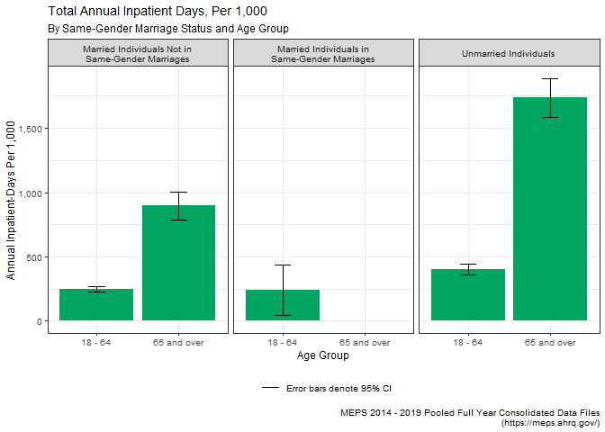

Healthcare Experiences of Elderly LGBTQ+ Individuals in the US: A Visual
Analysis Using Medical Expenditure Panel Survey (MEPS) Data
================
C. Seth Lester, ASA, MAAA
([Seth.Lester@milliman.com](mailto:seth.lester@milliman.com))  
6 July 2023

*The following paper is a submission in reply to the [Society of
Actuaries’ Call for
Papers](https://www.soa.org/research/opportunities/call-for-papers-list/)
under the heading “[Aging and Retirement Issues for LGBTQ+ People –
Second
Invitation](https://www.soa.org/research/opportunities/call-for-essay-aging-retire-lgbtq/)”.*

# Background and Purpose

For some LGBTQ+-identifying subpopulations, the level of discrimination
we face in society is rapidly decreasing; for others, such as
transgender individuals, there are still impactful and endemic stigmas
in play which act as a barrier to living full and rewarding lives.
Barriers such as these have potentially inhibited the ability of many
people who identify as LGBTQ+ from enjoying the same protections of our
social safety net – such as healthcare and retirement security systems –
that are enjoyed by non-LGBTQ+-identifying people.

It is difficult today for analysts to credibly estimate how
retirement-related outcomes differ between LGBTQ+ and non-LGBTQ+
populations, or how to quantify the disparities of outcomes among
intersectional subpopulations that exist today within LGBTQ+
communities. One key reason for this difficulty is the lack of available
data that can help guide our policymaking apparatus towards better
regulations and protections for members of our society who are more
likely to be marginalized, stigmatized, or disadvantaged by systemic
factors. This includes LGBTQ+ people, of course, but heavily intersects
with people of color, women, religious minorities, immigrants, disabled
individuals, and countless other populations of interest within the
United States.

In the healthcare space, there is ample energy surrounding the important
work being done by organizations, both private and public, to better
understand the impacts of what are known as Social Determinants of
Health – “the conditions in the environments where people are born,
live, learn, work, play, worship, and age that affect a wide range of
health, functioning, and quality-of-life outcomes and risks” (as defined
by the [US Dept. of Health and Human
Services](https://health.gov/healthypeople/priority-areas/social-determinants-health)).

Social Determinants of Health (SDoH) can provide strong causal evidence
for how certain subpopulations of our society disproportionately
experience poor health outcomes . Consequently, population health
professionals and actuaries alike have an interest in better
understanding the relationships between SDoH and access to quality
healthcare that is both affordable and can be sustainably provided by
the care delivery system.

It is therefore reasonable to suspect that disparities in
retirement-related outcomes between LGBTQ+ and non-LGBTQ+ populations
are also highly dependent upon many of the same Social Determinants of
Health (SDoH) factors that heavily influence healthcare outcomes,
experiences, and costs.

In order to investigate this idea, I set out to explore the publicly
available [Medical Expenditure Panel
Survey](https://meps.ahrq.gov/mepsweb/) (MEPS) public data files to
determine if there are useful data available for distilling connections
between retirement-related outcomes, many of which depend extensively on
healthcare outcomes and lived socioeconomic experiences, which may be
very different for LGBTQ+ individuals.

In order to investigate this idea, I set out to explore the
publicly-available (MEPS) datasets to determine if there were useful
data available for distilling connections between retirement-related
outcomes, many of which depend extensively on healthcare outcomes, and
the lived socioeconomic experiences often encountered by LGBTQ+
individuals.

## About MEPS

MEPS has been administered since 1996, and according the [Agency for
Healthcare Research and Quality](https://www.ahrq.gov/) (AHRQ), which is
the government agency at MEPS’s helm, MEPS is a collection of “data on
the specific health services that Americans use, how frequently they use
them, the cost of these services, and how they are paid for, as well as
data on the cost, scope, and breadth of health insurance held by and
available to U.S. workers” ([Survey Background, MEPS
Homepage](https://meps.ahrq.gov/mepsweb/about_meps/survey_back.jsp)).

For those individuals seeking to learn more about how to conduct
analyses using MEPS data, you can find code examples written in both SAS
and R on the [MEPS Github page](https://github.com/HHS-AHRQ/MEPS).
Furthermore, the MEPS staff regularly conducts online training seminars.

As MEPS is a survey and therefore the data is either self-reported or
imputed, there are some situations in which individuals using this data
might want to perform additional quality checks. An example of quality
checking could consist of checking the count of individuals with a
non-null value for spouse ID (metadata not generated by the respondent)
against the count of individuals who indicated in response to a survey
question that they are married (data provided by the respondent).

Additionally, MEPS provides [statistical precision
guidelines](https://meps.ahrq.gov/survey_comp/precision_guidelines.shtml)
about making inferences with the data, which include restrictions and
guidance concerning minimum sample size and acceptable error rates. I
discuss this guidance further in a subsequent section.

## LGBTQ+ Individuals and MEPS Data

The MEPS questionnaire includes questions ranging from basic demography
facts to employment status, food stamp usage, diagnoses of key chronic
conditions, whether the respondent has a commercially or
government-administered health-plan, what medications they filled,
medical procedures they received, even down to the race or ethnicity of
their providers.

However, one piece of information that is glaringly absent from the
survey responses or imputed data is any mention of whether the
respondent identifies as LGBTQ+.

However, since it is possible to use the survey metadata to identify
respondents who are spouses of one another, and because MEPS provides
the self-reported gender of each respondent within each family unit and
household, this approach can be used to create a data set of all married
respondents, and furthermore, a label indicating which married
respondents are in same-gender marriages, which serves as a proxy
indicator of LGBTQ+ identity for the purposes of this analysis.

The R code that performs this analysis and prepares the data tables
visualizations that follow is available on [my personal Github
site](https://github.com/bentwheel/lgbtq-retirement-meps-analysis).

# Data and Methodology

Since the LGBTQ+-identifying population in the United States is a
relatively small subset of the overall US population, MEPS data PUFs
(Public Use Files) from surveys representative of years between 2014 and
2019 (see table below) have been pooled together to produce the data
visualizations and tables within this essay. The purpose of pooling
these PUFs is to create a final table that is sufficiently large to meet
MEPS’ [statistical precision
guidelines](https://meps.ahrq.gov/survey_comp/precision_guidelines.shtml)
for making inferences about population-level estimates of key statistics
relevant to the healthcare experiences of individuals in the US who are
(a) in same-gender marriages and (b) above the age of 65.

All MEPS Full Year Consolidated data PUFs listed in the following table
contain variables pertaining to survey administration, income,
person-level conditions, health status, disability days, quality of
care, employment, health insurance, and person-level medical care use
and expenditures.

| Data File                                                                                                                                                       | Description                                                                                                                                                                                                |
|:----------------------------------------------------------------------------------------------------------------------------------------------------------------|:-----------------------------------------------------------------------------------------------------------------------------------------------------------------------------------------------------------|
| [2019 Full Year Consolidated Data File](https://meps.ahrq.gov/mepsweb/data_stats/download_data_files_detail.jsp?cboPufNumber=HC-216)                            | This file consists of MEPS survey data obtained in Rounds 3, 4, and 5 of Panel 23 and Rounds 1, 2, and 3 of Panel 24, the rounds for the MEPS panels covering calendar year 2019.                          |
| [2018 Full Year Consolidated Data File](https://meps.ahrq.gov/mepsweb/data_stats/download_data_files_detail.jsp?cboPufNumber=HC-209)                            | This file consists of MEPS survey data obtained in Rounds 3, 4, and 5 of Panel 22 and Rounds 1, 2, and 3 of Panel 23, the rounds for the MEPS panels covering calendar year 2018.                          |
| [2017 Full Year Consolidated Data File](https://meps.ahrq.gov/mepsweb/data_stats/download_data_files_detail.jsp?cboPufNumber=HC-201)                            | This file consists of MEPS survey data obtained in Rounds 3, 4, and 5 of Panel 21 and Rounds 1, 2, and 3 of Panel 22, the rounds for the MEPS panels covering calendar year 2017.                          |
| [2016 Full Year Consolidated Data File](https://meps.ahrq.gov/mepsweb/data_stats/download_data_files_detail.jsp?cboPufNumber=HC-192)                            | This file consists of MEPS survey data obtained in Rounds 3, 4, and 5 of Panel 20 and Rounds 1, 2, and 3 of Panel 21, the rounds for the MEPS panels covering calendar year 2016.                          |
| [2015 Full Year Consolidated Data File](https://meps.ahrq.gov/mepsweb/data_stats/download_data_files_detail.jsp?cboPufNumber=HC-181)                            | This file consists of MEPS survey data obtained in Rounds 3, 4, and 5 of Panel 19 and Rounds 1, 2, and 3 of Panel 20, the rounds for the MEPS panels covering calendar year 2015.                          |
| [2014 Full Year Consolidated Data File](https://meps.ahrq.gov/mepsweb/data_stats/download_data_files_detail.jsp?cboPufNumber=HC-171)                            | This file consists of MEPS survey data obtained in Rounds 3, 4, and 5 of Panel 18 and Rounds 1, 2, and 3 of Panel 19, the rounds for the MEPS panels covering calendar year 2014.                          |
| [MEPS 1996-2020 Pooled Linkage File for Common Variance Structure](https://meps.ahrq.gov/mepsweb/data_stats/download_data_files_detail.jsp?cboPufNumber=HC-036) | This HC-036 file contains the proper variance structure to use when making estimates from MEPS data that have been pooled over multiple years and where one or more years are from 1996-2001 or 2019-2020. |

## Identifying Individuals in Same-Gender Marriages in the MEPS Public Use Files

As specified earlier, there is no LGBTQ+ indicator in the MEPS survey
questions that are administered to respondents. Therefore, in this
essay, we will make the simplifying assumption that individuals in
same-gender marriages are members of the US subpopulation identifying as
LGBTQ+.

Below is an image consisting of several examples of actual records in
the 2019 MEPS Full Year Consolidated PUF to highlight how the data
elements within MEPS PUFs are used to determine individuals who are in
same-gender marriages.

Fig. 1: Example Records in the 2019 MEPS PUFs

There are many shortcomings to this approach, as this approach will fail
to identify certain individual respondents who may identify as LGBTQ+,
such as:

- Any male-identifying individual who is married to a female-identifying
  individual, in cases where at least one of the spouses identifies as
  LGBTQ+; and,
- All unmarried persons who identify as LGBQT+.

However, this approach will succeed in identifying the following
individual respondents:

- Any LGBTQ+-identifying individual married to a any other
  LGBTQ+-identifying individual, in cases where both spouses identify as
  the same binary gender.

While this approach does fail to identify large subgroups within the
broader LGBQT+ population in the United States, we can still use this
approach to determine if there are substantial differences in the
underlying demography, patient experiences, or incurred expenses between
some LGBQT+ subpopulations and otherwise-similar non-LGBQT+
subpopulations within the US.

In this essay, we will consider and even see some evidence supporting
the possibility that marriage (or cohabitation, more generally) have a
confounding influence on some of the population-level estimates of
measurements of interest (e.g., annual healthcare expenditures,
emergency room utilization, etc.). Therefore, most data visualizations
and data tables in this essay will present findings comparing key
population-level estimates between married individuals in same-gender
marriages against married individuals not in same-gender marriages in
order to control for the potential confounding effect of marriage or
cohabitation.

## MEPS Precision Guidelines for Population-Level Estimates

In most cases, the MEPS precision guidelines referenced earlier require
that any mean, count, ratio, etc. of categorical indicators (such as
race, gender, etc.) or numeric variables (such as “total healthcare
expenditures”) computed for any subpopulation in the MEPS data adhere to
two restrictions:

1.  The underlying sample data from which the estimates are derived
    should consist of at least 60 sampling units (in our case,
    individual respondents).
2.  The relative standard error (RSE) corresponding to any estimate of a
    statistic of interest, such as a mean, count, or ratio, must
    absolutely not exceed 0.5. If so, it should not be displayed.
    Furthermore, if the RSE of the corresponding population-level
    estimate exceeds 0.3, it must be called out in any charts or tables
    as potentially spurious. Relative standard error can be computed as
    $$ RSE = \frac{Std. Err}{Estimate} $$ and is displayed as a
    percentage in the data tables in [Appendix
    A](#appendix-a-data-tables) for all population-level estimates
    computed in this essay.

Fig 2: Counts of Individuals in Sample Before Pooling Across Years

In the data visualization above, the minimum sample threshold required
by the MEPS precision standards guidelines is denoted by a dashed red
line.

Additionally, there should also be some concern about the statistical
validity of population-level estimates that are computed by applying
weights to very small cross-sectional subsets of the MEPS respondent
data, especially when the subpopulation of interest (in our case, LGBTQ+
individuals over age 65) was sampled across demographic strata (e.g.,
race, gender, etc.) that have little to do with the demographic subset
we are attempting to study in this essay.

As a validation exercise, we will compute population-level estimates of
total counts of individuals in same-gender marriages below, and then
compare these results to estimates of total counts of individuals in
same-gender marriages drawn from survey data not related to MEPS. In the
following table, we can see the computed population-level estimates for
the total number of married individuals within the United States, broken
out by MEPS survey year.

## Evaluating Visualizations of Population-level Estimates

Please note that each of the solid bars in the data visualizations
within this essay extend upwards from the x-axis to the survey-weighted
estimate of the statistic of interest for the entire US population
(generally an estimate of the mean, unless otherwise specified). The
error bars accompanying each solid bar represent the upper and lower
bounds of the 95% confidence interval around the corresponding
population-level estimate.

In lay terms, you can imagine each solid bar as representing the “true”
population measure, but because this chart is presenting an *estimate*
of the “true” population measure based on survey data, you should
interpret the bar to be “fuzzy” in length but still “almost certainly”
(95%) contained within the boundaries of the error bars. In other words,
we are confident at a 95% level that the “true” population-level measure
of interest, if we were able to survey the entire US population, falls
somewhere in between the two extreme points of the associated error bar.

## Validating Population-level Estimates

As you inspect the data visualizations in this essay, please refer to
the accompanying data table for the respective visualizations in
[Appendix A](#appendix-a-data-tables) for additional information about
the estimates or their variability and statistical validity. Throughout
the course of this essay, I will take every opportunity to
cross-reference population-level estimates derived from MEPS data
against available 3rd-party data sources in order to provide some level
of external validation.

Let us take for example the data from 2016, which represents the US
population one year after the landmark Supreme Court decision in
*Obergefell v. Hodges* that effectively legalized same-gender marriages
across the US. Same-gender marriages were already legal in several, but
not all, US geographies at the time. In the visualization and
accompanying data table above, we see that the population-level estimate
of the number of individuals ages 18 - 64 in same-gender marriages in
the US is centered at 982,877 with a 95% confidence interval spanning
from 666,223 to 1,299,532. The corresponding estimate for individuals in
same-gender marriages ages 65 and up is 167,152, and is marked as
potentially spurious due to a high RSE (relative standard error),
largely as a result of small sample cardinality for this particular
subpopulation.

One external source we can use to externally validate this estimate is
the [American Community
Survey](https://www.census.gov/programs-surveys/acs) for the same year
(2016), which places an [estimated count of individuals living in
“Same-Sex Married Couple
Households”](https://www.census.gov/content/dam/Census/library/publications/2021/demo/p70-167.pdf)
(p. 22) at around 1,000,000 individuals, with slightly more female
individuals comprising this total than males.

Also note that, for each year of MEPS data, the 95% confidence interval
around the population-level estimates of the total number married
individuals *not* in same-gender marriages is far smaller than it is for
the estimate of the count of individuals in same-gender marriages, due
to the fact that the latter subpopulation is sampled far less frequently
in the underlying data than the former. In fact, in some years, the
representative sample is so small for same-gender married individuals
over age 65 that the computed lower bound of the 95% confidence interval
extends into negative territory, which is nonsensical. Avoiding this
kind of nonsensical presentation of statistical variability around an
estimate derived from MEPS data is the primary reasoning given by MEPS
for imposing the RSE restriction in their statistical precision
guidelines.

Displaying nonsensical error bars on the following visualization is done
for explanatory purposes only. Going forward, subsequent data
visualizations in this essay will be constructed by suppressing any and
all subgroups in which the standard error of the population-level
estimate exceeds the 50% RSE threshold specified in the MEPS statistical
precision guidelines (denoted in corresponding data tables by the symbol
“†”).

## Population-level Estimates After Pooling MEPS Data Years

Since our aim is to compare the experiences or healthcare expenses
between LGBQT+ subpopulations and non-LGBQT+ subpopulations with a focus
on individuals age 65 and up, we will not be able to meet the basic MEPS
precision guidelines described above without pooling across multiple
years. This is due to the fact that any single-year MEPS file lacks the
required number of respondents (*n* \>= 60) who are age 65 and up and in
same-gender marriages.

MEPS prescribes a methodology for pooling across multiple data years
within [the documentation for the Pooled Linkage
PUF](https://meps.ahrq.gov/data_stats/download_data/pufs/h036/h36u20doc.shtml).
This PUF contains survey weights and variances at the sampling unit and
demographic stratum level that enables pooling across multiple years.

Once pooling from 2014 - 2019 is completed, we can see that both age
groups in the same-gender marriage subpopulation meet the minimum sample
size of 60 required by the MEPS statistical precision guidelines (*n* =
435 for the 18 - 64 age band, *n* = 62 for the over 65 age band).
However, even with over 60 respondents, we are likely to encounter a
good deal of variability around the estimates of measurements for the
subpopulations of which these respondents are representative.

## External Validation of Estimates Computed Using Pooled MEPS Data

When using the pooled 2014 - 2019 data to compute population-level
estimates, we arrive at an estimate of 1,051,043 total individuals in
same-gender marriages within the US, arrived at simply adding the
estimated totals for each subgroup (900,950 for the “18 to 64” age band,
plus 150,093 for the “65 and over” band).

To determine the 95% confidence interval around this estimate, we can
simply take the square root of the sum of squared confidence interval
radii given for each subgroup’s estimate,
$\sqrt{ (1.959964 * 90,969)^2 + (1.959964 * 39,229)^2 }$, to arrive at a
the 95% confidence interval radius for our combined estimate of the
total number of same-gender marriages within the US. The 95% confidence
interval around this estimate spans from 856,875 to 1,245,211.

Once again, we can compare these estimates to the [findings from the
American Community Survey for
2019](https://www.census.gov/content/dam/Census/library/publications/2021/acs/acsbr-005.pdf)
which reports the total estimated count of same-sex married individuals
at 1,136,220 (two times the number of same-sex married couples
*households* reported in Table 1, on page 2), which falls relatively
close to the center of the 95% confidence interval around our
population-level estimate for the same statistic.

One finding I took away from these visualization exercises that was
surprising to me is that marriage by race/ethnicity appears to be
proportionally similar between same-gender and different-gender
marriages, with the exception of Hispanic and non-Hispanic Asian groups,
where there appears to be less adoption of same-sex marriages in the
18-65 age ranges in these race and ethnicity groupings. This could
potentially indicate a greater deal of social acceptance of same-sex
marriages among non-Hispanic white populations.

This is an important point of discussion as it illustrates the need for
researchers and policymakers to better understand the idea of
intersectionality within the many subpopulations within LGBTQ+ groups.
As marriage tends to confer financial security and stabilization
benefits, to both participants in the couple, then it follows that
LGBTQ+ individuals who are white are more likely to access these
benefits than their non-white LGBTQ+ counterparts, which can contribute
to additional disparities along racial lines which are fully contained
within the LGBTQ+ population.

# Visualizing Differences in Healthcare Experiences for LGBTQ+ Subpopulations

It is also the case that LGBTQ+ individuals can possess unique
healthcare needs or face different barriers to access to healthcare,
both of which can move the needle on the cost of healthcare –
particularly in retirement, in which individuals are more likely to face
one or more costly chronic conditions such as heart disease, diabetes,
or asthma.

To better determine if there are relationships between these demographic
factors and the cost of care – particularly for older age groups, I
prepared the following series of visualizations below that examine the
average individual expenditures broken out on the same demographic
features as the visualizations above.

## Emergency Room Utilization and Average Inpatient Length of Stay

lorem ipsum

Unmarried individuals are displayed to show a known benefit from
cohabitation.

“Impact of marital status on outcomes in hospitalized patients. Evidence
from an academic medical center”
<https://pubmed.ncbi.nlm.nih.gov/7503606/> “In additional analyses,
multivariable models estimated that hospital charges and length of stay
were 5% and 8% higher (P \< .001), respectively, for unmarried than for
married patients.”

“Marriage Status Predicts Hospital Outcomes Following Orthopedic Trauma”
<https://doi.org/10.1177/2151459319898648>

Validation Against:
<https://www.kff.org/other/state-indicator/emergency-room-visits-by-ownership/>

lorem ipsum
<https://www.kff.org/other/state-indicator/inpatient-days-by-ownership/?currentTimeframe=0&sortModel=%7B%22colId%22:%22Location%22,%22sort%22:%22asc%22%7D>

Reported on HCA earnings call - an important financial metric!

## Drug Costs are a Large Part of Healthcare Costs for Seniors

In the 2022 Inflation Reduction Act signed into law by President Biden,
[several reforms to the Medicare Part D
program](https://www.milliman.com/en/insight/inflation-reduction-act-health-plans-and-part-d-sponsors-need-to-know)
are set to be implemented in the coming years. While the overall bill
was passed on a party-line vote, the legislated Part D reforms reflect a
genuinely bipartisan perception of political urgency around reducing the
cost burden of access to low-cost and lifesaving pharmaceutical
therapies for seniors, many of whom are living with one or more chronic
and behavioral health conditions.

A substantial portion of the total medical expenditures incurred by
individuals in retirement are attributable to pharmacy spend, as we are
able to see in the visualizations of total healthcare spend above, which
include breakout estimates of total individual healthcare spend as well
as RX spend alone. Across most socioeconomic strata, racial/ethnicity
boundaries, and other demographic classifiers, individuals age 65 and up
appear to spend more money on pharmaceutical therapies than their
younger counterparts who are in their working years of adulthood.

lorem ipsum drug utilization

validated against:
<https://www.kff.org/health-costs/state-indicator/retail-rx-drugs-per-capita/>

## Prevalence of Chronic Conditions

Senior citizens often make use of low-cost generic medications to manage
their chronic health conditions such as diabetes, hyperlipidemia (high
cholesterol), or hypertension (high blood pressure). Some examples of
very common drugs include non-insulin blood glucose reducing agents like
[metformin](https://mor.nlm.nih.gov/RxNav/search?searchBy=String&searchTerm=metformin)
used for treating Type 2 Diabetes, statins like
[atorvastatin](https://mor.nlm.nih.gov/RxNav/search?searchBy=String&searchTerm=atorvastatin)
(brand name “Lipitor”) used for treating high cholesterol, or ACE
inhibitors like
[lisinopril](https://mor.nlm.nih.gov/RxNav/search?searchBy=String&searchTerm=lisinopril)
(brand names “Prinivil” or “Zestril”) to treat hypertension.

Type 2 diabetes, high cholesterol, and hypertension are three of the
leading causes of many other high-cost and potentially avoidable medical
complications. Therefore, if senior citizens are able to manage these
conditions with regular visits to their primary care providers and by
adherence to low-cost drug therapies such as the drugs discussed above,
then seniors are less likely to incur potentially avoidable medical
costs down the line, which can ultimately help safeguard their their
financial security and well-being in retirement.

## Family Size Can Impact Healthcare Outcomes for Seniors

One feature that can drive the total cost of care at the individual
level is family size. Larger families within the same dwelling unit can
help take care of one another when sick, coordinate transportation to
and from sites where healthcare is provided, manage childcare duties so
that adults are able to arrange for healthcare services, and so on.
Several studies have shown a linkage between medication adherence and
family size, particularly among families in low-income socioeconomic
strata.

“Older Adults’ Social Relationships and Health Care Utilization: A
Systematic Review” <https://pubmed.ncbi.nlm.nih.gov/29470115/>

For a number of reasons not discussed further here, the family size of
families that include individuals within same-sex marriages is likely to
be smaller than that of their counterparts in marriages not regarded as
same-sex. As such, it is worth exploring how family size can impact the
total individual healthcare spend across age groups.

# Conclusion

Due to the lack of data currently available that describes the
healthcare experiences specific to LGBTQ+ populations, we must continue
to be creative about how we source information that helps build policy
and products to better strengthen the lives of LGBTQ+ individuals who
are currently enjoying retirement, as well as those who will be retiring
soon.

While we’ve only just skimmed the surface of what MEPS has to offer,
MEPS provides an excellent cross section of data collected in a
well-designed survey framework that can aid key decision makers as they
go about analyzing the impacts that Social Determinants of Health have
on retirement-related outcomes.

Some examples of other potentially interesting variables in the context
of examining retirement-related outcomes alongside the ones I’ve shown
in this paper include:

    MILDIF31        DIFFICULTY WALKING A MILE - RD 3/1 
    MIAGED          AGE OF DIAGNOSIS-HEART ATTACK(MI) 
    WHTLGSPK        WHAT LANGUAGE SPOKEN OTHER THAN ENGLISH 
    DDNWRK19        # DAYS MISSED WORK DUE TO ILL/INJ 2019 
    ADRESP42        SAQ 12 MOS: DR SHOWED RESPECT 
    PROBPY42        FAMILY HAVING PROB PAYING MEDICAL BILLS 

And while the particular method I’ve demonstrated in this paper for
identifying LGBTQ+ individuals and experiences certainly does have its
flaws, we have to do the best we can with the information we have – and
publicly available data on the needs of LGBTQ+ individuals at or near
retirement age is, at times, frustratingly scarce.

Finally, this sort of work encourages discussions that broaden our
understanding of how systemic disparities act with intersectionality
among other groups and subpopulations. And while understanding the
concept of intersectionality is one thing, being able to quantify the
result of intersectional disparate outcomes, even if the data isn’t
perfect, is entirely more useful.

# Appendix A: Data Tables

<table data-quarto-disable-processing='true' class='cl-ab838f9e'><thead><tr style="overflow-wrap:break-word;"><th  colspan="9"class="cl-ab7c24de">
Counts of Individuals in Sample Before Pooling Across Years By Survey Year, Marriage Classification, and Age Group
</th></tr><tr style="overflow-wrap:break-word;"><th class="cl-ab7c24de">
Marriage Classification
</th><th class="cl-ab7c24de">
Age Group
</th><th class="cl-ab7c24de">
MEPS Survey Year
</th><th class="cl-ab7c24e8">
n
</th><th class="cl-ab7c24e8">
Pop-lvl. Estimate
</th><th class="cl-ab7c24e8">
Standard Error
</th><th class="cl-ab7c24e8">
95% CI Lower Bound
</th><th class="cl-ab7c24e8">
95% CI Upper Bound
</th><th class="cl-ab7c24de">
Relative Standard Error (RSE)
</th></tr></thead><tbody><tr style="overflow-wrap:break-word;"><td  rowspan="13"class="cl-ab7c24f2">
Married Individuals Not in Same-Gender Marriages
</td><td class="cl-ab7c24f2">
Under 18
</td><td class="cl-ab7c24f2">
2016
</td><td class="cl-ab7c24fc">
1
</td><td class="cl-ab7c24fc">
2,733
</td><td class="cl-ab7c24fc">
2,733
</td><td class="cl-ab7c24fc">
-2,624
</td><td class="cl-ab7c24fc">
8,091
</td><td class="cl-ab7c24f2">
100.00% †
</td></tr><tr style="overflow-wrap:break-word;"><td  rowspan="6"class="cl-ab7c24de">
18 - 64
</td><td class="cl-ab7c24de">
2014
</td><td class="cl-ab7c24e8">
8,556
</td><td class="cl-ab7c24e8">
96,102,041
</td><td class="cl-ab7c24e8">
2,723,089
</td><td class="cl-ab7c24e8">
90,764,885
</td><td class="cl-ab7c24e8">
101,439,197
</td><td class="cl-ab7c24de">
2.83% 
</td></tr><tr style="overflow-wrap:break-word;"><td class="cl-ab7c24de">
2015
</td><td class="cl-ab7c24e8">
8,892
</td><td class="cl-ab7c24e8">
96,787,353
</td><td class="cl-ab7c24e8">
2,959,551
</td><td class="cl-ab7c24e8">
90,986,740
</td><td class="cl-ab7c24e8">
102,587,967
</td><td class="cl-ab7c24de">
3.06% 
</td></tr><tr style="overflow-wrap:break-word;"><td class="cl-ab7c24de">
2016
</td><td class="cl-ab7c24e8">
8,629
</td><td class="cl-ab7c24e8">
94,337,377
</td><td class="cl-ab7c24e8">
2,902,250
</td><td class="cl-ab7c24e8">
88,649,071
</td><td class="cl-ab7c24e8">
100,025,683
</td><td class="cl-ab7c24de">
3.08% 
</td></tr><tr style="overflow-wrap:break-word;"><td class="cl-ab7c24de">
2017
</td><td class="cl-ab7c24e8">
7,968
</td><td class="cl-ab7c24e8">
92,659,230
</td><td class="cl-ab7c24e8">
2,119,318
</td><td class="cl-ab7c24e8">
88,505,442
</td><td class="cl-ab7c24e8">
96,813,018
</td><td class="cl-ab7c24de">
2.29% 
</td></tr><tr style="overflow-wrap:break-word;"><td class="cl-ab7c24de">
2018
</td><td class="cl-ab7c24e8">
7,683
</td><td class="cl-ab7c24e8">
92,889,257
</td><td class="cl-ab7c24e8">
2,756,832
</td><td class="cl-ab7c24e8">
87,485,964
</td><td class="cl-ab7c24e8">
98,292,549
</td><td class="cl-ab7c24de">
2.97% 
</td></tr><tr style="overflow-wrap:break-word;"><td class="cl-ab7c24de">
2019
</td><td class="cl-ab7c24e8">
7,165
</td><td class="cl-ab7c24e8">
91,319,125
</td><td class="cl-ab7c24e8">
3,006,026
</td><td class="cl-ab7c24e8">
85,427,423
</td><td class="cl-ab7c24e8">
97,210,826
</td><td class="cl-ab7c24de">
3.29% 
</td></tr><tr style="overflow-wrap:break-word;"><td  rowspan="6"class="cl-ab7c24de">
65 and over
</td><td class="cl-ab7c24de">
2014
</td><td class="cl-ab7c24e8">
1,814
</td><td class="cl-ab7c24e8">
24,030,932
</td><td class="cl-ab7c24e8">
1,240,582
</td><td class="cl-ab7c24e8">
21,599,435
</td><td class="cl-ab7c24e8">
26,462,429
</td><td class="cl-ab7c24de">
5.16% 
</td></tr><tr style="overflow-wrap:break-word;"><td class="cl-ab7c24de">
2015
</td><td class="cl-ab7c24e8">
1,995
</td><td class="cl-ab7c24e8">
25,698,911
</td><td class="cl-ab7c24e8">
1,125,244
</td><td class="cl-ab7c24e8">
23,493,474
</td><td class="cl-ab7c24e8">
27,904,348
</td><td class="cl-ab7c24de">
4.38% 
</td></tr><tr style="overflow-wrap:break-word;"><td class="cl-ab7c24de">
2016
</td><td class="cl-ab7c24e8">
2,161
</td><td class="cl-ab7c24e8">
26,394,055
</td><td class="cl-ab7c24e8">
1,195,495
</td><td class="cl-ab7c24e8">
24,050,928
</td><td class="cl-ab7c24e8">
28,737,181
</td><td class="cl-ab7c24de">
4.53% 
</td></tr><tr style="overflow-wrap:break-word;"><td class="cl-ab7c24de">
2017
</td><td class="cl-ab7c24e8">
2,292
</td><td class="cl-ab7c24e8">
26,795,556
</td><td class="cl-ab7c24e8">
1,028,101
</td><td class="cl-ab7c24e8">
24,780,514
</td><td class="cl-ab7c24e8">
28,810,598
</td><td class="cl-ab7c24de">
3.84% 
</td></tr><tr style="overflow-wrap:break-word;"><td class="cl-ab7c24de">
2018
</td><td class="cl-ab7c24e8">
2,649
</td><td class="cl-ab7c24e8">
27,673,346
</td><td class="cl-ab7c24e8">
975,474
</td><td class="cl-ab7c24e8">
25,761,451
</td><td class="cl-ab7c24e8">
29,585,240
</td><td class="cl-ab7c24de">
3.52% 
</td></tr><tr style="overflow-wrap:break-word;"><td class="cl-ab7c24de">
2019
</td><td class="cl-ab7c24e8">
2,651
</td><td class="cl-ab7c24e8">
27,438,639
</td><td class="cl-ab7c24e8">
1,022,391
</td><td class="cl-ab7c24e8">
25,434,789
</td><td class="cl-ab7c24e8">
29,442,489
</td><td class="cl-ab7c24de">
3.73% 
</td></tr><tr style="overflow-wrap:break-word;"><td  rowspan="12"class="cl-ab7c24de">
Married Individuals in Same-Gender Marriages
</td><td  rowspan="6"class="cl-ab7c24de">
18 - 64
</td><td class="cl-ab7c24de">
2014
</td><td class="cl-ab7c24e8">
41
</td><td class="cl-ab7c24e8">
497,417
</td><td class="cl-ab7c24e8">
143,493
</td><td class="cl-ab7c24e8">
216,176
</td><td class="cl-ab7c24e8">
778,658
</td><td class="cl-ab7c24de">
28.85% 
</td></tr><tr style="overflow-wrap:break-word;"><td class="cl-ab7c24de">
2015
</td><td class="cl-ab7c24e8">
57
</td><td class="cl-ab7c24e8">
701,225
</td><td class="cl-ab7c24e8">
144,287
</td><td class="cl-ab7c24e8">
418,427
</td><td class="cl-ab7c24e8">
984,024
</td><td class="cl-ab7c24de">
20.58% 
</td></tr><tr style="overflow-wrap:break-word;"><td class="cl-ab7c24de">
2016
</td><td class="cl-ab7c24e8">
83
</td><td class="cl-ab7c24e8">
982,877
</td><td class="cl-ab7c24e8">
161,561
</td><td class="cl-ab7c24e8">
666,223
</td><td class="cl-ab7c24e8">
1,299,532
</td><td class="cl-ab7c24de">
16.44% 
</td></tr><tr style="overflow-wrap:break-word;"><td class="cl-ab7c24de">
2017
</td><td class="cl-ab7c24e8">
102
</td><td class="cl-ab7c24e8">
1,166,348
</td><td class="cl-ab7c24e8">
181,834
</td><td class="cl-ab7c24e8">
809,959
</td><td class="cl-ab7c24e8">
1,522,736
</td><td class="cl-ab7c24de">
15.59% 
</td></tr><tr style="overflow-wrap:break-word;"><td class="cl-ab7c24de">
2018
</td><td class="cl-ab7c24e8">
80
</td><td class="cl-ab7c24e8">
932,480
</td><td class="cl-ab7c24e8">
162,362
</td><td class="cl-ab7c24e8">
614,256
</td><td class="cl-ab7c24e8">
1,250,703
</td><td class="cl-ab7c24de">
17.41% 
</td></tr><tr style="overflow-wrap:break-word;"><td class="cl-ab7c24de">
2019
</td><td class="cl-ab7c24e8">
72
</td><td class="cl-ab7c24e8">
1,125,354
</td><td class="cl-ab7c24e8">
196,043
</td><td class="cl-ab7c24e8">
741,117
</td><td class="cl-ab7c24e8">
1,509,590
</td><td class="cl-ab7c24de">
17.42% 
</td></tr><tr style="overflow-wrap:break-word;"><td  rowspan="6"class="cl-ab7c24de">
65 and over
</td><td class="cl-ab7c24de">
2014
</td><td class="cl-ab7c24e8">
5
</td><td class="cl-ab7c24e8">
80,463
</td><td class="cl-ab7c24e8">
58,499
</td><td class="cl-ab7c24e8">
-34,194
</td><td class="cl-ab7c24e8">
195,120
</td><td class="cl-ab7c24de">
72.70% †
</td></tr><tr style="overflow-wrap:break-word;"><td class="cl-ab7c24de">
2015
</td><td class="cl-ab7c24e8">
15
</td><td class="cl-ab7c24e8">
220,017
</td><td class="cl-ab7c24e8">
91,331
</td><td class="cl-ab7c24e8">
41,013
</td><td class="cl-ab7c24e8">
399,022
</td><td class="cl-ab7c24de">
41.51% *
</td></tr><tr style="overflow-wrap:break-word;"><td class="cl-ab7c24de">
2016
</td><td class="cl-ab7c24e8">
11
</td><td class="cl-ab7c24e8">
167,152
</td><td class="cl-ab7c24e8">
81,976
</td><td class="cl-ab7c24e8">
6,481
</td><td class="cl-ab7c24e8">
327,822
</td><td class="cl-ab7c24de">
49.04% *
</td></tr><tr style="overflow-wrap:break-word;"><td class="cl-ab7c24de">
2017
</td><td class="cl-ab7c24e8">
6
</td><td class="cl-ab7c24e8">
103,145
</td><td class="cl-ab7c24e8">
62,693
</td><td class="cl-ab7c24e8">
-19,731
</td><td class="cl-ab7c24e8">
226,021
</td><td class="cl-ab7c24de">
60.78% †
</td></tr><tr style="overflow-wrap:break-word;"><td class="cl-ab7c24de">
2018
</td><td class="cl-ab7c24e8">
12
</td><td class="cl-ab7c24e8">
163,299
</td><td class="cl-ab7c24e8">
70,304
</td><td class="cl-ab7c24e8">
25,505
</td><td class="cl-ab7c24e8">
301,094
</td><td class="cl-ab7c24de">
43.05% *
</td></tr><tr style="overflow-wrap:break-word;"><td class="cl-ab7c24de">
2019
</td><td class="cl-ab7c24e8">
13
</td><td class="cl-ab7c24e8">
166,481
</td><td class="cl-ab7c24e8">
56,654
</td><td class="cl-ab7c24e8">
55,441
</td><td class="cl-ab7c24e8">
277,522
</td><td class="cl-ab7c24de">
34.03% *
</td></tr><tr style="overflow-wrap:break-word;"><td  rowspan="18"class="cl-ab7c24de">
Unmarried Individuals
</td><td  rowspan="6"class="cl-ab7c24de">
Under 18
</td><td class="cl-ab7c24de">
2014
</td><td class="cl-ab7c24e8">
8,634
</td><td class="cl-ab7c24e8">
68,371,394
</td><td class="cl-ab7c24e8">
2,233,108
</td><td class="cl-ab7c24e8">
63,994,582
</td><td class="cl-ab7c24e8">
72,748,206
</td><td class="cl-ab7c24de">
3.27% 
</td></tr><tr style="overflow-wrap:break-word;"><td class="cl-ab7c24de">
2015
</td><td class="cl-ab7c24e8">
8,599
</td><td class="cl-ab7c24e8">
68,513,378
</td><td class="cl-ab7c24e8">
2,288,072
</td><td class="cl-ab7c24e8">
64,028,839
</td><td class="cl-ab7c24e8">
72,997,917
</td><td class="cl-ab7c24de">
3.34% 
</td></tr><tr style="overflow-wrap:break-word;"><td class="cl-ab7c24de">
2016
</td><td class="cl-ab7c24e8">
8,195
</td><td class="cl-ab7c24e8">
68,268,664
</td><td class="cl-ab7c24e8">
2,129,868
</td><td class="cl-ab7c24e8">
64,094,199
</td><td class="cl-ab7c24e8">
72,443,129
</td><td class="cl-ab7c24de">
3.12% 
</td></tr><tr style="overflow-wrap:break-word;"><td class="cl-ab7c24de">
2017
</td><td class="cl-ab7c24e8">
7,311
</td><td class="cl-ab7c24e8">
67,897,667
</td><td class="cl-ab7c24e8">
1,725,171
</td><td class="cl-ab7c24e8">
64,516,394
</td><td class="cl-ab7c24e8">
71,278,941
</td><td class="cl-ab7c24de">
2.54% 
</td></tr><tr style="overflow-wrap:break-word;"><td class="cl-ab7c24de">
2018
</td><td class="cl-ab7c24e8">
6,690
</td><td class="cl-ab7c24e8">
67,987,396
</td><td class="cl-ab7c24e8">
2,115,773
</td><td class="cl-ab7c24e8">
63,840,557
</td><td class="cl-ab7c24e8">
72,134,235
</td><td class="cl-ab7c24de">
3.11% 
</td></tr><tr style="overflow-wrap:break-word;"><td class="cl-ab7c24de">
2019
</td><td class="cl-ab7c24e8">
5,906
</td><td class="cl-ab7c24e8">
67,791,411
</td><td class="cl-ab7c24e8">
2,423,037
</td><td class="cl-ab7c24e8">
63,042,345
</td><td class="cl-ab7c24e8">
72,540,476
</td><td class="cl-ab7c24de">
3.57% 
</td></tr><tr style="overflow-wrap:break-word;"><td  rowspan="6"class="cl-ab7c24de">
18 - 64
</td><td class="cl-ab7c24de">
2014
</td><td class="cl-ab7c24e8">
10,722
</td><td class="cl-ab7c24e8">
94,976,938
</td><td class="cl-ab7c24e8">
2,510,822
</td><td class="cl-ab7c24e8">
90,055,816
</td><td class="cl-ab7c24e8">
99,898,059
</td><td class="cl-ab7c24de">
2.64% 
</td></tr><tr style="overflow-wrap:break-word;"><td class="cl-ab7c24de">
2015
</td><td class="cl-ab7c24e8">
10,783
</td><td class="cl-ab7c24e8">
94,417,804
</td><td class="cl-ab7c24e8">
2,193,317
</td><td class="cl-ab7c24e8">
90,118,982
</td><td class="cl-ab7c24e8">
98,716,627
</td><td class="cl-ab7c24de">
2.32% 
</td></tr><tr style="overflow-wrap:break-word;"><td class="cl-ab7c24de">
2016
</td><td class="cl-ab7c24e8">
10,317
</td><td class="cl-ab7c24e8">
95,123,760
</td><td class="cl-ab7c24e8">
2,053,220
</td><td class="cl-ab7c24e8">
91,099,523
</td><td class="cl-ab7c24e8">
99,147,996
</td><td class="cl-ab7c24de">
2.16% 
</td></tr><tr style="overflow-wrap:break-word;"><td class="cl-ab7c24de">
2017
</td><td class="cl-ab7c24e8">
9,231
</td><td class="cl-ab7c24e8">
98,134,737
</td><td class="cl-ab7c24e8">
1,876,166
</td><td class="cl-ab7c24e8">
94,457,519
</td><td class="cl-ab7c24e8">
101,811,956
</td><td class="cl-ab7c24de">
1.91% 
</td></tr><tr style="overflow-wrap:break-word;"><td class="cl-ab7c24de">
2018
</td><td class="cl-ab7c24e8">
8,373
</td><td class="cl-ab7c24e8">
97,405,253
</td><td class="cl-ab7c24e8">
2,265,942
</td><td class="cl-ab7c24e8">
92,964,088
</td><td class="cl-ab7c24e8">
101,846,417
</td><td class="cl-ab7c24de">
2.33% 
</td></tr><tr style="overflow-wrap:break-word;"><td class="cl-ab7c24de">
2019
</td><td class="cl-ab7c24e8">
7,936
</td><td class="cl-ab7c24e8">
98,620,261
</td><td class="cl-ab7c24e8">
2,955,216
</td><td class="cl-ab7c24e8">
92,828,144
</td><td class="cl-ab7c24e8">
104,412,379
</td><td class="cl-ab7c24de">
3.00% 
</td></tr><tr style="overflow-wrap:break-word;"><td  rowspan="6"class="cl-ab7c24de">
65 and over
</td><td class="cl-ab7c24de">
2014
</td><td class="cl-ab7c24e8">
2,064
</td><td class="cl-ab7c24e8">
22,461,619
</td><td class="cl-ab7c24e8">
805,793
</td><td class="cl-ab7c24e8">
20,882,294
</td><td class="cl-ab7c24e8">
24,040,944
</td><td class="cl-ab7c24de">
3.59% 
</td></tr><tr style="overflow-wrap:break-word;"><td class="cl-ab7c24de">
2015
</td><td class="cl-ab7c24e8">
2,232
</td><td class="cl-ab7c24e8">
22,157,603
</td><td class="cl-ab7c24e8">
789,809
</td><td class="cl-ab7c24e8">
20,609,605
</td><td class="cl-ab7c24e8">
23,705,601
</td><td class="cl-ab7c24de">
3.56% 
</td></tr><tr style="overflow-wrap:break-word;"><td class="cl-ab7c24de">
2016
</td><td class="cl-ab7c24e8">
2,316
</td><td class="cl-ab7c24e8">
23,179,175
</td><td class="cl-ab7c24e8">
778,785
</td><td class="cl-ab7c24e8">
21,652,784
</td><td class="cl-ab7c24e8">
24,705,566
</td><td class="cl-ab7c24de">
3.36% 
</td></tr><tr style="overflow-wrap:break-word;"><td class="cl-ab7c24de">
2017
</td><td class="cl-ab7c24e8">
2,404
</td><td class="cl-ab7c24e8">
24,088,160
</td><td class="cl-ab7c24e8">
772,400
</td><td class="cl-ab7c24e8">
22,574,283
</td><td class="cl-ab7c24e8">
25,602,036
</td><td class="cl-ab7c24de">
3.21% 
</td></tr><tr style="overflow-wrap:break-word;"><td class="cl-ab7c24de">
2018
</td><td class="cl-ab7c24e8">
2,598
</td><td class="cl-ab7c24e8">
24,779,543
</td><td class="cl-ab7c24e8">
779,929
</td><td class="cl-ab7c24e8">
23,250,910
</td><td class="cl-ab7c24e8">
26,308,176
</td><td class="cl-ab7c24de">
3.15% 
</td></tr><tr style="overflow-wrap:break-word;"><td class="cl-ab7c24de">
2019
</td><td class="cl-ab7c24e8">
2,611
</td><td class="cl-ab7c24e8">
24,709,246
</td><td class="cl-ab7c24e8">
888,509
</td><td class="cl-ab7c24e8">
22,967,800
</td><td class="cl-ab7c24e8">
26,450,692
</td><td class="cl-ab7c24de">
3.60% 
</td></tr></tbody><tfoot><tr style="overflow-wrap:break-word;"><td  colspan="9"class="cl-ab7c2506">
From MEPS Precision Standards Guidelines: * "Estimate can be reported but flagged with an * to indicate that its precision is questionable." † "Estimate should not be reported or displayed in tables due to extremely large sampling error." These rows are generally not reflected in accompanying data visualizations.
</td></tr></tfoot></table>

<table data-quarto-disable-processing='true' class='cl-ab91494a'><thead><tr style="overflow-wrap:break-word;"><th  colspan="8"class="cl-ab8ca6ba">
Data Table for 'Counts of Individuals in Sample After Pooling Across Years By Marriage Classification and Age Group'
</th></tr><tr style="overflow-wrap:break-word;"><th class="cl-ab8ca6ba">
Marriage Classification
</th><th class="cl-ab8ca6ba">
Age Group
</th><th class="cl-ab8ca6c4">
n
</th><th class="cl-ab8ca6c4">
Pop-lvl. Estimate
</th><th class="cl-ab8ca6c4">
Standard Error
</th><th class="cl-ab8ca6c4">
95% CI Lower Bound
</th><th class="cl-ab8ca6c4">
95% CI Upper Bound
</th><th class="cl-ab8ca6ba">
Relative Standard Error (RSE)
</th></tr></thead><tbody><tr style="overflow-wrap:break-word;"><td  rowspan="3"class="cl-ab8ca6ce">
Married Individuals Not in Same-Gender Marriages
</td><td class="cl-ab8ca6ce">
Under 18
</td><td class="cl-ab8ca6cf">
1
</td><td class="cl-ab8ca6cf">
456
</td><td class="cl-ab8ca6cf">
456
</td><td class="cl-ab8ca6cf">
-437
</td><td class="cl-ab8ca6cf">
1,348
</td><td class="cl-ab8ca6ce">
100.00% †
</td></tr><tr style="overflow-wrap:break-word;"><td class="cl-ab8ca6ba">
18 - 64
</td><td class="cl-ab8ca6c4">
48,893
</td><td class="cl-ab8ca6c4">
94,015,730
</td><td class="cl-ab8ca6c4">
2,042,224
</td><td class="cl-ab8ca6c4">
90,013,045
</td><td class="cl-ab8ca6c4">
98,018,416
</td><td class="cl-ab8ca6ba">
2.17% 
</td></tr><tr style="overflow-wrap:break-word;"><td class="cl-ab8ca6ba">
65 and over
</td><td class="cl-ab8ca6c4">
13,562
</td><td class="cl-ab8ca6c4">
26,338,573
</td><td class="cl-ab8ca6c4">
720,851
</td><td class="cl-ab8ca6c4">
24,925,731
</td><td class="cl-ab8ca6c4">
27,751,415
</td><td class="cl-ab8ca6ba">
2.74% 
</td></tr><tr style="overflow-wrap:break-word;"><td  rowspan="2"class="cl-ab8ca6ba">
Married Individuals in Same-Gender Marriages
</td><td class="cl-ab8ca6ba">
18 - 64
</td><td class="cl-ab8ca6c4">
435
</td><td class="cl-ab8ca6c4">
900,950
</td><td class="cl-ab8ca6c4">
90,969
</td><td class="cl-ab8ca6c4">
722,655
</td><td class="cl-ab8ca6c4">
1,079,245
</td><td class="cl-ab8ca6ba">
10.10% 
</td></tr><tr style="overflow-wrap:break-word;"><td class="cl-ab8ca6ba">
65 and over
</td><td class="cl-ab8ca6c4">
62
</td><td class="cl-ab8ca6c4">
150,093
</td><td class="cl-ab8ca6c4">
39,229
</td><td class="cl-ab8ca6c4">
73,206
</td><td class="cl-ab8ca6c4">
226,980
</td><td class="cl-ab8ca6ba">
26.14% 
</td></tr><tr style="overflow-wrap:break-word;"><td  rowspan="3"class="cl-ab8ca6ba">
Unmarried Individuals
</td><td class="cl-ab8ca6ba">
Under 18
</td><td class="cl-ab8ca6c4">
45,335
</td><td class="cl-ab8ca6c4">
68,138,319
</td><td class="cl-ab8ca6c4">
1,548,979
</td><td class="cl-ab8ca6c4">
65,102,376
</td><td class="cl-ab8ca6c4">
71,174,261
</td><td class="cl-ab8ca6ba">
2.27% 
</td></tr><tr style="overflow-wrap:break-word;"><td class="cl-ab8ca6ba">
18 - 64
</td><td class="cl-ab8ca6c4">
57,362
</td><td class="cl-ab8ca6c4">
96,446,459
</td><td class="cl-ab8ca6c4">
1,717,047
</td><td class="cl-ab8ca6c4">
93,081,109
</td><td class="cl-ab8ca6c4">
99,811,809
</td><td class="cl-ab8ca6ba">
1.78% 
</td></tr><tr style="overflow-wrap:break-word;"><td class="cl-ab8ca6ba">
65 and over
</td><td class="cl-ab8ca6c4">
14,225
</td><td class="cl-ab8ca6c4">
23,562,558
</td><td class="cl-ab8ca6c4">
540,214
</td><td class="cl-ab8ca6c4">
22,503,758
</td><td class="cl-ab8ca6c4">
24,621,357
</td><td class="cl-ab8ca6ba">
2.29% 
</td></tr></tbody><tfoot><tr style="overflow-wrap:break-word;"><td  colspan="8"class="cl-ab8ca6d8">
From MEPS Precision Standards Guidelines: * "Estimate can be reported but flagged with an * to indicate that its precision is questionable." † "Estimate should not be reported or displayed in tables due to extremely large sampling error." These rows are generally not reflected in accompanying data visualizations.
</td></tr></tfoot></table>

<table data-quarto-disable-processing='true' class='cl-ab9caf2e'><thead><tr style="overflow-wrap:break-word;"><th  colspan="8"class="cl-ab9892ea">
Data Table for 'Estimated Proportions of Married Individuals Across Gender By Same-Gender Marriage Status and Age Group'
</th></tr><tr style="overflow-wrap:break-word;"><th class="cl-ab9892ea">
Marriage Classification
</th><th class="cl-ab9892ea">
Age Group
</th><th class="cl-ab9892ea">
Gender
</th><th class="cl-ab9892ea">
Population Estimate
</th><th class="cl-ab9892ea">
Standard Error
</th><th class="cl-ab9892ea">
95% CI Lower Bound
</th><th class="cl-ab9892ea">
95% CI Upper Bound
</th><th class="cl-ab9892ea">
Relative Standard Error (RSE)
</th></tr></thead><tbody><tr style="overflow-wrap:break-word;"><td  rowspan="4"class="cl-ab9892fe">
Married Individuals Not in Same-Gender Marriages
</td><td  rowspan="2"class="cl-ab9892fe">
18 - 64
</td><td class="cl-ab9892fe">
Female
</td><td class="cl-ab9892fe">
51.72%
</td><td class="cl-ab9892fe">
0.11%
</td><td class="cl-ab9892fe">
51.50%
</td><td class="cl-ab9892fe">
51.93%
</td><td class="cl-ab9892fe">
0.21% 
</td></tr><tr style="overflow-wrap:break-word;"><td class="cl-ab9892ea">
Male
</td><td class="cl-ab9892ea">
48.28%
</td><td class="cl-ab9892ea">
0.11%
</td><td class="cl-ab9892ea">
48.07%
</td><td class="cl-ab9892ea">
48.50%
</td><td class="cl-ab9892ea">
0.23% 
</td></tr><tr style="overflow-wrap:break-word;"><td  rowspan="2"class="cl-ab9892ea">
65 and over
</td><td class="cl-ab9892ea">
Female
</td><td class="cl-ab9892ea">
45.12%
</td><td class="cl-ab9892ea">
0.32%
</td><td class="cl-ab9892ea">
44.50%
</td><td class="cl-ab9892ea">
45.74%
</td><td class="cl-ab9892ea">
0.70% 
</td></tr><tr style="overflow-wrap:break-word;"><td class="cl-ab9892ea">
Male
</td><td class="cl-ab9892ea">
54.88%
</td><td class="cl-ab9892ea">
0.32%
</td><td class="cl-ab9892ea">
54.26%
</td><td class="cl-ab9892ea">
55.50%
</td><td class="cl-ab9892ea">
0.58% 
</td></tr><tr style="overflow-wrap:break-word;"><td  rowspan="4"class="cl-ab9892ea">
Married Individuals in Same-Gender Marriages
</td><td  rowspan="2"class="cl-ab9892ea">
18 - 64
</td><td class="cl-ab9892ea">
Female
</td><td class="cl-ab9892ea">
56.85%
</td><td class="cl-ab9892ea">
4.68%
</td><td class="cl-ab9892ea">
47.67%
</td><td class="cl-ab9892ea">
66.04%
</td><td class="cl-ab9892ea">
8.24% 
</td></tr><tr style="overflow-wrap:break-word;"><td class="cl-ab9892ea">
Male
</td><td class="cl-ab9892ea">
43.15%
</td><td class="cl-ab9892ea">
4.68%
</td><td class="cl-ab9892ea">
33.96%
</td><td class="cl-ab9892ea">
52.33%
</td><td class="cl-ab9892ea">
10.86% 
</td></tr><tr style="overflow-wrap:break-word;"><td  rowspan="2"class="cl-ab9892ea">
65 and over
</td><td class="cl-ab9892ea">
Female
</td><td class="cl-ab9892ea">
44.17%
</td><td class="cl-ab9892ea">
12.84%
</td><td class="cl-ab9892ea">
19.01%
</td><td class="cl-ab9892ea">
69.34%
</td><td class="cl-ab9892ea">
29.07% 
</td></tr><tr style="overflow-wrap:break-word;"><td class="cl-ab9892ea">
Male
</td><td class="cl-ab9892ea">
55.83%
</td><td class="cl-ab9892ea">
12.84%
</td><td class="cl-ab9892ea">
30.66%
</td><td class="cl-ab9892ea">
80.99%
</td><td class="cl-ab9892ea">
23.00% 
</td></tr></tbody><tfoot><tr style="overflow-wrap:break-word;"><td  colspan="8"class="cl-ab989308">
From MEPS Precision Standards Guidelines: * "Estimate can be reported but flagged with an * to indicate that its precision is questionable." † "Estimate should not be reported or displayed in tables due to extremely large sampling error." These rows are generally not reflected in accompanying data visualizations.
</td></tr></tfoot></table>

<table data-quarto-disable-processing='true' class='cl-aba94e46'><thead><tr style="overflow-wrap:break-word;"><th  colspan="8"class="cl-aba4b098">
Data Table for 'Estimated Proportions of Married Individuals Across Health Plan Types By Same-Gender Marriage Status and Age Group'
</th></tr><tr style="overflow-wrap:break-word;"><th class="cl-aba4b098">
Marriage Classification
</th><th class="cl-aba4b098">
Age Group
</th><th class="cl-aba4b098">
Health Plan Coverage
</th><th class="cl-aba4b098">
Population Estimate
</th><th class="cl-aba4b098">
Standard Error
</th><th class="cl-aba4b098">
95% CI Lower Bound
</th><th class="cl-aba4b098">
95% CI Upper Bound
</th><th class="cl-aba4b098">
Relative Standard Error (RSE)
</th></tr></thead><tbody><tr style="overflow-wrap:break-word;"><td  rowspan="6"class="cl-aba4b0a2">
Married Individuals Not in Same-Gender Marriages
</td><td  rowspan="3"class="cl-aba4b0a2">
18 - 64
</td><td class="cl-aba4b0a2">
Any Private
</td><td class="cl-aba4b0a2">
83.79%
</td><td class="cl-aba4b0a2">
0.47%
</td><td class="cl-aba4b0a2">
82.88%
</td><td class="cl-aba4b0a2">
84.71%
</td><td class="cl-aba4b0a2">
0.56% 
</td></tr><tr style="overflow-wrap:break-word;"><td class="cl-aba4b098">
Public Only
</td><td class="cl-aba4b098">
8.22%
</td><td class="cl-aba4b098">
0.29%
</td><td class="cl-aba4b098">
7.66%
</td><td class="cl-aba4b098">
8.79%
</td><td class="cl-aba4b098">
3.51% 
</td></tr><tr style="overflow-wrap:break-word;"><td class="cl-aba4b098">
Uninsured
</td><td class="cl-aba4b098">
7.98%
</td><td class="cl-aba4b098">
0.32%
</td><td class="cl-aba4b098">
7.36%
</td><td class="cl-aba4b098">
8.61%
</td><td class="cl-aba4b098">
3.98% 
</td></tr><tr style="overflow-wrap:break-word;"><td  rowspan="3"class="cl-aba4b098">
65 and over
</td><td class="cl-aba4b098">
Any Private
</td><td class="cl-aba4b098">
60.35%
</td><td class="cl-aba4b098">
0.93%
</td><td class="cl-aba4b098">
58.52%
</td><td class="cl-aba4b098">
62.18%
</td><td class="cl-aba4b098">
1.54% 
</td></tr><tr style="overflow-wrap:break-word;"><td class="cl-aba4b098">
Public Only
</td><td class="cl-aba4b098">
39.46%
</td><td class="cl-aba4b098">
0.93%
</td><td class="cl-aba4b098">
37.63%
</td><td class="cl-aba4b098">
41.29%
</td><td class="cl-aba4b098">
2.36% 
</td></tr><tr style="overflow-wrap:break-word;"><td class="cl-aba4b098">
Uninsured
</td><td class="cl-aba4b098">
0.19%
</td><td class="cl-aba4b098">
0.04%
</td><td class="cl-aba4b098">
0.11%
</td><td class="cl-aba4b098">
0.27%
</td><td class="cl-aba4b098">
22.57% 
</td></tr><tr style="overflow-wrap:break-word;"><td  rowspan="6"class="cl-aba4b098">
Married Individuals in Same-Gender Marriages
</td><td  rowspan="3"class="cl-aba4b098">
18 - 64
</td><td class="cl-aba4b098">
Any Private
</td><td class="cl-aba4b098">
89.42%
</td><td class="cl-aba4b098">
2.13%
</td><td class="cl-aba4b098">
85.25%
</td><td class="cl-aba4b098">
93.60%
</td><td class="cl-aba4b098">
2.38% 
</td></tr><tr style="overflow-wrap:break-word;"><td class="cl-aba4b098">
Public Only
</td><td class="cl-aba4b098">
6.14%
</td><td class="cl-aba4b098">
1.70%
</td><td class="cl-aba4b098">
2.81%
</td><td class="cl-aba4b098">
9.47%
</td><td class="cl-aba4b098">
27.64% 
</td></tr><tr style="overflow-wrap:break-word;"><td class="cl-aba4b098">
Uninsured
</td><td class="cl-aba4b098">
4.43%
</td><td class="cl-aba4b098">
1.30%
</td><td class="cl-aba4b098">
1.88%
</td><td class="cl-aba4b098">
6.98%
</td><td class="cl-aba4b098">
29.34% 
</td></tr><tr style="overflow-wrap:break-word;"><td  rowspan="3"class="cl-aba4b098">
65 and over
</td><td class="cl-aba4b098">
Any Private
</td><td class="cl-aba4b098">
63.35%
</td><td class="cl-aba4b098">
10.43%
</td><td class="cl-aba4b098">
42.92%
</td><td class="cl-aba4b098">
83.79%
</td><td class="cl-aba4b098">
16.46% 
</td></tr><tr style="overflow-wrap:break-word;"><td class="cl-aba4b098">
Public Only
</td><td class="cl-aba4b098">
36.65%
</td><td class="cl-aba4b098">
10.43%
</td><td class="cl-aba4b098">
16.21%
</td><td class="cl-aba4b098">
57.08%
</td><td class="cl-aba4b098">
28.45% 
</td></tr><tr style="overflow-wrap:break-word;"><td class="cl-aba4b098">
Uninsured
</td><td class="cl-aba4b098">
0.00%
</td><td class="cl-aba4b098">
0.00%
</td><td class="cl-aba4b098">
0.00%
</td><td class="cl-aba4b098">
0.00%
</td><td class="cl-aba4b098">
NA 
</td></tr></tbody><tfoot><tr style="overflow-wrap:break-word;"><td  colspan="8"class="cl-aba4b0a3">
From MEPS Precision Standards Guidelines: * "Estimate can be reported but flagged with an * to indicate that its precision is questionable." † "Estimate should not be reported or displayed in tables due to extremely large sampling error." These rows are generally not reflected in accompanying data visualizations.
</td></tr></tfoot></table>

<table data-quarto-disable-processing='true' class='cl-abb65f14'><thead><tr style="overflow-wrap:break-word;"><th  colspan="8"class="cl-abb1f14a">
Data Table for 'Estimated Proportions of Married Individuals Across Race &amp; Ethnicity By Same-Gender Marriage Status and Age Group'
</th></tr><tr style="overflow-wrap:break-word;"><th class="cl-abb1f14a">
Marriage Classification
</th><th class="cl-abb1f14a">
Age Group
</th><th class="cl-abb1f14a">
Race &amp; Ethnicity
</th><th class="cl-abb1f14a">
Population Estimate
</th><th class="cl-abb1f14a">
Standard Error
</th><th class="cl-abb1f14a">
95% CI Lower Bound
</th><th class="cl-abb1f14a">
95% CI Upper Bound
</th><th class="cl-abb1f14a">
Relative Standard Error (RSE)
</th></tr></thead><tbody><tr style="overflow-wrap:break-word;"><td  rowspan="10"class="cl-abb1f15e">
Married Individuals Not in Same-Gender Marriages
</td><td  rowspan="5"class="cl-abb1f15e">
18 - 64
</td><td class="cl-abb1f15e">
Hispanic
</td><td class="cl-abb1f15e">
16.17%
</td><td class="cl-abb1f15e">
0.66%
</td><td class="cl-abb1f15e">
14.87%
</td><td class="cl-abb1f15e">
17.46%
</td><td class="cl-abb1f15e">
4.083% 
</td></tr><tr style="overflow-wrap:break-word;"><td class="cl-abb1f14a">
Non-Hispanic White Only
</td><td class="cl-abb1f14a">
66.65%
</td><td class="cl-abb1f14a">
0.79%
</td><td class="cl-abb1f14a">
65.11%
</td><td class="cl-abb1f14a">
68.19%
</td><td class="cl-abb1f14a">
1.182% 
</td></tr><tr style="overflow-wrap:break-word;"><td class="cl-abb1f14a">
Non-Hispanic Black Only
</td><td class="cl-abb1f14a">
7.53%
</td><td class="cl-abb1f14a">
0.33%
</td><td class="cl-abb1f14a">
6.89%
</td><td class="cl-abb1f14a">
8.18%
</td><td class="cl-abb1f14a">
4.364% 
</td></tr><tr style="overflow-wrap:break-word;"><td class="cl-abb1f14a">
Non-Hispanic Asian Only
</td><td class="cl-abb1f14a">
7.37%
</td><td class="cl-abb1f14a">
0.36%
</td><td class="cl-abb1f14a">
6.67%
</td><td class="cl-abb1f14a">
8.07%
</td><td class="cl-abb1f14a">
4.849% 
</td></tr><tr style="overflow-wrap:break-word;"><td class="cl-abb1f14a">
Non-Hispanic Other Race or Multiple Race
</td><td class="cl-abb1f14a">
2.28%
</td><td class="cl-abb1f14a">
0.21%
</td><td class="cl-abb1f14a">
1.88%
</td><td class="cl-abb1f14a">
2.68%
</td><td class="cl-abb1f14a">
8.995% 
</td></tr><tr style="overflow-wrap:break-word;"><td  rowspan="5"class="cl-abb1f14a">
18 - 64
</td><td class="cl-abb1f14a">
Hispanic
</td><td class="cl-abb1f14a">
14.45%
</td><td class="cl-abb1f14a">
2.52%
</td><td class="cl-abb1f14a">
9.51%
</td><td class="cl-abb1f14a">
19.39%
</td><td class="cl-abb1f14a">
17.433% 
</td></tr><tr style="overflow-wrap:break-word;"><td class="cl-abb1f14a">
Non-Hispanic White Only
</td><td class="cl-abb1f14a">
74.91%
</td><td class="cl-abb1f14a">
3.72%
</td><td class="cl-abb1f14a">
67.61%
</td><td class="cl-abb1f14a">
82.21%
</td><td class="cl-abb1f14a">
4.970% 
</td></tr><tr style="overflow-wrap:break-word;"><td class="cl-abb1f14a">
Non-Hispanic Black Only
</td><td class="cl-abb1f14a">
5.90%
</td><td class="cl-abb1f14a">
1.72%
</td><td class="cl-abb1f14a">
2.53%
</td><td class="cl-abb1f14a">
9.27%
</td><td class="cl-abb1f14a">
29.130% 
</td></tr><tr style="overflow-wrap:break-word;"><td class="cl-abb1f14a">
Non-Hispanic Asian Only
</td><td class="cl-abb1f14a">
2.08%
</td><td class="cl-abb1f14a">
1.15%
</td><td class="cl-abb1f14a">
-0.17%
</td><td class="cl-abb1f14a">
4.32%
</td><td class="cl-abb1f14a">
55.201% †
</td></tr><tr style="overflow-wrap:break-word;"><td class="cl-abb1f14a">
Non-Hispanic Other Race or Multiple Race
</td><td class="cl-abb1f14a">
2.67%
</td><td class="cl-abb1f14a">
1.49%
</td><td class="cl-abb1f14a">
-0.24%
</td><td class="cl-abb1f14a">
5.58%
</td><td class="cl-abb1f14a">
55.703% †
</td></tr><tr style="overflow-wrap:break-word;"><td  rowspan="10"class="cl-abb1f14a">
Married Individuals Not in Same-Gender Marriages
</td><td  rowspan="5"class="cl-abb1f14a">
65 and over
</td><td class="cl-abb1f14a">
Hispanic
</td><td class="cl-abb1f14a">
7.31%
</td><td class="cl-abb1f14a">
0.49%
</td><td class="cl-abb1f14a">
6.35%
</td><td class="cl-abb1f14a">
8.28%
</td><td class="cl-abb1f14a">
6.739% 
</td></tr><tr style="overflow-wrap:break-word;"><td class="cl-abb1f14a">
Non-Hispanic White Only
</td><td class="cl-abb1f14a">
79.57%
</td><td class="cl-abb1f14a">
0.79%
</td><td class="cl-abb1f14a">
78.02%
</td><td class="cl-abb1f14a">
81.12%
</td><td class="cl-abb1f14a">
0.996% 
</td></tr><tr style="overflow-wrap:break-word;"><td class="cl-abb1f14a">
Non-Hispanic Black Only
</td><td class="cl-abb1f14a">
5.88%
</td><td class="cl-abb1f14a">
0.41%
</td><td class="cl-abb1f14a">
5.08%
</td><td class="cl-abb1f14a">
6.67%
</td><td class="cl-abb1f14a">
6.917% 
</td></tr><tr style="overflow-wrap:break-word;"><td class="cl-abb1f14a">
Non-Hispanic Asian Only
</td><td class="cl-abb1f14a">
5.49%
</td><td class="cl-abb1f14a">
0.47%
</td><td class="cl-abb1f14a">
4.58%
</td><td class="cl-abb1f14a">
6.41%
</td><td class="cl-abb1f14a">
8.510% 
</td></tr><tr style="overflow-wrap:break-word;"><td class="cl-abb1f14a">
Non-Hispanic Other Race or Multiple Race
</td><td class="cl-abb1f14a">
1.75%
</td><td class="cl-abb1f14a">
0.24%
</td><td class="cl-abb1f14a">
1.27%
</td><td class="cl-abb1f14a">
2.23%
</td><td class="cl-abb1f14a">
14.013% 
</td></tr><tr style="overflow-wrap:break-word;"><td  rowspan="5"class="cl-abb1f14a">
65 and over
</td><td class="cl-abb1f14a">
Hispanic
</td><td class="cl-abb1f14a">
2.24%
</td><td class="cl-abb1f14a">
1.24%
</td><td class="cl-abb1f14a">
-0.20%
</td><td class="cl-abb1f14a">
4.68%
</td><td class="cl-abb1f14a">
55.515% †
</td></tr><tr style="overflow-wrap:break-word;"><td class="cl-abb1f14a">
Non-Hispanic White Only
</td><td class="cl-abb1f14a">
87.67%
</td><td class="cl-abb1f14a">
6.09%
</td><td class="cl-abb1f14a">
75.74%
</td><td class="cl-abb1f14a">
99.60%
</td><td class="cl-abb1f14a">
6.945% 
</td></tr><tr style="overflow-wrap:break-word;"><td class="cl-abb1f14a">
Non-Hispanic Black Only
</td><td class="cl-abb1f14a">
0.86%
</td><td class="cl-abb1f14a">
0.88%
</td><td class="cl-abb1f14a">
-0.86%
</td><td class="cl-abb1f14a">
2.59%
</td><td class="cl-abb1f14a">
101.694% †
</td></tr><tr style="overflow-wrap:break-word;"><td class="cl-abb1f14a">
Non-Hispanic Asian Only
</td><td class="cl-abb1f14a">
4.63%
</td><td class="cl-abb1f14a">
4.38%
</td><td class="cl-abb1f14a">
-3.95%
</td><td class="cl-abb1f14a">
13.21%
</td><td class="cl-abb1f14a">
94.534% †
</td></tr><tr style="overflow-wrap:break-word;"><td class="cl-abb1f14a">
Non-Hispanic Other Race or Multiple Race
</td><td class="cl-abb1f14a">
4.59%
</td><td class="cl-abb1f14a">
4.54%
</td><td class="cl-abb1f14a">
-4.30%
</td><td class="cl-abb1f14a">
13.49%
</td><td class="cl-abb1f14a">
98.815% †
</td></tr></tbody><tfoot><tr style="overflow-wrap:break-word;"><td  colspan="8"class="cl-abb1f15f">
From MEPS Precision Standards Guidelines: * "Estimate can be reported but flagged with an * to indicate that its precision is questionable." † "Estimate should not be reported or displayed in tables due to extremely large sampling error." These rows are generally not reflected in accompanying data visualizations.
</td></tr></tfoot></table>

<table data-quarto-disable-processing='true' class='cl-abc3094e'><thead><tr style="overflow-wrap:break-word;"><th  colspan="8"class="cl-abbe77bc">
Data Table for 'Estimated Proportions of Married Individuals Across Income Thresholds By Same-Gender Marriage Status and Age Group'
</th></tr><tr style="overflow-wrap:break-word;"><th class="cl-abbe77bc">
Marriage Classification
</th><th class="cl-abbe77bc">
Age Group
</th><th class="cl-abbe77bc">
Income as % of FPL
</th><th class="cl-abbe77bc">
Population Estimate
</th><th class="cl-abbe77bc">
Standard Error
</th><th class="cl-abbe77bc">
95% CI Lower Bound
</th><th class="cl-abbe77bc">
95% CI Upper Bound
</th><th class="cl-abbe77bc">
Relative Standard Error (RSE)
</th></tr></thead><tbody><tr style="overflow-wrap:break-word;"><td  rowspan="10"class="cl-abbe77c6">
Married Individuals Not in Same-Gender Marriages
</td><td  rowspan="5"class="cl-abbe77c6">
18 - 64
</td><td class="cl-abbe77c6">
0% to less than 100%
</td><td class="cl-abbe77c6">
5.12%
</td><td class="cl-abbe77c6">
0.21%
</td><td class="cl-abbe77c6">
4.70%
</td><td class="cl-abbe77c6">
5.53%
</td><td class="cl-abbe77c6">
4.1619% 
</td></tr><tr style="overflow-wrap:break-word;"><td class="cl-abbe77bc">
100% to less than 125%
</td><td class="cl-abbe77bc">
2.36%
</td><td class="cl-abbe77bc">
0.12%
</td><td class="cl-abbe77bc">
2.12%
</td><td class="cl-abbe77bc">
2.59%
</td><td class="cl-abbe77bc">
5.0340% 
</td></tr><tr style="overflow-wrap:break-word;"><td class="cl-abbe77bc">
125% to less than 200%
</td><td class="cl-abbe77bc">
9.00%
</td><td class="cl-abbe77bc">
0.25%
</td><td class="cl-abbe77bc">
8.51%
</td><td class="cl-abbe77bc">
9.49%
</td><td class="cl-abbe77bc">
2.7705% 
</td></tr><tr style="overflow-wrap:break-word;"><td class="cl-abbe77bc">
200% to less than 400%
</td><td class="cl-abbe77bc">
27.69%
</td><td class="cl-abbe77bc">
0.43%
</td><td class="cl-abbe77bc">
26.85%
</td><td class="cl-abbe77bc">
28.54%
</td><td class="cl-abbe77bc">
1.5561% 
</td></tr><tr style="overflow-wrap:break-word;"><td class="cl-abbe77bc">
400% or more
</td><td class="cl-abbe77bc">
55.84%
</td><td class="cl-abbe77bc">
0.61%
</td><td class="cl-abbe77bc">
54.64%
</td><td class="cl-abbe77bc">
57.03%
</td><td class="cl-abbe77bc">
1.0948% 
</td></tr><tr style="overflow-wrap:break-word;"><td  rowspan="5"class="cl-abbe77bc">
18 - 64
</td><td class="cl-abbe77bc">
0% to less than 100%
</td><td class="cl-abbe77bc">
7.90%
</td><td class="cl-abbe77bc">
1.60%
</td><td class="cl-abbe77bc">
4.76%
</td><td class="cl-abbe77bc">
11.04%
</td><td class="cl-abbe77bc">
20.2641% 
</td></tr><tr style="overflow-wrap:break-word;"><td class="cl-abbe77bc">
100% to less than 125%
</td><td class="cl-abbe77bc">
1.49%
</td><td class="cl-abbe77bc">
0.56%
</td><td class="cl-abbe77bc">
0.40%
</td><td class="cl-abbe77bc">
2.59%
</td><td class="cl-abbe77bc">
37.3828% *
</td></tr><tr style="overflow-wrap:break-word;"><td class="cl-abbe77bc">
125% to less than 200%
</td><td class="cl-abbe77bc">
6.24%
</td><td class="cl-abbe77bc">
1.40%
</td><td class="cl-abbe77bc">
3.49%
</td><td class="cl-abbe77bc">
8.98%
</td><td class="cl-abbe77bc">
22.4508% 
</td></tr><tr style="overflow-wrap:break-word;"><td class="cl-abbe77bc">
200% to less than 400%
</td><td class="cl-abbe77bc">
23.51%
</td><td class="cl-abbe77bc">
3.00%
</td><td class="cl-abbe77bc">
17.64%
</td><td class="cl-abbe77bc">
29.39%
</td><td class="cl-abbe77bc">
12.7563% 
</td></tr><tr style="overflow-wrap:break-word;"><td class="cl-abbe77bc">
400% or more
</td><td class="cl-abbe77bc">
60.85%
</td><td class="cl-abbe77bc">
3.60%
</td><td class="cl-abbe77bc">
53.80%
</td><td class="cl-abbe77bc">
67.90%
</td><td class="cl-abbe77bc">
5.9117% 
</td></tr><tr style="overflow-wrap:break-word;"><td  rowspan="10"class="cl-abbe77bc">
Married Individuals Not in Same-Gender Marriages
</td><td  rowspan="5"class="cl-abbe77bc">
65 and over
</td><td class="cl-abbe77bc">
0% to less than 100%
</td><td class="cl-abbe77bc">
5.60%
</td><td class="cl-abbe77bc">
0.36%
</td><td class="cl-abbe77bc">
4.90%
</td><td class="cl-abbe77bc">
6.30%
</td><td class="cl-abbe77bc">
6.4105% 
</td></tr><tr style="overflow-wrap:break-word;"><td class="cl-abbe77bc">
100% to less than 125%
</td><td class="cl-abbe77bc">
2.34%
</td><td class="cl-abbe77bc">
0.24%
</td><td class="cl-abbe77bc">
1.86%
</td><td class="cl-abbe77bc">
2.82%
</td><td class="cl-abbe77bc">
10.4242% 
</td></tr><tr style="overflow-wrap:break-word;"><td class="cl-abbe77bc">
125% to less than 200%
</td><td class="cl-abbe77bc">
10.93%
</td><td class="cl-abbe77bc">
0.52%
</td><td class="cl-abbe77bc">
9.92%
</td><td class="cl-abbe77bc">
11.94%
</td><td class="cl-abbe77bc">
4.7204% 
</td></tr><tr style="overflow-wrap:break-word;"><td class="cl-abbe77bc">
200% to less than 400%
</td><td class="cl-abbe77bc">
25.92%
</td><td class="cl-abbe77bc">
0.72%
</td><td class="cl-abbe77bc">
24.52%
</td><td class="cl-abbe77bc">
27.33%
</td><td class="cl-abbe77bc">
2.7725% 
</td></tr><tr style="overflow-wrap:break-word;"><td class="cl-abbe77bc">
400% or more
</td><td class="cl-abbe77bc">
55.21%
</td><td class="cl-abbe77bc">
1.00%
</td><td class="cl-abbe77bc">
53.25%
</td><td class="cl-abbe77bc">
57.16%
</td><td class="cl-abbe77bc">
1.8057% 
</td></tr><tr style="overflow-wrap:break-word;"><td  rowspan="5"class="cl-abbe77bc">
65 and over
</td><td class="cl-abbe77bc">
0% to less than 100%
</td><td class="cl-abbe77bc">
8.51%
</td><td class="cl-abbe77bc">
5.43%
</td><td class="cl-abbe77bc">
-2.12%
</td><td class="cl-abbe77bc">
19.15%
</td><td class="cl-abbe77bc">
63.7258% †
</td></tr><tr style="overflow-wrap:break-word;"><td class="cl-abbe77bc">
100% to less than 125%
</td><td class="cl-abbe77bc">
0.86%
</td><td class="cl-abbe77bc">
0.85%
</td><td class="cl-abbe77bc">
-0.81%
</td><td class="cl-abbe77bc">
2.53%
</td><td class="cl-abbe77bc">
99.4805% †
</td></tr><tr style="overflow-wrap:break-word;"><td class="cl-abbe77bc">
125% to less than 200%
</td><td class="cl-abbe77bc">
5.66%
</td><td class="cl-abbe77bc">
4.33%
</td><td class="cl-abbe77bc">
-2.82%
</td><td class="cl-abbe77bc">
14.14%
</td><td class="cl-abbe77bc">
76.4639% †
</td></tr><tr style="overflow-wrap:break-word;"><td class="cl-abbe77bc">
200% to less than 400%
</td><td class="cl-abbe77bc">
26.22%
</td><td class="cl-abbe77bc">
5.36%
</td><td class="cl-abbe77bc">
15.71%
</td><td class="cl-abbe77bc">
36.73%
</td><td class="cl-abbe77bc">
20.4579% 
</td></tr><tr style="overflow-wrap:break-word;"><td class="cl-abbe77bc">
400% or more
</td><td class="cl-abbe77bc">
58.75%
</td><td class="cl-abbe77bc">
7.62%
</td><td class="cl-abbe77bc">
43.81%
</td><td class="cl-abbe77bc">
73.69%
</td><td class="cl-abbe77bc">
12.9713% 
</td></tr></tbody><tfoot><tr style="overflow-wrap:break-word;"><td  colspan="8"class="cl-abbe77c7">
From MEPS Precision Standards Guidelines: * "Estimate can be reported but flagged with an * to indicate that its precision is questionable." † "Estimate should not be reported or displayed in tables due to extremely large sampling error." These rows are generally not reflected in accompanying data visualizations.
</td></tr></tfoot></table>

<table data-quarto-disable-processing='true' class='cl-abce0bf0'><thead><tr style="overflow-wrap:break-word;"><th  colspan="7"class="cl-abc9a420">
Data Table for 'Average Annual Emergency Room Admissions Per 1,000 By Same-Gender Marriage Status and Age Group'
</th></tr><tr style="overflow-wrap:break-word;"><th class="cl-abc9a420">
Marriage Classification
</th><th class="cl-abc9a420">
Age Group
</th><th class="cl-abc9a420">
Annual ER Admits Per 1,000
</th><th class="cl-abc9a420">
Standard Error
</th><th class="cl-abc9a420">
95% CI Lower Bound
</th><th class="cl-abc9a420">
95% CI Upper Bound
</th><th class="cl-abc9a420">
Relative Standard Error (RSE)
</th></tr></thead><tbody><tr style="overflow-wrap:break-word;"><td  rowspan="2"class="cl-abc9a42a">
Married Individuals Not in Same-Gender Marriages
</td><td class="cl-abc9a42a">
18 - 64
</td><td class="cl-abc9a42a">
149.39
</td><td class="cl-abc9a42a">
3.43
</td><td class="cl-abc9a42a">
142.66
</td><td class="cl-abc9a42a">
156.13
</td><td class="cl-abc9a42a">
2.30% 
</td></tr><tr style="overflow-wrap:break-word;"><td class="cl-abc9a420">
65 and over
</td><td class="cl-abc9a420">
257.23
</td><td class="cl-abc9a420">
8.25
</td><td class="cl-abc9a420">
241.05
</td><td class="cl-abc9a420">
273.40
</td><td class="cl-abc9a420">
3.21% 
</td></tr><tr style="overflow-wrap:break-word;"><td  rowspan="2"class="cl-abc9a420">
Married Individuals in Same-Gender Marriages
</td><td class="cl-abc9a420">
18 - 64
</td><td class="cl-abc9a420">
122.87
</td><td class="cl-abc9a420">
25.52
</td><td class="cl-abc9a420">
72.85
</td><td class="cl-abc9a420">
172.90
</td><td class="cl-abc9a420">
20.77% 
</td></tr><tr style="overflow-wrap:break-word;"><td class="cl-abc9a420">
65 and over
</td><td class="cl-abc9a420">
130.22
</td><td class="cl-abc9a420">
50.83
</td><td class="cl-abc9a420">
30.60
</td><td class="cl-abc9a420">
229.84
</td><td class="cl-abc9a420">
39.03% *
</td></tr><tr style="overflow-wrap:break-word;"><td  rowspan="2"class="cl-abc9a420">
Unmarried Individuals
</td><td class="cl-abc9a420">
18 - 64
</td><td class="cl-abc9a420">
224.42
</td><td class="cl-abc9a420">
4.30
</td><td class="cl-abc9a420">
216.00
</td><td class="cl-abc9a420">
232.85
</td><td class="cl-abc9a420">
1.92% 
</td></tr><tr style="overflow-wrap:break-word;"><td class="cl-abc9a420">
65 and over
</td><td class="cl-abc9a420">
428.11
</td><td class="cl-abc9a420">
11.10
</td><td class="cl-abc9a420">
406.35
</td><td class="cl-abc9a420">
449.88
</td><td class="cl-abc9a420">
2.59% 
</td></tr></tbody><tfoot><tr style="overflow-wrap:break-word;"><td  colspan="7"class="cl-abc9a434">
From MEPS Precision Standards Guidelines: * "Estimate can be reported but flagged with an * to indicate that its precision is questionable." † "Estimate should not be reported or displayed in tables due to extremely large sampling error." These rows are generally not reflected in accompanying data visualizations.
</td></tr></tfoot></table>

<table data-quarto-disable-processing='true' class='cl-abd99bd2'><thead><tr style="overflow-wrap:break-word;"><th  colspan="7"class="cl-abd533ee">
Data Table for 'Average Annual Hospital Inpatient Length of Stay, Per 1,000 Population By Same-Gender Marriage Status and Age Group'
</th></tr><tr style="overflow-wrap:break-word;"><th class="cl-abd533ee">
Marriage Classification
</th><th class="cl-abd533ee">
Age Group
</th><th class="cl-abd533ee">
Annual Inpatient-Days Per 1,000
</th><th class="cl-abd533ee">
Standard Error
</th><th class="cl-abd533ee">
95% CI Lower Bound
</th><th class="cl-abd533ee">
95% CI Upper Bound
</th><th class="cl-abd533ee">
Relative Standard Error (RSE)
</th></tr></thead><tbody><tr style="overflow-wrap:break-word;"><td  rowspan="2"class="cl-abd533f8">
Married Individuals Not in Same-Gender Marriages
</td><td class="cl-abd533f8">
18 - 64
</td><td class="cl-abd533f8">
248.23
</td><td class="cl-abd533f8">
10.76
</td><td class="cl-abd533f8">
227.14
</td><td class="cl-abd533f8">
269.32
</td><td class="cl-abd533f8">
4.335% 
</td></tr><tr style="overflow-wrap:break-word;"><td class="cl-abd533ee">
65 and over
</td><td class="cl-abd533ee">
896.09
</td><td class="cl-abd533ee">
55.87
</td><td class="cl-abd533ee">
786.58
</td><td class="cl-abd533ee">
1,005.60
</td><td class="cl-abd533ee">
6.235% 
</td></tr><tr style="overflow-wrap:break-word;"><td  rowspan="2"class="cl-abd533ee">
Married Individuals in Same-Gender Marriages
</td><td class="cl-abd533ee">
18 - 64
</td><td class="cl-abd533ee">
240.44
</td><td class="cl-abd533ee">
99.31
</td><td class="cl-abd533ee">
45.80
</td><td class="cl-abd533ee">
435.08
</td><td class="cl-abd533ee">
41.303% *
</td></tr><tr style="overflow-wrap:break-word;"><td class="cl-abd533ee">
65 and over
</td><td class="cl-abd533ee">
692.04
</td><td class="cl-abd533ee">
383.39
</td><td class="cl-abd533ee">
-59.39
</td><td class="cl-abd533ee">
1,443.47
</td><td class="cl-abd533ee">
55.400% †
</td></tr><tr style="overflow-wrap:break-word;"><td  rowspan="2"class="cl-abd533ee">
Unmarried Individuals
</td><td class="cl-abd533ee">
18 - 64
</td><td class="cl-abd533ee">
403.22
</td><td class="cl-abd533ee">
21.87
</td><td class="cl-abd533ee">
360.36
</td><td class="cl-abd533ee">
446.08
</td><td class="cl-abd533ee">
5.423% 
</td></tr><tr style="overflow-wrap:break-word;"><td class="cl-abd533ee">
65 and over
</td><td class="cl-abd533ee">
1,737.33
</td><td class="cl-abd533ee">
76.18
</td><td class="cl-abd533ee">
1,588.01
</td><td class="cl-abd533ee">
1,886.65
</td><td class="cl-abd533ee">
4.385% 
</td></tr></tbody><tfoot><tr style="overflow-wrap:break-word;"><td  colspan="7"class="cl-abd533f9">
From MEPS Precision Standards Guidelines: * "Estimate can be reported but flagged with an * to indicate that its precision is questionable." † "Estimate should not be reported or displayed in tables due to extremely large sampling error." These rows are generally not reflected in accompanying data visualizations.
</td></tr></tfoot></table>

<table data-quarto-disable-processing='true' class='cl-abe54e50'><thead><tr style="overflow-wrap:break-word;"><th  colspan="8"class="cl-abe10214">
Data Table for 'Average Annual Healthcare Expenditure By Same-Gender Marriage Status and Age Group'
</th></tr><tr style="overflow-wrap:break-word;"><th class="cl-abe10214">
Marriage Classification
</th><th class="cl-abe10214">
Age Group
</th><th class="cl-abe10214">
Expense Type
</th><th class="cl-abe10214">
Estimated Total Annual Expenses
</th><th class="cl-abe10214">
Standard Error
</th><th class="cl-abe10214">
95% CI Lower Bound
</th><th class="cl-abe10214">
95% CI Upper Bound
</th><th class="cl-abe10214">
Relative Standard Error (RSE)
</th></tr></thead><tbody><tr style="overflow-wrap:break-word;"><td  rowspan="4"class="cl-abe10228">
Married Individuals Not in Same-Gender Marriages
</td><td  rowspan="2"class="cl-abe10228">
18 - 64
</td><td class="cl-abe10228">
All Expenses
</td><td class="cl-abe10228">
$5,229.68
</td><td class="cl-abe10228">
$106.10
</td><td class="cl-abe10228">
$5,021.72
</td><td class="cl-abe10228">
$5,437.64
</td><td class="cl-abe10228">
2.03% 
</td></tr><tr style="overflow-wrap:break-word;"><td class="cl-abe10214">
RX Expenses Only
</td><td class="cl-abe10214">
$1,263.28
</td><td class="cl-abe10214">
$55.53
</td><td class="cl-abe10214">
$1,154.45
</td><td class="cl-abe10214">
$1,372.10
</td><td class="cl-abe10214">
4.40% 
</td></tr><tr style="overflow-wrap:break-word;"><td  rowspan="2"class="cl-abe10214">
65 and over
</td><td class="cl-abe10214">
All Expenses
</td><td class="cl-abe10214">
$10,562.94
</td><td class="cl-abe10214">
$232.60
</td><td class="cl-abe10214">
$10,107.05
</td><td class="cl-abe10214">
$11,018.84
</td><td class="cl-abe10214">
2.20% 
</td></tr><tr style="overflow-wrap:break-word;"><td class="cl-abe10214">
RX Expenses Only
</td><td class="cl-abe10214">
$2,623.17
</td><td class="cl-abe10214">
$91.57
</td><td class="cl-abe10214">
$2,443.70
</td><td class="cl-abe10214">
$2,802.65
</td><td class="cl-abe10214">
3.49% 
</td></tr><tr style="overflow-wrap:break-word;"><td  rowspan="4"class="cl-abe10214">
Married Individuals in Same-Gender Marriages
</td><td  rowspan="2"class="cl-abe10214">
18 - 64
</td><td class="cl-abe10214">
All Expenses
</td><td class="cl-abe10214">
$7,119.59
</td><td class="cl-abe10214">
$841.99
</td><td class="cl-abe10214">
$5,469.32
</td><td class="cl-abe10214">
$8,769.86
</td><td class="cl-abe10214">
11.83% 
</td></tr><tr style="overflow-wrap:break-word;"><td class="cl-abe10214">
RX Expenses Only
</td><td class="cl-abe10214">
$2,760.82
</td><td class="cl-abe10214">
$498.75
</td><td class="cl-abe10214">
$1,783.29
</td><td class="cl-abe10214">
$3,738.34
</td><td class="cl-abe10214">
18.07% 
</td></tr><tr style="overflow-wrap:break-word;"><td  rowspan="2"class="cl-abe10214">
65 and over
</td><td class="cl-abe10214">
All Expenses
</td><td class="cl-abe10214">
$12,099.68
</td><td class="cl-abe10214">
$2,295.59
</td><td class="cl-abe10214">
$7,600.40
</td><td class="cl-abe10214">
$16,598.96
</td><td class="cl-abe10214">
18.97% 
</td></tr><tr style="overflow-wrap:break-word;"><td class="cl-abe10214">
RX Expenses Only
</td><td class="cl-abe10214">
$2,050.64
</td><td class="cl-abe10214">
$527.07
</td><td class="cl-abe10214">
$1,017.60
</td><td class="cl-abe10214">
$3,083.68
</td><td class="cl-abe10214">
25.70% 
</td></tr></tbody><tfoot><tr style="overflow-wrap:break-word;"><td  colspan="8"class="cl-abe10229">
From MEPS Precision Standards Guidelines: * "Estimate can be reported but flagged with an * to indicate that its precision is questionable." † "Estimate should not be reported or displayed in tables due to extremely large sampling error." These rows are generally not reflected in accompanying data visualizations.
</td></tr></tfoot></table>

<table data-quarto-disable-processing='true' class='cl-abf05a16'><thead><tr style="overflow-wrap:break-word;"><th  colspan="7"class="cl-abec3864">
Data Table for 'Average Annual Count of Prescriptions Filled or Refilled, Per Individual By Same-Gender Marriage Status and Age Group'
</th></tr><tr style="overflow-wrap:break-word;"><th class="cl-abec3864">
Marriage Classification
</th><th class="cl-abec3864">
Age Group
</th><th class="cl-abec3864">
Annual RX Fills
</th><th class="cl-abec3864">
Standard Error
</th><th class="cl-abec3864">
95% CI Lower Bound
</th><th class="cl-abec3864">
95% CI Upper Bound
</th><th class="cl-abec3864">
Relative Standard Error (RSE)
</th></tr></thead><tbody><tr style="overflow-wrap:break-word;"><td  rowspan="2"class="cl-abec386e">
Married Individuals Not in Same-Gender Marriages
</td><td class="cl-abec386e">
18 - 64
</td><td class="cl-abec386e">
9.45
</td><td class="cl-abec386e">
0.18
</td><td class="cl-abec386e">
9.11
</td><td class="cl-abec386e">
9.80
</td><td class="cl-abec386e">
1.87% 
</td></tr><tr style="overflow-wrap:break-word;"><td class="cl-abec3864">
65 and over
</td><td class="cl-abec3864">
21.98
</td><td class="cl-abec3864">
0.38
</td><td class="cl-abec3864">
21.24
</td><td class="cl-abec3864">
22.73
</td><td class="cl-abec3864">
1.73% 
</td></tr><tr style="overflow-wrap:break-word;"><td  rowspan="2"class="cl-abec3864">
Married Individuals in Same-Gender Marriages
</td><td class="cl-abec3864">
18 - 64
</td><td class="cl-abec3864">
11.82
</td><td class="cl-abec3864">
1.47
</td><td class="cl-abec3864">
8.93
</td><td class="cl-abec3864">
14.70
</td><td class="cl-abec3864">
12.47% 
</td></tr><tr style="overflow-wrap:break-word;"><td class="cl-abec3864">
65 and over
</td><td class="cl-abec3864">
16.77
</td><td class="cl-abec3864">
2.47
</td><td class="cl-abec3864">
11.94
</td><td class="cl-abec3864">
21.61
</td><td class="cl-abec3864">
14.71% 
</td></tr><tr style="overflow-wrap:break-word;"><td  rowspan="2"class="cl-abec3864">
Unmarried Individuals
</td><td class="cl-abec3864">
18 - 64
</td><td class="cl-abec3864">
9.24
</td><td class="cl-abec3864">
0.16
</td><td class="cl-abec3864">
8.93
</td><td class="cl-abec3864">
9.54
</td><td class="cl-abec3864">
1.69% 
</td></tr><tr style="overflow-wrap:break-word;"><td class="cl-abec3864">
65 and over
</td><td class="cl-abec3864">
27.04
</td><td class="cl-abec3864">
0.46
</td><td class="cl-abec3864">
26.14
</td><td class="cl-abec3864">
27.93
</td><td class="cl-abec3864">
1.68% 
</td></tr></tbody><tfoot><tr style="overflow-wrap:break-word;"><td  colspan="7"class="cl-abec3878">
From MEPS Precision Standards Guidelines: * "Estimate can be reported but flagged with an * to indicate that its precision is questionable." † "Estimate should not be reported or displayed in tables due to extremely large sampling error." These rows are generally not reflected in accompanying data visualizations.
</td></tr></tfoot></table>

<table data-quarto-disable-processing='true' class='cl-abfd17ec'><thead><tr style="overflow-wrap:break-word;"><th  colspan="8"class="cl-abf8b4fe">
Data Table for 'Average Prevalence of Diabetes, Hyperlipidemia, and Hypertension By Same-Gender Marriage Status and Age Group'
</th></tr><tr style="overflow-wrap:break-word;"><th class="cl-abf8b4fe">
Marriage Classification
</th><th class="cl-abf8b4fe">
Age Group
</th><th class="cl-abf8b4fe">
Chronic Condition Status
</th><th class="cl-abf8b4fe">
Prevalence
</th><th class="cl-abf8b4fe">
Standard Error
</th><th class="cl-abf8b4fe">
95% CI Lower Bound
</th><th class="cl-abf8b4fe">
95% CI Upper Bound
</th><th class="cl-abf8b4fe">
Relative Standard Error (RSE)
</th></tr></thead><tbody><tr style="overflow-wrap:break-word;"><td  rowspan="6"class="cl-abf8b4ff">
Married Individuals Not in Same-Gender Marriages
</td><td  rowspan="3"class="cl-abf8b4ff">
18 - 64
</td><td class="cl-abf8b4ff">
Diagnosed with Diabetes
</td><td class="cl-abf8b4ff">
7.93%
</td><td class="cl-abf8b4ff">
0.20%
</td><td class="cl-abf8b4ff">
7.55%
</td><td class="cl-abf8b4ff">
8.32%
</td><td class="cl-abf8b4ff">
2.501% 
</td></tr><tr style="overflow-wrap:break-word;"><td class="cl-abf8b4fe">
Diagnosed with High Blood Pressure
</td><td class="cl-abf8b4fe">
27.14%
</td><td class="cl-abf8b4fe">
0.38%
</td><td class="cl-abf8b4fe">
26.39%
</td><td class="cl-abf8b4fe">
27.89%
</td><td class="cl-abf8b4fe">
1.408% 
</td></tr><tr style="overflow-wrap:break-word;"><td class="cl-abf8b4fe">
Diagnosed with High Cholesterol
</td><td class="cl-abf8b4fe">
27.20%
</td><td class="cl-abf8b4fe">
0.35%
</td><td class="cl-abf8b4fe">
26.51%
</td><td class="cl-abf8b4fe">
27.88%
</td><td class="cl-abf8b4fe">
1.282% 
</td></tr><tr style="overflow-wrap:break-word;"><td  rowspan="3"class="cl-abf8b4fe">
65 and over
</td><td class="cl-abf8b4fe">
Diagnosed with Diabetes
</td><td class="cl-abf8b4fe">
21.67%
</td><td class="cl-abf8b4fe">
0.58%
</td><td class="cl-abf8b4fe">
20.53%
</td><td class="cl-abf8b4fe">
22.81%
</td><td class="cl-abf8b4fe">
2.678% 
</td></tr><tr style="overflow-wrap:break-word;"><td class="cl-abf8b4fe">
Diagnosed with High Blood Pressure
</td><td class="cl-abf8b4fe">
62.97%
</td><td class="cl-abf8b4fe">
0.71%
</td><td class="cl-abf8b4fe">
61.58%
</td><td class="cl-abf8b4fe">
64.36%
</td><td class="cl-abf8b4fe">
1.125% 
</td></tr><tr style="overflow-wrap:break-word;"><td class="cl-abf8b4fe">
Diagnosed with High Cholesterol
</td><td class="cl-abf8b4fe">
61.54%
</td><td class="cl-abf8b4fe">
0.77%
</td><td class="cl-abf8b4fe">
60.03%
</td><td class="cl-abf8b4fe">
63.06%
</td><td class="cl-abf8b4fe">
1.256% 
</td></tr><tr style="overflow-wrap:break-word;"><td  rowspan="6"class="cl-abf8b4fe">
Married Individuals in Same-Gender Marriages
</td><td  rowspan="3"class="cl-abf8b4fe">
18 - 64
</td><td class="cl-abf8b4fe">
Diagnosed with Diabetes
</td><td class="cl-abf8b4fe">
7.11%
</td><td class="cl-abf8b4fe">
1.63%
</td><td class="cl-abf8b4fe">
3.91%
</td><td class="cl-abf8b4fe">
10.31%
</td><td class="cl-abf8b4fe">
22.984% 
</td></tr><tr style="overflow-wrap:break-word;"><td class="cl-abf8b4fe">
Diagnosed with High Blood Pressure
</td><td class="cl-abf8b4fe">
25.51%
</td><td class="cl-abf8b4fe">
3.21%
</td><td class="cl-abf8b4fe">
19.22%
</td><td class="cl-abf8b4fe">
31.80%
</td><td class="cl-abf8b4fe">
12.585% 
</td></tr><tr style="overflow-wrap:break-word;"><td class="cl-abf8b4fe">
Diagnosed with High Cholesterol
</td><td class="cl-abf8b4fe">
32.87%
</td><td class="cl-abf8b4fe">
3.70%
</td><td class="cl-abf8b4fe">
25.61%
</td><td class="cl-abf8b4fe">
40.13%
</td><td class="cl-abf8b4fe">
11.267% 
</td></tr><tr style="overflow-wrap:break-word;"><td  rowspan="3"class="cl-abf8b4fe">
65 and over
</td><td class="cl-abf8b4fe">
Diagnosed with Diabetes
</td><td class="cl-abf8b4fe">
10.21%
</td><td class="cl-abf8b4fe">
5.50%
</td><td class="cl-abf8b4fe">
-0.58%
</td><td class="cl-abf8b4fe">
20.99%
</td><td class="cl-abf8b4fe">
53.895% †
</td></tr><tr style="overflow-wrap:break-word;"><td class="cl-abf8b4fe">
Diagnosed with High Blood Pressure
</td><td class="cl-abf8b4fe">
49.92%
</td><td class="cl-abf8b4fe">
8.54%
</td><td class="cl-abf8b4fe">
33.18%
</td><td class="cl-abf8b4fe">
66.66%
</td><td class="cl-abf8b4fe">
17.113% 
</td></tr><tr style="overflow-wrap:break-word;"><td class="cl-abf8b4fe">
Diagnosed with High Cholesterol
</td><td class="cl-abf8b4fe">
54.01%
</td><td class="cl-abf8b4fe">
7.75%
</td><td class="cl-abf8b4fe">
38.82%
</td><td class="cl-abf8b4fe">
69.21%
</td><td class="cl-abf8b4fe">
14.354% 
</td></tr></tbody><tfoot><tr style="overflow-wrap:break-word;"><td  colspan="8"class="cl-abf8b512">
From MEPS Precision Standards Guidelines: * "Estimate can be reported but flagged with an * to indicate that its precision is questionable." † "Estimate should not be reported or displayed in tables due to extremely large sampling error." These rows are generally not reflected in accompanying data visualizations.
</td></tr></tfoot></table>

<table data-quarto-disable-processing='true' class='cl-ac0850f8'><thead><tr style="overflow-wrap:break-word;"><th  colspan="7"class="cl-ac04133a">
Data Table for 'Average Family Size By Same-Gender Marriage Status and Age Group'
</th></tr><tr style="overflow-wrap:break-word;"><th class="cl-ac04133a">
Marriage Classification
</th><th class="cl-ac04133a">
Age Group
</th><th class="cl-ac04133a">
Family Size
</th><th class="cl-ac04133a">
Standard Error
</th><th class="cl-ac04133a">
95% CI Lower Bound
</th><th class="cl-ac04133a">
95% CI Upper Bound
</th><th class="cl-ac04133a">
Relative Standard Error (RSE)
</th></tr></thead><tbody><tr style="overflow-wrap:break-word;"><td  rowspan="2"class="cl-ac04134e">
Married Individuals Not in Same-Gender Marriages
</td><td class="cl-ac04134e">
18 - 64
</td><td class="cl-ac04134e">
3.41
</td><td class="cl-ac04134e">
0.02
</td><td class="cl-ac04134e">
3.38
</td><td class="cl-ac04134e">
3.44
</td><td class="cl-ac04134e">
0.4675% 
</td></tr><tr style="overflow-wrap:break-word;"><td class="cl-ac04133a">
65 and over
</td><td class="cl-ac04133a">
2.28
</td><td class="cl-ac04133a">
0.01
</td><td class="cl-ac04133a">
2.25
</td><td class="cl-ac04133a">
2.31
</td><td class="cl-ac04133a">
0.6375% 
</td></tr><tr style="overflow-wrap:break-word;"><td  rowspan="2"class="cl-ac04133a">
Married Individuals in Same-Gender Marriages
</td><td class="cl-ac04133a">
18 - 64
</td><td class="cl-ac04133a">
2.44
</td><td class="cl-ac04133a">
0.08
</td><td class="cl-ac04133a">
2.28
</td><td class="cl-ac04133a">
2.61
</td><td class="cl-ac04133a">
3.4149% 
</td></tr><tr style="overflow-wrap:break-word;"><td class="cl-ac04133a">
65 and over
</td><td class="cl-ac04133a">
2.04
</td><td class="cl-ac04133a">
0.03
</td><td class="cl-ac04133a">
1.98
</td><td class="cl-ac04133a">
2.11
</td><td class="cl-ac04133a">
1.6555% 
</td></tr></tbody><tfoot><tr style="overflow-wrap:break-word;"><td  colspan="7"class="cl-ac04134f">
From MEPS Precision Standards Guidelines: * "Estimate can be reported but flagged with an * to indicate that its precision is questionable." † "Estimate should not be reported or displayed in tables due to extremely large sampling error." These rows are generally not reflected in accompanying data visualizations.
</td></tr></tfoot></table>

