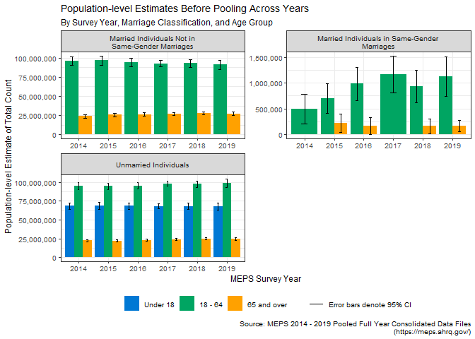
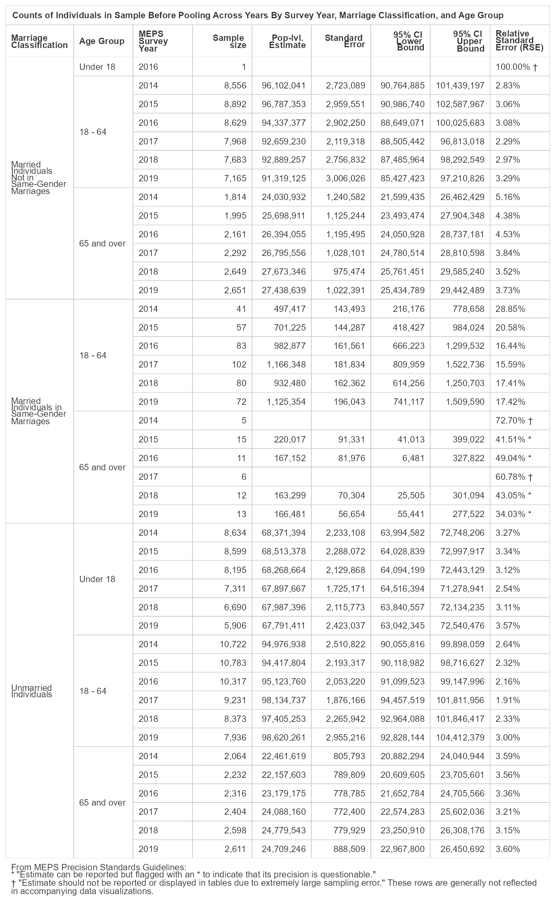
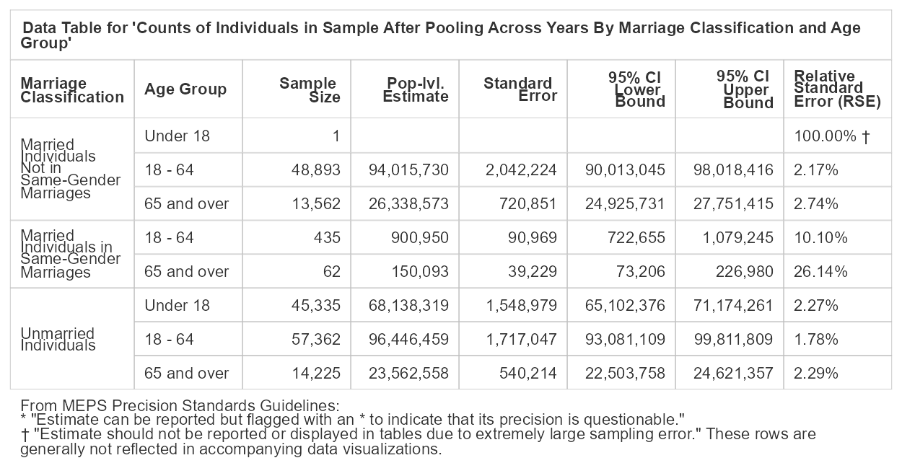
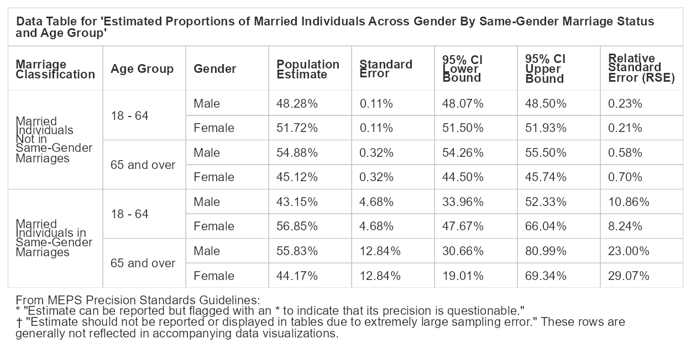
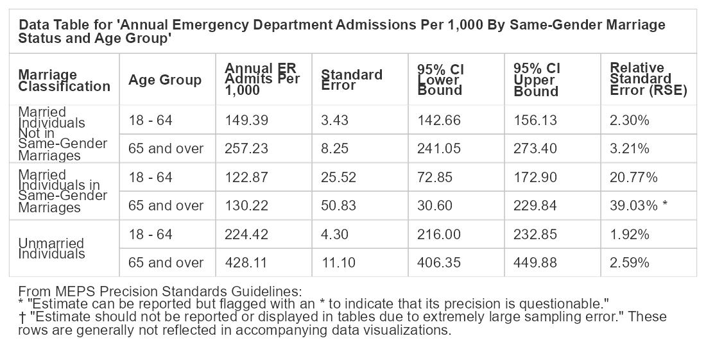
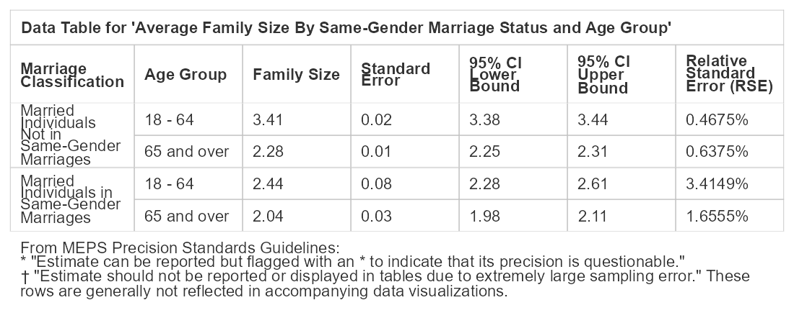

Healthcare Experiences of Elderly LGBTQ+ Individuals in the US: A Visual
Analysis Using Medical Expenditure Panel Survey (MEPS) Data
================
C. Seth Lester, ASA, MAAA
([Seth.Lester@milliman.com](mailto:seth.lester@milliman.com))  
6 July 2023

*The following paper is a submission in reply to the [Society of
Actuaries’ Call for
Papers](https://www.soa.org/research/opportunities/call-for-papers-list/)
under the heading “[Aging and Retirement Issues for LGBTQ+ People –
Second
Invitation](https://www.soa.org/research/opportunities/call-for-essay-aging-retire-lgbtq/)”.*

# Background and Purpose

For some LGBTQ+-identifying subpopulations, the level of discrimination
we face in society is rapidly decreasing; for others, such as
transgender individuals, there are still impactful and endemic stigmas
in play which act as a barrier to living full and rewarding lives.
Barriers such as these have potentially inhibited the ability of many
people who identify as LGBTQ+ from enjoying the same protections of our
social safety net – such as healthcare and retirement security systems –
that are enjoyed by non-LGBTQ+-identifying people.

It is difficult today for analysts to credibly estimate how
retirement-related outcomes differ between LGBTQ+ and non-LGBTQ+
populations, or to know how to quantify the disparities of outcomes
among intersectional subpopulations that exist today within the United
States’ LGBTQ+ population. One key reason for this difficulty is the
lack of available data that can help guide our policymaking apparatus
towards better regulations and protections for members of our society
who are more likely to be marginalized, stigmatized, or disadvantaged by
systemic factors. This includes LGBTQ+ people, of course, but heavily
intersects with people of color, women, religious minorities,
immigrants, disabled individuals, and – key to this essay – the US’
rapidly growing aging population.

In the healthcare space, there is ample energy surrounding the important
work being done by organizations, both private and public, to better
understand the impacts of what are known as Social Determinants of
Health – “the conditions in the environments where people are born,
live, learn, work, play, worship, and age that affect a wide range of
health, functioning, and quality-of-life outcomes and risks” (as defined
by the [US Dept. of Health and Human
Services](https://health.gov/healthypeople/priority-areas/social-determinants-health)).

Social Determinants of Health (SDoH) can provide [causal
evidence](https://aspe.hhs.gov/reports/sdoh-evidence-review) for how
certain subpopulations of our society disproportionately experience poor
health outcomes. Consequently, population health professionals and
actuaries alike have an interest in better understanding the
relationships between SDoH and access to quality healthcare that is both
affordable and can be sustainably provided by the care delivery system.

It is therefore reasonable to suspect that investigating differences in
patient experiences between elderly LGBTQ+-identifying individuals and
their non-LGBTQ+ elderly or non-elderly LGBTQ+ counterparts can give us
better information about how the elderly LGBTQ+ population should plan
and prepare for healthcare expenses in retirement.

In order to carry out this preliminary investigation, I performed an
analysis of the public use files (PUFs) made available by the [Medical
Expenditure Panel Survey](https://meps.ahrq.gov/mepsweb/) (MEPS). The
purpose of this essay is twofold, and the essay is divided into two
primary sections:

1.  In [Data and Methodology](#data-and-methodology) I explain and
    document a consistent data manipulation approach for identifying
    certain cohorts who are likely to identify as LGBTQ+ within the MEPS
    public data files; and
2.  In [Visualizing Healthcare Experiences for LGBTQ+
    Subpopulations](#visualizing-healthcare-experiences-for-lgbtq-subpopulations)
    I showcase a visual representation of preliminary findings around
    key healthcare experiences and outcomes between elderly LGBTQ+
    cohorts and other cohorts – findings which describe healthcare
    outcomes commonly of interest to population health analyses, such as
    total pharmacy expenditure per individual, and average pharmacy
    utilization, average inpatient length-of-stay, and average hospital
    emergency room utilization utilization, to name a few.

The primary goal of this essay is to motivate additional and more
rigorous research into the specific healthcare outcomes-related
challenges faced by current and future elderly LGBTQ+ individuals within
the United States.

# Data and Methodology

## About MEPS

MEPS has been administered in its current form since 1996, and according
the [Agency for Healthcare Research and Quality](https://www.ahrq.gov/)
(AHRQ), the government agency at MEPS’s helm, MEPS is a collection of
“data on the specific health services that Americans use, how frequently
they use them, the cost of these services, and how they are paid for, as
well as data on the cost, scope, and breadth of health insurance held by
and available to U.S. workers” ([Survey Background, MEPS
Homepage](https://meps.ahrq.gov/mepsweb/about_meps/survey_back.jsp)).

Because MEPS data is drawn from survey respondents, it is subject to
many of the usual strengths and limitations of survey data analysis.
performing inferential analysis survey data populated by individual
respondents, and therefore the public use data files that contain
responses at the individual or family level is either self-reported or
imputed. Therefore, there are some situations in which individuals using
this data might want to perform additional data quality checks. For
example, an analyst might want to compare, in aggregate, the results of
two separate but related survey questions, such as the count of
individual respondents that have a valid person ID (PID) value for
spouse ID (SPOUID) against the count of individuals who indicated that
they are currently married.

Additionally, MEPS provides [statistical precision
guidelines](https://meps.ahrq.gov/survey_comp/precision_guidelines.shtml)
about displaying and performing inferential statistical methods using
the data, which include restrictions and guidance concerning minimum
sample sizes of cohorts used in statistical methods, as well as
standards establishing acceptable standard error thresholds of estimates
calculated using statistical methods. I discuss this guidance further in
a subsequent section of this essay.

## About the MEPS Public Use Files

MEPS is administered in two distinct components - the [Household
Component](https://meps.ahrq.gov/mepsweb/survey_comp/household.jsp),
which was used to generate the preliminary findings in this essay, and
the [Insurance
Component](https://meps.ahrq.gov/mepsweb/survey_comp/Insurance.jsp),
which is not publicly available for download and must be accessed in a
[Federal Statistical Research Data
Center](https://www.census.gov/content/census/en/about/adrm/fsrdc/locations.html).
Data from this component was not used for this essay.

The MEPS Household Component “fields questionnaires to individual
household members to collect nationally representative data on
demographic characteristics, health conditions, health status, use of
medical care services, charges and payments, access to care,
satisfaction with care, health insurance coverage, income, and
employment” ([Household Component, Survey Background, MEPS
Homepage](https://meps.ahrq.gov/mepsweb/survey_comp/household.jsp)).

MEPS data files have been used in the past to generate a large number of
findings within the academic disciplines of public health and health
policy. Some specific examples of scientific literature containing an
analysis of MEPS data relevant to the current strategic research
initiatives of the [Society of Actuaries Research
Institute](https://www.soa.org/programs/strategic-research-program/) are
given below:

- [Medical Expenditure Panel Survey: a valuable database for studying
  racial and ethnic disparities in prescription drug
  use](https://pubmed.ncbi.nlm.nih.gov/18794032/)
- [Any Use and “Frequent Use” of Opioids among Elderly Adults in
  2018-2019, by Socioeconomic
  Characteristics](https://pubmed.ncbi.nlm.nih.gov/35696517/)
- [Healthcare Expenditures for Treatment of Mental Disorders: Estimates
  for Adults Ages 18 and Older, U.S. Civilian Noninstitutionalized
  Population, 2019](https://pubmed.ncbi.nlm.nih.gov/35696514/)
- [Comparison of the Total Number of People in the U.S. Civilian
  Noninstitutionalized Population Purchasing One or More Antidepressant
  or Antipsychotic Prescriptions by Select Sociodemographic
  Characteristics, 2013 and
  2018](https://pubmed.ncbi.nlm.nih.gov/35696503/)
- [Top Five Most Costly Conditions among Adults Age 18 and Older, 2012:
  Estimates for the U.S. Civilian Noninstitutionalized
  Population](https://pubmed.ncbi.nlm.nih.gov/28783295/)

One piece of information that absent from the long list of data points
sampled in the MEPS Household Component is whether individual
respondents identify as LGBTQ+. This presents a major challenge for
using MEPS public use files to investigate healthcare outcomes
experienced by LGBTQ+ individuals in the US. However, a method for
identifying some individuals who are very likely to identify as LGBTQ+
is described in further detail in the next section.

The R code that performs this analysis and prepares the this document,
including all data tables and visualizations, is available [on
Github](https://github.com/bentwheel/lgbtq-retirement-meps-analysis).

Since the LGBTQ+-identifying population in the United States is a
relatively small subset of the overall US population, MEPS data PUFs
(Public Use Files) from surveys representative of years between 2014 and
2019 (see table below) have been pooled together to produce the data
visualizations and tables within this essay.

The purpose of pooling the MEPS PUFs across such long span of time is to
build a cohort of elderly (age 65 and up) LGBTQ+ individuals that is
also large enough in size to meet MEPS’ [statistical precision
guidelines](https://meps.ahrq.gov/survey_comp/precision_guidelines.shtml)
for performing statistical methods to generate population-level
estimates of this cohort’s demographic composition and measurable
healthcare outcomes.

All MEPS Full Year Consolidated data PUFs listed in the following table
contain variables pertaining to survey administration, income,
person-level conditions, health status, disability days, quality of
care, employment, health insurance, and person-level medical care use
and expenditures:

| Data File                                                                                                                                                       | Description                                                                                                                                                                                                |
|:----------------------------------------------------------------------------------------------------------------------------------------------------------------|:-----------------------------------------------------------------------------------------------------------------------------------------------------------------------------------------------------------|
| [2019 Full Year Consolidated Data File](https://meps.ahrq.gov/mepsweb/data_stats/download_data_files_detail.jsp?cboPufNumber=HC-216)                            | This file consists of MEPS survey data obtained in Rounds 3, 4, and 5 of Panel 23 and Rounds 1, 2, and 3 of Panel 24, the rounds for the MEPS panels covering calendar year 2019.                          |
| [2018 Full Year Consolidated Data File](https://meps.ahrq.gov/mepsweb/data_stats/download_data_files_detail.jsp?cboPufNumber=HC-209)                            | This file consists of MEPS survey data obtained in Rounds 3, 4, and 5 of Panel 22 and Rounds 1, 2, and 3 of Panel 23, the rounds for the MEPS panels covering calendar year 2018.                          |
| [2017 Full Year Consolidated Data File](https://meps.ahrq.gov/mepsweb/data_stats/download_data_files_detail.jsp?cboPufNumber=HC-201)                            | This file consists of MEPS survey data obtained in Rounds 3, 4, and 5 of Panel 21 and Rounds 1, 2, and 3 of Panel 22, the rounds for the MEPS panels covering calendar year 2017.                          |
| [2016 Full Year Consolidated Data File](https://meps.ahrq.gov/mepsweb/data_stats/download_data_files_detail.jsp?cboPufNumber=HC-192)                            | This file consists of MEPS survey data obtained in Rounds 3, 4, and 5 of Panel 20 and Rounds 1, 2, and 3 of Panel 21, the rounds for the MEPS panels covering calendar year 2016.                          |
| [2015 Full Year Consolidated Data File](https://meps.ahrq.gov/mepsweb/data_stats/download_data_files_detail.jsp?cboPufNumber=HC-181)                            | This file consists of MEPS survey data obtained in Rounds 3, 4, and 5 of Panel 19 and Rounds 1, 2, and 3 of Panel 20, the rounds for the MEPS panels covering calendar year 2015.                          |
| [2014 Full Year Consolidated Data File](https://meps.ahrq.gov/mepsweb/data_stats/download_data_files_detail.jsp?cboPufNumber=HC-171)                            | This file consists of MEPS survey data obtained in Rounds 3, 4, and 5 of Panel 18 and Rounds 1, 2, and 3 of Panel 19, the rounds for the MEPS panels covering calendar year 2014.                          |
| [MEPS 1996-2020 Pooled Linkage File for Common Variance Structure](https://meps.ahrq.gov/mepsweb/data_stats/download_data_files_detail.jsp?cboPufNumber=HC-036) | This HC-036 file contains the proper variance structure to use when making estimates from MEPS data that have been pooled over multiple years and where one or more years are from 1996-2001 or 2019-2020. |

## Identifying Individuals in Same-Gender Marriages in the MEPS Public Use Files

As stated earlier, there is no LGBTQ+ indicator in the MEPS survey
questionnaires that are administered to respondents. Therefore, in this
essay, we will make the simplifying assumption that individuals in
same-gender marriages are members of the US subpopulation identifying as
LGBTQ+.

Below is an image consisting of several examples of actual records and
fields in the [2019 MEPS Full Year Consolidated PUF
Codebook](https://meps.ahrq.gov/mepsweb/data_stats/download_data_files_codebook.jsp?PUFId=H216)
provided in order to showcase the methodology used to construct the
same-gender marriage flag in the MEPS PUFs.

Fig. 1: Example Records in the 2019 MEPS PUFs

There are many shortcomings to this approach, as this approach will fail
to identify certain individual respondents who may identify as LGBTQ+,
such as:

- Any male-identifying individual who is married to a female-identifying
  individual, in cases where at least one of the spouses identifies as
  LGBTQ+ (e.g., individuals who identify as transgender); and,
- All unmarried persons who identify as LGBQT+.

However, this approach will succeed in identifying the following
individual respondents:

- Any LGBTQ+-identifying individual married to a any other
  LGBTQ+-identifying individual, in cases where both spouses identify as
  the same binary gender.

While this approach does fail to identify large subgroups within the
broader LGBQT+ population in the United States, we can still use this
approach to determine if there are substantial differences in the
underlying demography, patient experiences, or incurred expenses between
some LGBQT+ subpopulations and otherwise-similar non-LGBQT+
subpopulations within the US.

In this essay, we will consider and even see some evidence supporting
the possibility that marriage (or cohabitation, more generally) has a
confounding influence on some of the population-level estimates of
measurements of interest (e.g., annual healthcare expenditures,
emergency room utilization, etc.). Therefore, most data visualizations
and data tables in this essay will present findings comparing key
population-level estimates between married individuals in same-gender
marriages against married individuals not in same-gender marriages in
order to control for the potential confounding effect of marriage or
cohabitation.

## MEPS Precision Guidelines for Population-Level Estimates

In most cases, the MEPS statistical precision guidelines require that
any estimates of statistics (e.g., means, total counts, or proportions)
based on categorical indicators (e.g., race, gender, etc.) *or* numeric
variables (e.g., mean number of RX fills per year) adhere to the
following two restrictions:

1.  The underlying sample data associated with the subpopulation from
    which the estimates are derived should consist of at least 60
    sampling units. The sampling units can be families or individuals,
    but in our case is composed of individual respondents.
2.  The relative standard error (RSE) corresponding to any estimate of a
    statistic of interest must absolutely not exceed 0.5. If so, it
    should not be displayed in data tables or visualizations of
    findings. Furthermore, if the RSE of the corresponding
    population-level estimate exceeds 0.3, it must be called out in any
    charts or tables as potentially spurious. Relative standard error
    can be computed as $$ RSE = \frac{Std. Err}{Estimate} $$ and is
    displayed as a percentage in the data tables in [Appendix
    A](#appendix-a-data-tables) for all population-level estimates
    computed in this essay.

## Sample Sizes Before Pooling Across MEPS Years

In the data visualization below, the minimum sample threshold required
by the MEPS precision standards guidelines (*n* = 60) is denoted by a
dashed red line. We can see from this visualization that almost all of
the cohorts of interest (individuals in same-gender marriages, in age
groups 18 - 64 and 65+) fail to meet the sample size requirement in any
single year.

Fig 2: Counts of Individuals in Sample Before Pooling Across Years

Additionally, we should be concerned about the statistical validity of
population-level estimates that are computed by applying weights to very
small cross-sectional subsets of the MEPS respondent data, especially
when the subpopulation of interest (in our case, LGBTQ+ individuals over
age 65) was sampled across and will be ultimately weighted by
demographic strata that have little to do with the demographic subsets
we are attempting to study in this essay.

## Population-level Estimates Before Pooling

In the following table, we can see the population-level estimates for
the total number of married individuals within the United States, broken
out by MEPS survey year, which have been calculated based on the
individual respondents in each group and their associated weighting.
Furthermore, person- and stratum-level variances are also used to
compute a measure of the estimate’s precision, which is expressed as a
standard error measurement, relative standard error (RSE), and the lower
and upper bounds of the 95% confidence interval.

<table data-quarto-disable-processing='true' class='cl-29f6f9aa'><thead><tr style="overflow-wrap:break-word;"><th  colspan="9"class="cl-29eee97c">
Counts of Individuals in Sample Before Pooling Across Years By Survey Year, Marriage Classification, and Age Group
</th></tr><tr style="overflow-wrap:break-word;"><th class="cl-29eee97c">
Marriage Classification
</th><th class="cl-29eee97c">
Age Group
</th><th class="cl-29eee97c">
MEPS Survey Year
</th><th class="cl-29eee986">
n
</th><th class="cl-29eee986">
Pop-lvl. Estimate
</th><th class="cl-29eee986">
Standard Error
</th><th class="cl-29eee986">
95% CI Lower Bound
</th><th class="cl-29eee986">
95% CI Upper Bound
</th><th class="cl-29eee97c">
Relative Standard Error (RSE)
</th></tr></thead><tbody><tr style="overflow-wrap:break-word;"><td  rowspan="13"class="cl-29eee990">
Married Individuals Not in Same-Gender Marriages
</td><td class="cl-29eee990">
Under 18
</td><td class="cl-29eee990">
2016
</td><td class="cl-29eee991">
1
</td><td class="cl-29eee991">
2,733
</td><td class="cl-29eee991">
2,733
</td><td class="cl-29eee991">
-2,624
</td><td class="cl-29eee991">
8,091
</td><td class="cl-29eee990">
100.00% †
</td></tr><tr style="overflow-wrap:break-word;"><td  rowspan="6"class="cl-29eee97c">
18 - 64
</td><td class="cl-29eee97c">
2014
</td><td class="cl-29eee986">
8,556
</td><td class="cl-29eee986">
96,102,041
</td><td class="cl-29eee986">
2,723,089
</td><td class="cl-29eee986">
90,764,885
</td><td class="cl-29eee986">
101,439,197
</td><td class="cl-29eee97c">
2.83% 
</td></tr><tr style="overflow-wrap:break-word;"><td class="cl-29eee97c">
2015
</td><td class="cl-29eee986">
8,892
</td><td class="cl-29eee986">
96,787,353
</td><td class="cl-29eee986">
2,959,551
</td><td class="cl-29eee986">
90,986,740
</td><td class="cl-29eee986">
102,587,967
</td><td class="cl-29eee97c">
3.06% 
</td></tr><tr style="overflow-wrap:break-word;"><td class="cl-29eee97c">
2016
</td><td class="cl-29eee986">
8,629
</td><td class="cl-29eee986">
94,337,377
</td><td class="cl-29eee986">
2,902,250
</td><td class="cl-29eee986">
88,649,071
</td><td class="cl-29eee986">
100,025,683
</td><td class="cl-29eee97c">
3.08% 
</td></tr><tr style="overflow-wrap:break-word;"><td class="cl-29eee97c">
2017
</td><td class="cl-29eee986">
7,968
</td><td class="cl-29eee986">
92,659,230
</td><td class="cl-29eee986">
2,119,318
</td><td class="cl-29eee986">
88,505,442
</td><td class="cl-29eee986">
96,813,018
</td><td class="cl-29eee97c">
2.29% 
</td></tr><tr style="overflow-wrap:break-word;"><td class="cl-29eee97c">
2018
</td><td class="cl-29eee986">
7,683
</td><td class="cl-29eee986">
92,889,257
</td><td class="cl-29eee986">
2,756,832
</td><td class="cl-29eee986">
87,485,964
</td><td class="cl-29eee986">
98,292,549
</td><td class="cl-29eee97c">
2.97% 
</td></tr><tr style="overflow-wrap:break-word;"><td class="cl-29eee97c">
2019
</td><td class="cl-29eee986">
7,165
</td><td class="cl-29eee986">
91,319,125
</td><td class="cl-29eee986">
3,006,026
</td><td class="cl-29eee986">
85,427,423
</td><td class="cl-29eee986">
97,210,826
</td><td class="cl-29eee97c">
3.29% 
</td></tr><tr style="overflow-wrap:break-word;"><td  rowspan="6"class="cl-29eee97c">
65 and over
</td><td class="cl-29eee97c">
2014
</td><td class="cl-29eee986">
1,814
</td><td class="cl-29eee986">
24,030,932
</td><td class="cl-29eee986">
1,240,582
</td><td class="cl-29eee986">
21,599,435
</td><td class="cl-29eee986">
26,462,429
</td><td class="cl-29eee97c">
5.16% 
</td></tr><tr style="overflow-wrap:break-word;"><td class="cl-29eee97c">
2015
</td><td class="cl-29eee986">
1,995
</td><td class="cl-29eee986">
25,698,911
</td><td class="cl-29eee986">
1,125,244
</td><td class="cl-29eee986">
23,493,474
</td><td class="cl-29eee986">
27,904,348
</td><td class="cl-29eee97c">
4.38% 
</td></tr><tr style="overflow-wrap:break-word;"><td class="cl-29eee97c">
2016
</td><td class="cl-29eee986">
2,161
</td><td class="cl-29eee986">
26,394,055
</td><td class="cl-29eee986">
1,195,495
</td><td class="cl-29eee986">
24,050,928
</td><td class="cl-29eee986">
28,737,181
</td><td class="cl-29eee97c">
4.53% 
</td></tr><tr style="overflow-wrap:break-word;"><td class="cl-29eee97c">
2017
</td><td class="cl-29eee986">
2,292
</td><td class="cl-29eee986">
26,795,556
</td><td class="cl-29eee986">
1,028,101
</td><td class="cl-29eee986">
24,780,514
</td><td class="cl-29eee986">
28,810,598
</td><td class="cl-29eee97c">
3.84% 
</td></tr><tr style="overflow-wrap:break-word;"><td class="cl-29eee97c">
2018
</td><td class="cl-29eee986">
2,649
</td><td class="cl-29eee986">
27,673,346
</td><td class="cl-29eee986">
975,474
</td><td class="cl-29eee986">
25,761,451
</td><td class="cl-29eee986">
29,585,240
</td><td class="cl-29eee97c">
3.52% 
</td></tr><tr style="overflow-wrap:break-word;"><td class="cl-29eee97c">
2019
</td><td class="cl-29eee986">
2,651
</td><td class="cl-29eee986">
27,438,639
</td><td class="cl-29eee986">
1,022,391
</td><td class="cl-29eee986">
25,434,789
</td><td class="cl-29eee986">
29,442,489
</td><td class="cl-29eee97c">
3.73% 
</td></tr><tr style="overflow-wrap:break-word;"><td  rowspan="12"class="cl-29eee97c">
Married Individuals in Same-Gender Marriages
</td><td  rowspan="6"class="cl-29eee97c">
18 - 64
</td><td class="cl-29eee97c">
2014
</td><td class="cl-29eee986">
41
</td><td class="cl-29eee986">
497,417
</td><td class="cl-29eee986">
143,493
</td><td class="cl-29eee986">
216,176
</td><td class="cl-29eee986">
778,658
</td><td class="cl-29eee97c">
28.85% 
</td></tr><tr style="overflow-wrap:break-word;"><td class="cl-29eee97c">
2015
</td><td class="cl-29eee986">
57
</td><td class="cl-29eee986">
701,225
</td><td class="cl-29eee986">
144,287
</td><td class="cl-29eee986">
418,427
</td><td class="cl-29eee986">
984,024
</td><td class="cl-29eee97c">
20.58% 
</td></tr><tr style="overflow-wrap:break-word;"><td class="cl-29eee97c">
2016
</td><td class="cl-29eee986">
83
</td><td class="cl-29eee986">
982,877
</td><td class="cl-29eee986">
161,561
</td><td class="cl-29eee986">
666,223
</td><td class="cl-29eee986">
1,299,532
</td><td class="cl-29eee97c">
16.44% 
</td></tr><tr style="overflow-wrap:break-word;"><td class="cl-29eee97c">
2017
</td><td class="cl-29eee986">
102
</td><td class="cl-29eee986">
1,166,348
</td><td class="cl-29eee986">
181,834
</td><td class="cl-29eee986">
809,959
</td><td class="cl-29eee986">
1,522,736
</td><td class="cl-29eee97c">
15.59% 
</td></tr><tr style="overflow-wrap:break-word;"><td class="cl-29eee97c">
2018
</td><td class="cl-29eee986">
80
</td><td class="cl-29eee986">
932,480
</td><td class="cl-29eee986">
162,362
</td><td class="cl-29eee986">
614,256
</td><td class="cl-29eee986">
1,250,703
</td><td class="cl-29eee97c">
17.41% 
</td></tr><tr style="overflow-wrap:break-word;"><td class="cl-29eee97c">
2019
</td><td class="cl-29eee986">
72
</td><td class="cl-29eee986">
1,125,354
</td><td class="cl-29eee986">
196,043
</td><td class="cl-29eee986">
741,117
</td><td class="cl-29eee986">
1,509,590
</td><td class="cl-29eee97c">
17.42% 
</td></tr><tr style="overflow-wrap:break-word;"><td  rowspan="6"class="cl-29eee97c">
65 and over
</td><td class="cl-29eee97c">
2014
</td><td class="cl-29eee986">
5
</td><td class="cl-29eee986">
80,463
</td><td class="cl-29eee986">
58,499
</td><td class="cl-29eee986">
-34,194
</td><td class="cl-29eee986">
195,120
</td><td class="cl-29eee97c">
72.70% †
</td></tr><tr style="overflow-wrap:break-word;"><td class="cl-29eee97c">
2015
</td><td class="cl-29eee986">
15
</td><td class="cl-29eee986">
220,017
</td><td class="cl-29eee986">
91,331
</td><td class="cl-29eee986">
41,013
</td><td class="cl-29eee986">
399,022
</td><td class="cl-29eee97c">
41.51% *
</td></tr><tr style="overflow-wrap:break-word;"><td class="cl-29eee97c">
2016
</td><td class="cl-29eee986">
11
</td><td class="cl-29eee986">
167,152
</td><td class="cl-29eee986">
81,976
</td><td class="cl-29eee986">
6,481
</td><td class="cl-29eee986">
327,822
</td><td class="cl-29eee97c">
49.04% *
</td></tr><tr style="overflow-wrap:break-word;"><td class="cl-29eee97c">
2017
</td><td class="cl-29eee986">
6
</td><td class="cl-29eee986">
103,145
</td><td class="cl-29eee986">
62,693
</td><td class="cl-29eee986">
-19,731
</td><td class="cl-29eee986">
226,021
</td><td class="cl-29eee97c">
60.78% †
</td></tr><tr style="overflow-wrap:break-word;"><td class="cl-29eee97c">
2018
</td><td class="cl-29eee986">
12
</td><td class="cl-29eee986">
163,299
</td><td class="cl-29eee986">
70,304
</td><td class="cl-29eee986">
25,505
</td><td class="cl-29eee986">
301,094
</td><td class="cl-29eee97c">
43.05% *
</td></tr><tr style="overflow-wrap:break-word;"><td class="cl-29eee97c">
2019
</td><td class="cl-29eee986">
13
</td><td class="cl-29eee986">
166,481
</td><td class="cl-29eee986">
56,654
</td><td class="cl-29eee986">
55,441
</td><td class="cl-29eee986">
277,522
</td><td class="cl-29eee97c">
34.03% *
</td></tr><tr style="overflow-wrap:break-word;"><td  rowspan="18"class="cl-29eee97c">
Unmarried Individuals
</td><td  rowspan="6"class="cl-29eee97c">
Under 18
</td><td class="cl-29eee97c">
2014
</td><td class="cl-29eee986">
8,634
</td><td class="cl-29eee986">
68,371,394
</td><td class="cl-29eee986">
2,233,108
</td><td class="cl-29eee986">
63,994,582
</td><td class="cl-29eee986">
72,748,206
</td><td class="cl-29eee97c">
3.27% 
</td></tr><tr style="overflow-wrap:break-word;"><td class="cl-29eee97c">
2015
</td><td class="cl-29eee986">
8,599
</td><td class="cl-29eee986">
68,513,378
</td><td class="cl-29eee986">
2,288,072
</td><td class="cl-29eee986">
64,028,839
</td><td class="cl-29eee986">
72,997,917
</td><td class="cl-29eee97c">
3.34% 
</td></tr><tr style="overflow-wrap:break-word;"><td class="cl-29eee97c">
2016
</td><td class="cl-29eee986">
8,195
</td><td class="cl-29eee986">
68,268,664
</td><td class="cl-29eee986">
2,129,868
</td><td class="cl-29eee986">
64,094,199
</td><td class="cl-29eee986">
72,443,129
</td><td class="cl-29eee97c">
3.12% 
</td></tr><tr style="overflow-wrap:break-word;"><td class="cl-29eee97c">
2017
</td><td class="cl-29eee986">
7,311
</td><td class="cl-29eee986">
67,897,667
</td><td class="cl-29eee986">
1,725,171
</td><td class="cl-29eee986">
64,516,394
</td><td class="cl-29eee986">
71,278,941
</td><td class="cl-29eee97c">
2.54% 
</td></tr><tr style="overflow-wrap:break-word;"><td class="cl-29eee97c">
2018
</td><td class="cl-29eee986">
6,690
</td><td class="cl-29eee986">
67,987,396
</td><td class="cl-29eee986">
2,115,773
</td><td class="cl-29eee986">
63,840,557
</td><td class="cl-29eee986">
72,134,235
</td><td class="cl-29eee97c">
3.11% 
</td></tr><tr style="overflow-wrap:break-word;"><td class="cl-29eee97c">
2019
</td><td class="cl-29eee986">
5,906
</td><td class="cl-29eee986">
67,791,411
</td><td class="cl-29eee986">
2,423,037
</td><td class="cl-29eee986">
63,042,345
</td><td class="cl-29eee986">
72,540,476
</td><td class="cl-29eee97c">
3.57% 
</td></tr><tr style="overflow-wrap:break-word;"><td  rowspan="6"class="cl-29eee97c">
18 - 64
</td><td class="cl-29eee97c">
2014
</td><td class="cl-29eee986">
10,722
</td><td class="cl-29eee986">
94,976,938
</td><td class="cl-29eee986">
2,510,822
</td><td class="cl-29eee986">
90,055,816
</td><td class="cl-29eee986">
99,898,059
</td><td class="cl-29eee97c">
2.64% 
</td></tr><tr style="overflow-wrap:break-word;"><td class="cl-29eee97c">
2015
</td><td class="cl-29eee986">
10,783
</td><td class="cl-29eee986">
94,417,804
</td><td class="cl-29eee986">
2,193,317
</td><td class="cl-29eee986">
90,118,982
</td><td class="cl-29eee986">
98,716,627
</td><td class="cl-29eee97c">
2.32% 
</td></tr><tr style="overflow-wrap:break-word;"><td class="cl-29eee97c">
2016
</td><td class="cl-29eee986">
10,317
</td><td class="cl-29eee986">
95,123,760
</td><td class="cl-29eee986">
2,053,220
</td><td class="cl-29eee986">
91,099,523
</td><td class="cl-29eee986">
99,147,996
</td><td class="cl-29eee97c">
2.16% 
</td></tr><tr style="overflow-wrap:break-word;"><td class="cl-29eee97c">
2017
</td><td class="cl-29eee986">
9,231
</td><td class="cl-29eee986">
98,134,737
</td><td class="cl-29eee986">
1,876,166
</td><td class="cl-29eee986">
94,457,519
</td><td class="cl-29eee986">
101,811,956
</td><td class="cl-29eee97c">
1.91% 
</td></tr><tr style="overflow-wrap:break-word;"><td class="cl-29eee97c">
2018
</td><td class="cl-29eee986">
8,373
</td><td class="cl-29eee986">
97,405,253
</td><td class="cl-29eee986">
2,265,942
</td><td class="cl-29eee986">
92,964,088
</td><td class="cl-29eee986">
101,846,417
</td><td class="cl-29eee97c">
2.33% 
</td></tr><tr style="overflow-wrap:break-word;"><td class="cl-29eee97c">
2019
</td><td class="cl-29eee986">
7,936
</td><td class="cl-29eee986">
98,620,261
</td><td class="cl-29eee986">
2,955,216
</td><td class="cl-29eee986">
92,828,144
</td><td class="cl-29eee986">
104,412,379
</td><td class="cl-29eee97c">
3.00% 
</td></tr><tr style="overflow-wrap:break-word;"><td  rowspan="6"class="cl-29eee97c">
65 and over
</td><td class="cl-29eee97c">
2014
</td><td class="cl-29eee986">
2,064
</td><td class="cl-29eee986">
22,461,619
</td><td class="cl-29eee986">
805,793
</td><td class="cl-29eee986">
20,882,294
</td><td class="cl-29eee986">
24,040,944
</td><td class="cl-29eee97c">
3.59% 
</td></tr><tr style="overflow-wrap:break-word;"><td class="cl-29eee97c">
2015
</td><td class="cl-29eee986">
2,232
</td><td class="cl-29eee986">
22,157,603
</td><td class="cl-29eee986">
789,809
</td><td class="cl-29eee986">
20,609,605
</td><td class="cl-29eee986">
23,705,601
</td><td class="cl-29eee97c">
3.56% 
</td></tr><tr style="overflow-wrap:break-word;"><td class="cl-29eee97c">
2016
</td><td class="cl-29eee986">
2,316
</td><td class="cl-29eee986">
23,179,175
</td><td class="cl-29eee986">
778,785
</td><td class="cl-29eee986">
21,652,784
</td><td class="cl-29eee986">
24,705,566
</td><td class="cl-29eee97c">
3.36% 
</td></tr><tr style="overflow-wrap:break-word;"><td class="cl-29eee97c">
2017
</td><td class="cl-29eee986">
2,404
</td><td class="cl-29eee986">
24,088,160
</td><td class="cl-29eee986">
772,400
</td><td class="cl-29eee986">
22,574,283
</td><td class="cl-29eee986">
25,602,036
</td><td class="cl-29eee97c">
3.21% 
</td></tr><tr style="overflow-wrap:break-word;"><td class="cl-29eee97c">
2018
</td><td class="cl-29eee986">
2,598
</td><td class="cl-29eee986">
24,779,543
</td><td class="cl-29eee986">
779,929
</td><td class="cl-29eee986">
23,250,910
</td><td class="cl-29eee986">
26,308,176
</td><td class="cl-29eee97c">
3.15% 
</td></tr><tr style="overflow-wrap:break-word;"><td class="cl-29eee97c">
2019
</td><td class="cl-29eee986">
2,611
</td><td class="cl-29eee986">
24,709,246
</td><td class="cl-29eee986">
888,509
</td><td class="cl-29eee986">
22,967,800
</td><td class="cl-29eee986">
26,450,692
</td><td class="cl-29eee97c">
3.60% 
</td></tr></tbody><tfoot><tr style="overflow-wrap:break-word;"><td  colspan="9"class="cl-29eee99a">
From MEPS Precision Standards Guidelines: * "Estimate can be reported but flagged with an * to indicate that its precision is questionable." † "Estimate should not be reported or displayed in tables due to extremely large sampling error." These rows are generally not reflected in accompanying data visualizations.
</td></tr></tfoot></table>

Additionally, we can use the population-level estimates and squared
errors displayed in the table to construct a visualization of these
estimates and the corresponding level of statistical variability around
them, which is potentially more helpful for identifying opportunities in
which more rigorous investigation would bear statistically meaningful
insights.

As in the chart above, and in subsequent visualizations of
population-level estimates of key findings in this essay, each of the
solid bars represents a population-level estimate of the statistic of
interest for the entire US population. The error bars accompanying each
solid bar represent the upper and lower bounds of the 95% confidence
interval around the corresponding population-level estimate.

In lay terms, you can imagine each solid bar as representing the “true”
population measure. Because this chart is presenting an *estimate* of
the population measure based on survey data, you should interpret the
bar to be a good (but not exact) guess at the “true” population-level
measure of interest.

The error bars can be interpreted as expressing the level of variability
around that guess. In other words, we are confident at a 95% level that
the “true” population-level measure of interest, if we were able to
survey the entire US population, falls somewhere in between the top and
bottom of the associated error bar. As in most cases, estimates with
larger underlying sample sizes (e.g., non-LGBTQ+ married individuals age
18 - 64) will tend to be expressed with much less variability.

In many cases, the estimates of population-level statistics will appear
to show meaningful differences between cohorts in this essay’s
visualizations. It is important to also contextualize these statistical
estimates by using the error bars. As you view the data visualizations
that follow, you should make use of the error bars to question the
degree of belief to which our estimates reflect “true” population-level
differences between cohorts.

Finally, as you inspect the data visualizations in this essay, please
refer to the accompanying data table for the respective visualizations
in [Appendix A](#appendix-a-data-tables) for additional information
about the estimates or their variability and statistical validity.
Throughout the course of this essay, I will take every opportunity to
cross-reference population-level estimates derived from MEPS data
against available 3rd-party data sources in order to provide some level
of external validation.

## A Validation Example: Estimating the Number of Same-Gender Marriages in the US

As a small validation exercise, we will first locate a population-level
estimate of total counts of individuals in same-gender marriages in the
table above from a MEPS survey year that *does* meet the MEPS
statistical precision guidelines for sample size. We can then compare
that estimate against comparable estimates derived from published
findings which are not related to MEPS.

Let us take for example the data from 2016, which represents the US
population one year after the landmark Supreme Court decision in
*Obergefell v. Hodges* that effectively legalized same-gender marriages
across the US. Despite the relative recency of this SCOTUS decision,
several US states legally recognized same-gender marriages at the time.

In the visualization and accompanying data table above, we see that the
population-level estimate of the number of individuals ages 18 - 64 in
same-gender marriages in the US is centered at 982,877 with a 95%
confidence interval spanning from 666,223 to 1,299,532. The
corresponding estimate for individuals in same-gender marriages ages 65
and up is 167,152, and is marked as potentially spurious due to a high
RSE (relative standard error), largely as a result of small sample
cardinality for this particular subpopulation.

One external source we can use to externally validate this estimate is
the [American Community
Survey](https://www.census.gov/programs-surveys/acs) for the same year
(2016), which places an [estimated count of individuals living in
“Same-Sex Married Couple
Households”](https://www.census.gov/content/dam/Census/library/publications/2021/demo/p70-167.pdf)
(p. 22) at around 1,000,000 individuals, which is consistent with our
estimate (and associated statistical variability) of the same statistic.

Finally, note that, in some years, the representative sample is so small
for same-gender married individuals over age 65 that the computed lower
bound of the 95% confidence interval extends into negative territory,
which is nonsensical. Avoiding this kind of nonsensical presentation of
statistical variability around an estimate derived from MEPS data is the
primary reasoning given by MEPS for imposing the RSE restriction in
their statistical precision guidelines.

Displaying nonsensical error bars that extend into negative territory on
the preceding visualization of population-level estimates is done for
explanatory purposes only. Going forward, subsequent data visualizations
in this essay will suppress all subgroups in which the standard error of
the population-level estimate exceeds the 50% RSE threshold specified in
the MEPS statistical precision guidelines (denoted in corresponding data
tables by the symbol “†”).

## Population-level Estimates After Pooling MEPS Data Years

Since our aim is to compare the experiences or healthcare expenses
between LGBQT+ subpopulations and non-LGBQT+ subpopulations with a focus
on individuals age 65 and up, we will not be able to meet the basic MEPS
precision guidelines described above without pooling across multiple
years. This is due to the fact that any single-year MEPS file lacks the
required number of respondents (*n* \>= 60) who are age 65 and up and in
same-gender marriages.

MEPS prescribes a methodology for pooling across multiple data years
within [the documentation for the Pooled Linkage
PUF](https://meps.ahrq.gov/data_stats/download_data/pufs/h036/h36u20doc.shtml).
This PUF contains survey weights and variances at the sampling unit and
demographic stratum level that enables pooling across multiple years.

Once pooling from 2014 - 2019 is completed, we can see that both age
groups in the same-gender marriage subpopulation meet the minimum sample
size of 60 required by the MEPS statistical precision guidelines (*n* =
435 for the 18 - 64 age band, *n* = 62 for the over 65 age band).
However, with just barely over 60 respondents in the latter group, we
are likely to encounter a good deal of variability around estimates of
measurements for this cohort.

## Another Validation Example: Using Pooled MEPS Data

When using the pooled 2014 - 2019 data to compute population-level
estimates, we arrive at an estimate of 1,051,043 total individuals in
same-gender marriages within the US, arrived at by adding the estimated
totals for each subgroup (900,950 for the “18 to 64” age band, plus
150,093 for the “65 and over” age band).

To determine the 95% confidence interval around this estimate, we can
simply take the square root of the sum of squared confidence interval
radii given for each subgroup’s estimate,
$\sqrt{ (1.95996 * 90,969)^2 + (1.95996 * 39,229)^2 }$, to arrive at a
the 95% confidence interval radius for our combined estimate of the
total number of same-gender marriages within the US. Thus, the 95%
confidence interval around this estimate spans from 856,875 to
1,245,211.

Once again, we can compare these estimates to the [findings from the
American Community Survey for
2019](https://www.census.gov/content/dam/Census/library/publications/2021/acs/acsbr-005.pdf)
which reports the total estimated count of same-sex married individuals
at 1,136,220 (two times the number of same-sex married couples
*households* reported in Table 1, on page 2), which falls relatively
close to the center of the 95% confidence interval around our
population-level estimate for the same statistic.

# Visualizing Healthcare Experiences for LGBTQ+ Subpopulations

## Exploring the Demographic Composition of LGBTQ+ Subpopulations

Prior to performing any analysis of healthcare outcomes experienced by
LGBTQ+ subpopulations, it’s important to first to understand any key
differences in the demographic compositions of our comparison cohort
(elderly LGBTQ+ individuals) and our three baseline cohorts ( (1)
non-LGBTQ+, non-elderly individuals, (2) non-LGBTQ+, elderly
individuals, and (3) non-elderly LGBTQ+ individuals). Meaningful
differences in demographic composition between these cohorts can act as
potential confounding factors when analyzing differences in healthcare
outcomes between these cohorts.

### Gender

Despite the larger degree of uncertainty around estimates of gender
proportions in the cohort of individuals in same-gender marriages,
gender composition appears to be similar.

In an official blog post, a data scientist with Facebook [described an
analysis of age difference in same-gender vs. opposite-gender
couples](https://m.facebook.com/nt/screen/?params=%7B%22note_id%22%3A10158928005158415%7D&path=%2Fnotes%2Fnote%2F&refsrc=deprecated&_rdr)
using anonymized Facebook member data. The findings include:

- Opposite-gender couples have an average age difference of 2.4 years,
  with the male being older than the female.
- The average age gap is wider for same-gender couples than it is for
  opposite-gender couples, and that this age gap widens even further for
  older couples.

These findings are echoed by a more recent publication, [Age Differences
Among Coresidential
Partners](https://www.census.gov/library/working-papers/2023/demo/SEHSD-WP2023-10.html),
published by the US Census Bureau using 2021 American Community Survey
data.

### Health Plan Coverage

In the MEPS datasets, the three levels in the health plan coverage
variable are defined as follows:

- **Any Private** includes individuals who have both Medicare and any
  other private comprehensive plan, such as a Medicare Supplement (aka
  “Medigap”) plan. This category also includes individuals over age 65
  exclusively on a private plan, which includes Medicare Advantage and
  TRICARE beneficiaries.
- **Public only** includes individuals on traditional “fee-for-service”
  Part B plans who do not have private supplemental coverage, Medicaid
  beneficiaries, dual-eligible individuals, and individuals enrolled in
  other public and state-sponsored plans (such as CHIP).
- **Uninsured** includes any individual not enrolled in a health plan.

There does not appear to be any significant differences between
distributions of coverage rates among the cohorts. As [marital status is
an important predictor of uninsured
status](https://www.census.gov/newsroom/blogs/random-samplings/2014/09/married-with-health-insurance.html),
it is useful for our purposes that the baseline and comparison cohorts
within this visualization consist exclusively of married individuals.
Nonetheless, it does appear that the uninsured rate for individuals in
the 18 - 64 age band in same-gender marriages is nearly half of the
uninsured rate for individuals in the 18 - 64 age band not in
same-gender marriages. Due to the non-overlapping confidence intervals
for these estimates, this could be a statistic of interest but also
could be confounded by other factors, such as race and ethnicity, which
we will investigate subsequently.

The MEPS data for the period of 2014 - 2019 does not appear to contain
even one sample respondent who is age 65 and up, in a same-gender
marriage, and uninsured. Therefore, an estimate of the uninsured rate
for the cohort of individuals over 65 in a same-gender marriage cannot
be determined from this data.

Estimates of coverage type distributions for all cohorts are consistent
with findings from a [2019 statistical
report](https://www.cdc.gov/nchs/data/nhsr/nhsr159-508.pdf) published by
the US Department of Health and Human Services based on data from
another survey.

### Race and Ethnicity

MEPS survey data does not offer a “Latine” option for responses to
questions surveying racial identity, but does poll respondents for an
ethnicity response, coded as either “Hispanic” or “Not Hispanic” with
another accompanying variable that breaks respondents who indicate an
ethnicity of “Hispanic” into subgroups based on geographic origin. As a
refresher, more information about the difference between coding
“Hispanic” as an individual’s ethnicity versus “Latine” as an
individual’s racial identity can found in an article from the Office of
Equity, Diversity & Inclusion at the Duke University School of Medicine,
[“Ask the OEDI: Hispanic, Latino, Latina, Latinx - Which is
Best?”](https://medschool.duke.edu/blog/ask-oedi-hispanic-latino-latina-latinx-which-best).

Distributions of proportions of responses to race and ethnicity
questions appear to be relatively comparable across all cohorts. Any
differences between cohorts observed here appear to be in line with the
usual expected differences we would expect. Marital status is known to
be predicted by age, race, and ethnicity factors as follows:

- **Across all race and ethnicity groups, fewer individuals in the US
  are marrying.** In 2022, [the US Census Bureau published
  findings](https://www.census.gov/newsroom/press-releases/2022/americas-families-and-living-arrangements.html)
  that 34% of individuals age 15 and up (the youngest age at which one
  can marry in some US states) have never been married. This is an
  increase from 23% observed in 1950.
- **Across all age groups, Black individuals have lower rates of
  marriage than other racial and ethic groups.** The growing Black
  marriage divide is a well-studied topic in sociology and demography
  journals and is thought to be caused by a number of factors, primarily
  “labor market disparities and other structural disadvantages that
  Black people face, especially Black men” ([“The Growing Racial and
  Ethnic Divide in U.S. Marriage
  Patterns”](https://www.ncbi.nlm.nih.gov/pmc/articles/PMC4850739/)).

Breaking estimates of proportional distribution of race and ethnicity
proportions out along so many lines can cause estimates of statistical
precision to become very high, especially in groups where estimates are
computed on smaller samples. Therefore, it is helpful to break out key
racial and ethnic identifiers in less granular subsets.

While exercising some caution around generalizing as “Hispanic” is a
broad group, there do not appear to be significant differences between
the comparison cohort and baseline cohorts in the distributions of
marriage by age group and race.

In this chart, I have chosen to add a third facet displaying
distributions of Black-identifying individuals among additional cohorts
which contain unmarried individuals in order to capture a visual
representation of the Black marriage divide within this data.

### Income Level

The following visualization compares our baseline and comparison cohorts
against one another expressed in terms of total income across all family
members divided by the applicable federal poverty level. The federal
poverty level (FPL) is [an income measure generated each year by the US
Department of Health and Human
Services](https://www.healthcare.gov/glossary/federal-poverty-level-fpl)
for the purpose of determining the eligibility of individuals and
families for certain state and federal health plans, assistance
programs, and other benefits. The HHS federal poverty level is based on
[statistical poverty thresholds determined and promulgated annually by
the US Census
Bureau](https://aspe.hhs.gov/topics/poverty-economic-mobility/poverty-guidelines/frequently-asked-questions-related-poverty-guidelines-poverty)
each year, which are determined at the household level based on family
size, number of children, and in some cases, the presence of elderly
individuals. Therefore, an individual’s total family income as a
percentage of FPL is calculated with a value for FPL which can vary
across individuals based on these factors.

In states that have elected to expanded Medicaid coverage (as of this
writing, 41 states including DC), individuals in households below 138%
of the applicable FPL are generally eligible for Medicaid coverage based
on income determination alone. In contrast, individuals in households at
or above 400% FPL are generally ineligible for ACA premium tax credits
or Medicaid benefits. The binned levels of income as a percentage of FPL
used in the visualization below are relevant to eligibility thresholds
for various state- and federally-funded or reduced-cost health plans.

Although the distributions of income as a percentage of FPL appear to be
fairly consistent between all cohorts, it appears there could be a
meaningful difference (i.e., only a tiny overlap in associated
confidence intervals) for estimates of total proportions earning less
than 100% of FPL between the cohort of individuals age 18 - 64 in
same-gender marriages and the cohort of individuals age 18 - 64 not in
same-gender marriages. The same comparison is not available for the
cohorts consisting of elderly individuals due to a lack of statistical
credibility for the cohort of individuals in same-gender marriages age
65 and up. This difference could be further investigated using a broader
survey that contains these data elements and is administered to a larger
number of respondents, such as the American Community Survey.

## Exploring Healthcare Outcomes for LGBTQ+ Subpopulations

The preceding visual comparisons of demographic measures between our
baseline and comparison cohorts help us to better understand the notion
of intersectionality between the many subpopulations within the broader
LGBTQ+ population in the US. In the following section, we will explore
whether marital status is a predictor of healthcare outcomes experienced
by our comparison and baseline cohorts. We will also investigate whether
healthcare outcomes differ significantly between individuals in
same-gender marriages and individuals not in same-gender marriages for
both age group cohorts.

It is also the case that LGBTQ+ individuals can possess unique
healthcare needs or face different barriers to access to healthcare,
both of which can move the needle on the costs of healthcare. This is
particularly true for individuals in retirement because non-working,
elderly individuals generally have less access to financial resources
and are more likely to face one or more highly-prevalent chronic
conditions such as heart disease, diabetes, or asthma, which can lead to
high-cost encounters if not properly managed.

### Emergency Room Utilization

Emergency Room utilization is a key statistic of interest because as
hospital admissions that start with the ER tend to be more costly for
health plans than ordinary, non-emergency inpatient hospital admissions.
Hospital organizations routinely report total ER visits on both a total
aggregate basis as well as a same-facility basis. For example, total ER
utilization is listed in the most recent (as of this writing) [quarterly
earnings
report](https://investor.hcahealthcare.com/news/news-details/2023/HCA-Healthcare-Reports-First-Quarter-2023-Results/default.aspx)
from [HCA Healthcare](https://hcahealthcare.com/about/), a
publicly-traded hospital organization with more than 182 hospitals and
2,300+ care delivery sites in the US and UK.

Due to the relative rarity of hospital emergency room admission, ER
admits are typically expressed in terms of per 1,000 patients/members
for a given time period. The visualization below uses MEPS data pooled
across 2014 - 2019 to build a statistical representation of ER
utilization over a period of one year. Results are consistent with
[annual ER utilization reports from Kaiser Family
Foundation](https://www.kff.org/other/state-indicator/emergency-room-visits-by-ownership/).

In this visualization, I chose once again to include a panel containing
unmarried individuals in order to showcase how marital status could be
predictive of hospital emergency room utilization. Additionally, it
appears as if more investigation could be warranted regarding the
relatively low ER utilization rate in the cohort of individuals 65 and
over in same-gender marriages; though there is no overlap in the
confidence interval boundaries for this estimate and the equivalent
estimates of other cohorts over age 65, it would be important to control
(at least) for gender and racial confounders before drawing any
conclusion.

### Average Inpatient Length of Stay

Another important measure of hospital utilization in a population is the
total number of days (or, sometimes, overnights) between admission and
discharge that all individuals within the cohort of interest were stayed
within hospital inpatient facilities. This measure is often also
reported as “total hospital (in)patient-days.” This statistic, much like
total ER utilization, is frequently reported by hospital organizations
due to the fact that it is very predictive of the total cost of care
delivered in inpatient hospital encounters.

Moreover, average length of stay is also highly predictive of hospital
readmissions and is a component of one of the oldest and well-known
indices, [the LACE
index](https://www.ncbi.nlm.nih.gov/pmc/articles/PMC2845681/), which is
used to predict post-discharge mortality or unplanned readmission after
discharge from an inpatient facility. Reducing readmissions are a key
focus for the Center for Medicare and Medicaid Services, the federal
agency that oversees or regulates Medicare and Medicaid administration,
[published findings in
2014](https://www.kff.org/wp-content/uploads/sites/2/2014/10/brennan.pdf)
claiming that nearly one in five fee-for-service Medicare patients
enrolled in Part A benefits return to the hospital within 30 days of
being discharged. In this same study, CMS attributed these readmissions
to cost the federal government \$26 billion per year, of which \$17
billion was associated with potentially avoidable readmissions.

While it is possible to investigate readmission rates directly using
MEPS data, the methodology is less simple and involves the use of
[additional data
files](https://meps.ahrq.gov/mepsweb/data_stats/download_data_files_detail.jsp?cboPufNumber=HC-213D).
Therefore, I have chosen to examine only total length of stay within our
baseline and comparison cohorts. Similarly to ER utilization, total
hospital length of stay is most usually expressed per 1,000
patients/members over a time period. The visualization below uses MEPS
data pooled across 2014 - 2019 to build a statistical representation of
total length of stay over a period of one year. Results are consistent
with [annual inpatient-days per
1,000](https://www.kff.org/other/state-indicator/inpatient-days-by-ownership/)
reported annually by Kaiser Family Foundation.

I again chose to include the panel containing estimates of this measure
for unmarried individuals to once again highlight the fact that marital
status is well-known in population health academic literature to be
predictive of measures of length of stay in hospital inpatient
facilities. [A study over 40 thousand adult hospital patients in 1988 -
1991](https://pubmed.ncbi.nlm.nih.gov/7503606/) found that, after
controlling for illness severity, age, gender, race, and diagnosis type,
“hospital charges and length of stay were 5% and 8% higher (P \< .001),
respectively, for unmarried than for married patients.”

[A more recent
study](https://journals.sagepub.com/doi/10.1177/2151459319898648) of
just under 2,000 patients admitted to a hospital inpatient facility for
orthopedic trauma found that “single and widowed patients experienced
1.36 and 1.3 times longer length of hospital stay thantheir married
counterparts, respectively.”

Estimates of total length of stay for the cohort of individuals age 65
and over in same-gender marriages has a RSE that exceeds the
MEPS-required threshold of 0.5 (please refer to the associated data
table in Appendix A).

### Total Annual Healthcare Expenditures & Drug Costs

In the 2022 Inflation Reduction Act signed into law by President Biden,
[several reforms to the Medicare Part D
program](https://www.milliman.com/en/insight/inflation-reduction-act-health-plans-and-part-d-sponsors-need-to-know)
are set to be implemented in the coming years. While the overall bill
was passed on a party-line vote, the legislated Part D reforms reflect a
genuinely bipartisan perception of political urgency around reducing the
cost burden of access to low-cost and lifesaving pharmaceutical
therapies for seniors, many of whom are living with one or more chronic
and behavioral health conditions.

A substantial portion of the total medical expenditures incurred by
individuals in retirement are attributable to pharmacy spend, as we are
able to see in the visualizations of total healthcare spend below, which
include breakout estimates of total individual healthcare spend as well
as RX (pharmacy) spend alone.

This visualization has two key insights. First, that total pharmacy
spend appears to be higher for elderly individuals. And second, that
there appears to be a pronounced increase in both total healthcare spend
and total pharmacy spend in the cohort of individuals age 18 - 64 in
same-gender marriages as compared to the cohort of individuals age 18 -
64 not in same-gender marriages, and further analysis would need to
consider age, race, and gender factors.

Additionally, LGBTQ+ individuals interested in starting a family can
potentially face [large healthcare-related
expenses](https://www.familyequality.org/resources/building-lgbtq-families-price-parenthood/)
(in the tens of thousands of dollars) associated with various surrogacy
approaches, in-vitro fertilization (IVF), or reciprocal IVF. Further
analysis should also control for the potential added cost of procedures
and drugs related to family planning.

### Average Pharmacy Utilization

The following visualization addresses average utilization of
pharmaceutical therapies across our cohorts of interest by estimating
the average number of fills or refills per individual, per year.

validated against:
<https://www.kff.org/health-costs/state-indicator/retail-rx-drugs-per-capita/>

## Prevalence of Chronic Conditions

Senior citizens often make use of low-cost generic medications to manage
their chronic health conditions such as diabetes, hyperlipidemia (high
cholesterol), or hypertension (high blood pressure). Some examples of
very common drugs include non-insulin blood glucose reducing agents like
[metformin](https://mor.nlm.nih.gov/RxNav/search?searchBy=String&searchTerm=metformin)
used for treating Type 2 Diabetes, statins like
[atorvastatin](https://mor.nlm.nih.gov/RxNav/search?searchBy=String&searchTerm=atorvastatin)
(brand name “Lipitor”) used for treating high cholesterol, or ACE
inhibitors like
[lisinopril](https://mor.nlm.nih.gov/RxNav/search?searchBy=String&searchTerm=lisinopril)
(brand names “Prinivil” or “Zestril”) to treat hypertension.

Type 2 diabetes, high cholesterol, and hypertension are three of the
leading causes of many other high-cost and potentially avoidable medical
complications. Therefore, if senior citizens are able to manage these
conditions with regular visits to their primary care providers and by
adherence to low-cost drug therapies such as the drugs discussed above,
then seniors are less likely to incur potentially avoidable medical
costs down the line, which can ultimately help safeguard their their
financial security and well-being in retirement.

## Family Size Can Impact Healthcare Outcomes for Seniors

One feature that can drive the total cost of care at the individual
level is family size. Larger families within the same dwelling unit can
help take care of one another when sick, coordinate transportation to
and from sites where healthcare is provided, manage childcare duties so
that adults are able to arrange for healthcare services, and so on.
Several studies have shown a linkage between medication adherence and
family size, particularly among families in low-income socioeconomic
strata.

“Older Adults’ Social Relationships and Health Care Utilization: A
Systematic Review” <https://pubmed.ncbi.nlm.nih.gov/29470115/>

For a number of reasons not discussed further here, the family size of
families that include individuals within same-sex marriages is likely to
be smaller than that of their counterparts in marriages not regarded as
same-sex. As such, it is worth exploring how family size can impact the
total individual healthcare spend across age groups.

# Conclusion

Due to the lack of data currently available that describes the
healthcare experiences specific to LGBTQ+ populations, we must continue
to be creative about how we source information that helps build policy
and products to better strengthen the lives of LGBTQ+ individuals who
are currently enjoying retirement, as well as those who will be retiring
soon.

NONE OF THESE ARE STATISTICALLY RIGOROUS BUT VISUAL ANALYSIS ALLOWS US
TO EXPLORE WHERE MORE EFFORT IN RESEARCH IS USEFUL:

What we know: \* Marital status is an important predictor of health plan
coverage status - in particular, an individual’s uninsured status. \*
Race, ethnicity, and age are significant predictors of marital status.

What we might explore further: \* Do individuals age 18 - 64 in
same-gender marriages have an overall lower uninsured rate versus
individuals in the age 18 - 64 not in same-gender marriages cohort?
Future research of this question should consider controlling for age,
race and ethnicity as they are likely to be significant confounder
measures.

Could payers offer a “Family Plan” much like your wireless carrier does?
Why do “Family Plans” have to be spousal?

While we’ve only just skimmed the surface of what MEPS has to offer,
MEPS provides an excellent cross section of data collected in a
well-designed survey framework that can aid key decision makers as they
go about analyzing the impacts that Social Determinants of Health have
on retirement-related outcomes.

Some examples of other potentially interesting variables in the context
of examining retirement-related outcomes alongside the ones I’ve shown
in this paper include:

    MILDIF31        DIFFICULTY WALKING A MILE - RD 3/1 
    MIAGED          AGE OF DIAGNOSIS-HEART ATTACK(MI) 
    WHTLGSPK        WHAT LANGUAGE SPOKEN OTHER THAN ENGLISH 
    DDNWRK19        # DAYS MISSED WORK DUE TO ILL/INJ 2019 
    ADRESP42        SAQ 12 MOS: DR SHOWED RESPECT 
    PROBPY42        FAMILY HAVING PROB PAYING MEDICAL BILLS 

And while the particular method I’ve demonstrated in this paper for
identifying LGBTQ+ individuals and experiences certainly does have its
flaws, we have to do the best we can with the information we have – and
publicly available data on the needs of LGBTQ+ individuals at or near
retirement age is, at times, frustratingly scarce.

Finally, this sort of work encourages discussions that broaden our
understanding of how systemic disparities act with intersectionality
among other groups and subpopulations. And while understanding the
concept of intersectionality is one thing, being able to quantify the
result of intersectional disparate outcomes, even if the data isn’t
perfect, is entirely more useful.

# Appendix A: Data Tables

